# blackfield


## nmap


53/tcp   open  domain?
| fingerprint-strings: 
|   DNSVersionBindReqTCP: 
|     version
|_    bind
88/tcp   open  kerberos-sec  Microsoft Windows Kerberos (server time: 2020-09-04 10:26:30Z)
135/tcp  open  msrpc         Microsoft Windows RPC
389/tcp  open  ldap          Microsoft Windows Active Directory LDAP (Domain: BLACKFIELD.local0., Site: Default-First-Site-Name)
445/tcp  open  microsoft-ds?
593/tcp  open  ncacn_http    Microsoft Windows RPC over HTTP 1.0
3268/tcp open  ldap          Microsoft Windows Active Directory LDAP (Domain: BLACKFIELD.local0., Site: Default-First-Site-Name)

- its a active directory domain


## smb

- we get a lots of usernames
- we can try to get a hash to check if anyone hash kerberos preauthentication disabled

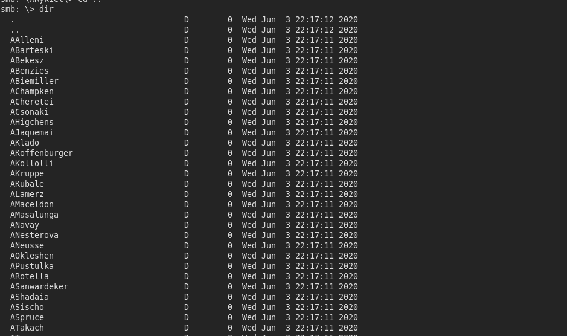


## impacket

- we can get a TGT for support user
- as its kerberos Pre Authentication is disabled

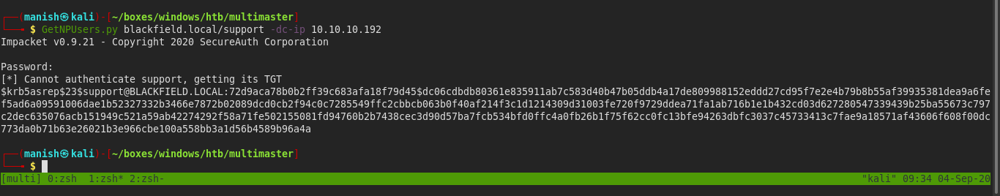


#### hashcat

- got the credentials

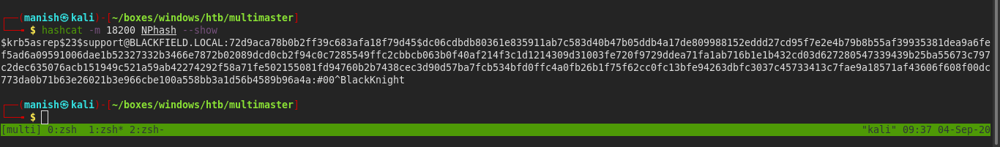

useraname					support

password						#00^BlackKnight


#### rpcclient

- support user have ability to change password of non admin users
- we were able to change the password of audit2020 user

[link to reset ad password](https://malicious.link/post/2017/reset-ad-user-password-with-linux/)

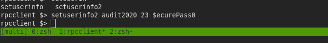


## forensics

- we got a share called forensics 
- in the share there is a folder memory analysis
- we download lsass.DMP file which can consist potential username and there NTLM hash

- article to read more about dump file

https://medium.com/@markmotig/some-ways-to-dump-lsass-exe-c4a75fdc49bf

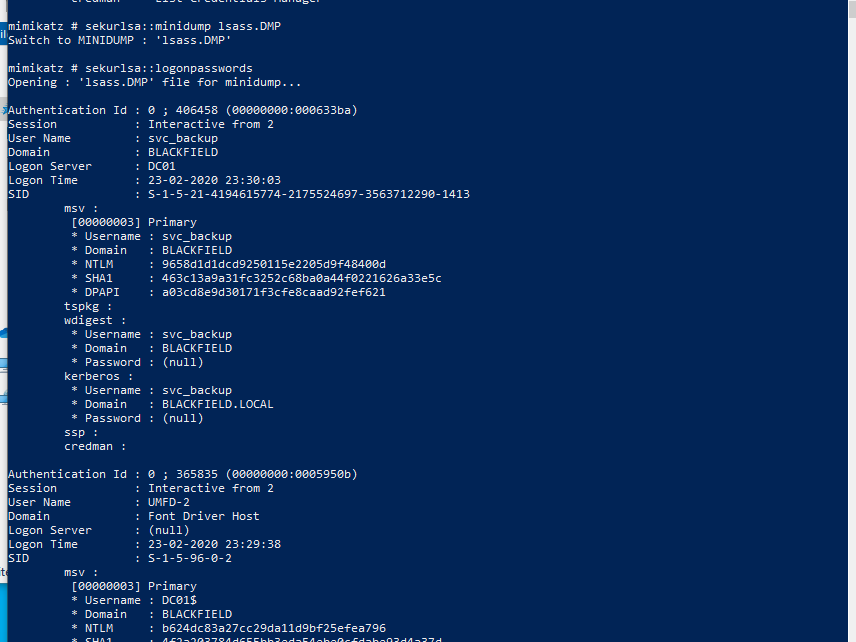

- found two hashes administrator and svc_backup


#### credential hashes

svc_backup					9658d1d1dcd9250115e2205d9f48400d

~~administrator				7f1e4ff8c6a8e6b6fcae2d9c0572cd62~~

- svc_backup is a valid hash and we  access domain 
- but administrator hash is not working probably the password was changed


## shell

- using evil-winrm we get a session as svc_backup

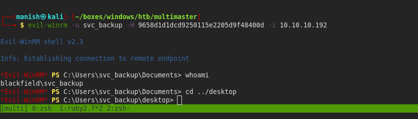


## post

- our privielges gives us access to backup anything on domain

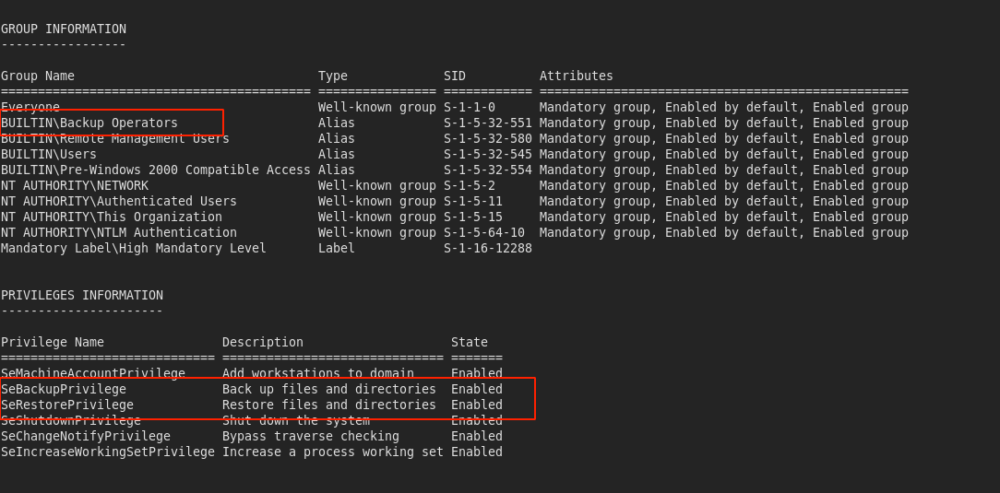

- this means we can backup anything 
- we will use it to backup ntds.dit and system hive

[link to configure shadow copy so that we can access anything](https://pentestlab.blog/tag/diskshadow/)

- remember to give one space
- now we can mount c: asias drive z: but we still cannot copy anything

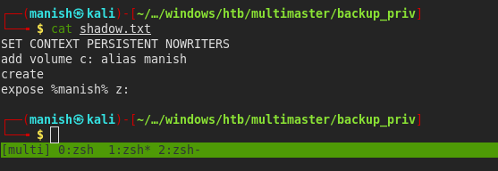


- to abuse the privilege we import 2 dlls.

[github repo](https://github.com/giuliano108/SeBackupPrivilege)

- then we can simply copy from the snapshot we created earlier

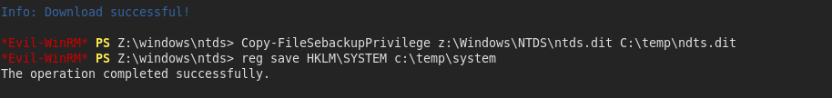

```
Copy-FileSebackupPrivilege z:\Windows\NTDS\ntds.dit C:\temp\ndts.dit
reg save HKLM\SYSTEM c:\temp\system
```


#### impacket-secretdump

- now we can dump the hashes

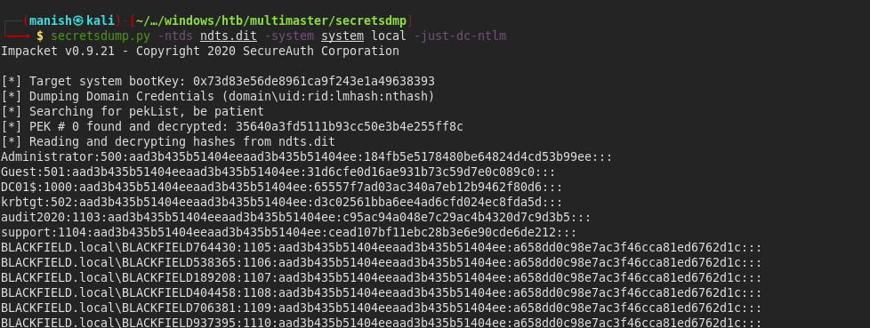

- now we can do pass the hash attack

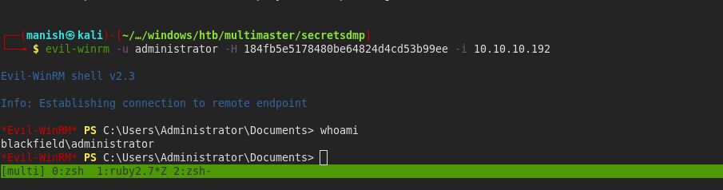


