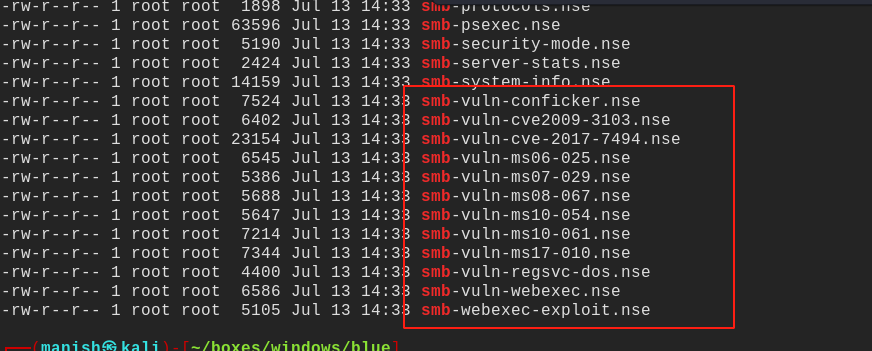
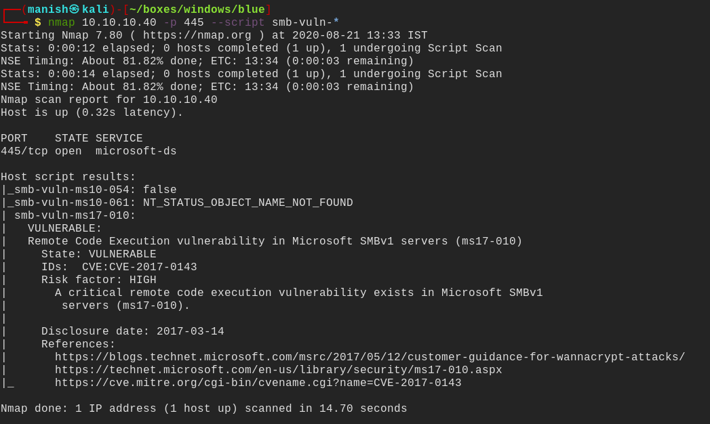
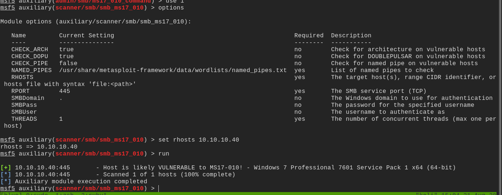
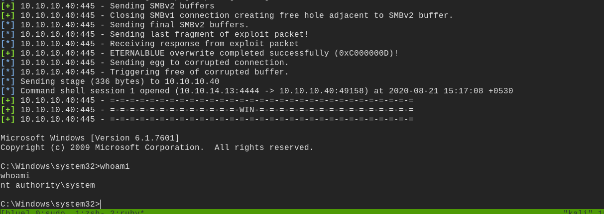

# blue


## nmap

PORT      STATE SERVICE      VERSION                                                                                                   
135/tcp   open  msrpc        Microsoft Windows RPC                                                                                     
139/tcp   open  netbios-ssn  Microsoft Windows netbios-ssn                                                                             
445/tcp   open  microsoft-ds Windows 7 Professional 7601 Service Pack 1 microsoft-ds (workgroup: WORKGROUP)
49152/tcp open  msrpc        Microsoft Windows RPC
49153/tcp open  msrpc        Microsoft Windows RPC
49154/tcp open  msrpc        Microsoft Windows RPC
49155/tcp open  msrpc        Microsoft Windows RPC
49156/tcp open  msrpc        Microsoft Windows RPC
49157/tcp open  msrpc        Microsoft Windows RPC


Host script results:
|_clock-skew: mean: -19m49s, deviation: 34m38s, median: 9s
| smb-os-discovery: 
|   OS: Windows 7 Professional 7601 Service Pack 1 (Windows 7 Professional 6.1)
|   OS CPE: cpe:/o:microsoft:windows_7::sp1:professional
|   Computer name: haris-PC
|   NetBIOS computer name: HARIS-PC\x00
|   Workgroup: WORKGROUP\x00
|_  System time: 2020-08-21T09:01:58+01:00
| smb-security-mode: 
|   account_used: guest
|   authentication_level: user
|   challenge_response: supported
|_  message_signing: disabled (dangerous, but default)
| smb2-security-mode: 
|   2.02: 
|_    Message signing enabled but not required
| smb2-time: 
|   date: 2020-08-21T08:02:00
|_  start_date: 2020-08-21T08:00:11

Host script results:
|_clock-skew: mean: -19m49s, deviation: 34m38s, median: 9s
| smb-os-discovery: 
|   OS: Windows 7 Professional 7601 Service Pack 1 (Windows 7 Professional 6.1)
|   OS CPE: cpe:/o:microsoft:windows_7::sp1:professional
|   Computer name: haris-PC
|   NetBIOS computer name: HARIS-PC\x00
|   Workgroup: WORKGROUP\x00
|_  System time: 2020-08-21T09:01:58+01:00
| smb-security-mode: 
|   account_used: guest
|   authentication_level: user
|   challenge_response: supported
|_  message_signing: disabled (dangerous, but default)
| smb2-security-mode: 
|   2.02: 
|_    Message signing enabled but not required
| smb2-time: 
|   date: 2020-08-21T08:02:00
|_  start_date: 2020-08-21T08:00:11


## smb enumeration


smb enumeration with nmap




- ```
  nmap 10.10.10.40 -p 445 smb-vuln-*
  ```




smb server is vulnerable to MS17-010


#### metasploit



- it is vulnerable to eternal blue exploit 
- using metasploit lets try to get a shell


## post


finally got the shell




## powershell empire


#### experiment

we will be using powershell empire to do some experiment

1.  first we will use listeners to set a type of agent
2. the we will use stagers to set a type of code that will deploy agents
3. the agent is deployed


