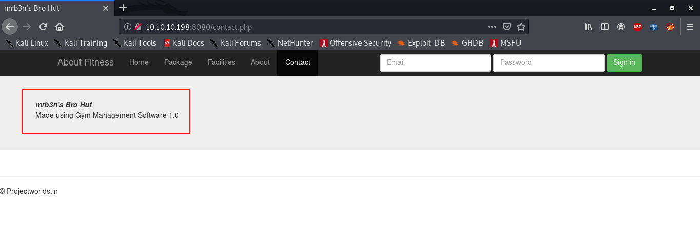
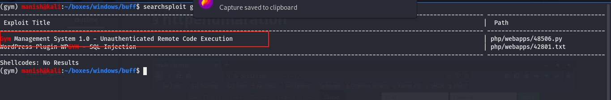
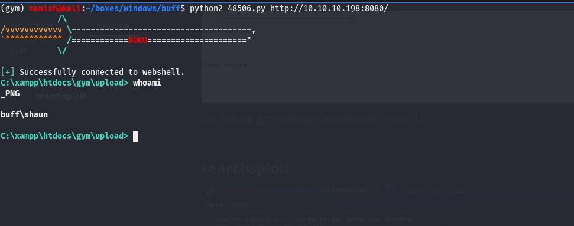

# buff

## nmap

PORT     STATE SERVICE    VERSION
7680/tcp open  pando-pub?
8080/tcp open  http       Apache httpd 2.4.43 ((Win64) OpenSSL/1.1.1g PHP/7.4.6)
| http-open-proxy: Potentially OPEN proxy.
|_Methods supported:CONNECTION
|_http-server-header: Apache/2.4.43 (Win64) OpenSSL/1.1.1g PHP/7.4.6
|_http-title: mrb3n's Bro Hut

## httpenumaration

it is running gym management software version 1.0

#### searchsploit

## exploit

got the shell

#### shell

we will try to get a meterpreter shell

uploaded meterpreter 

getting a meterpreter session

