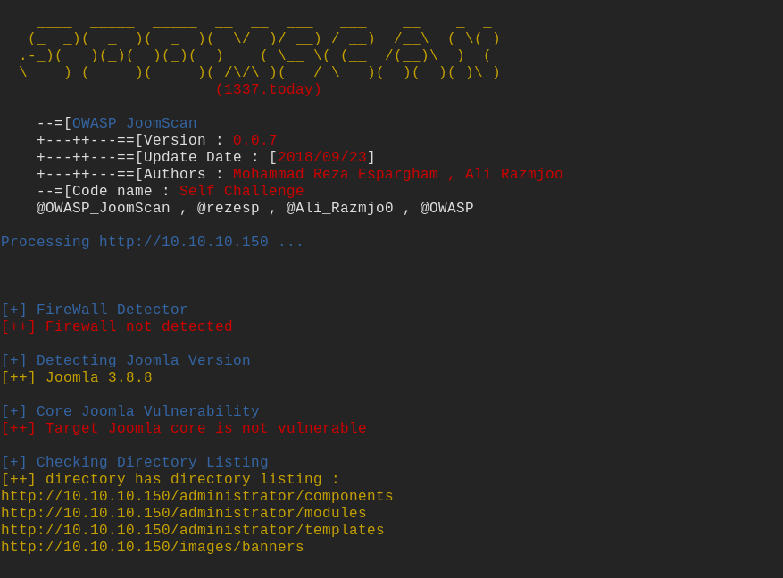
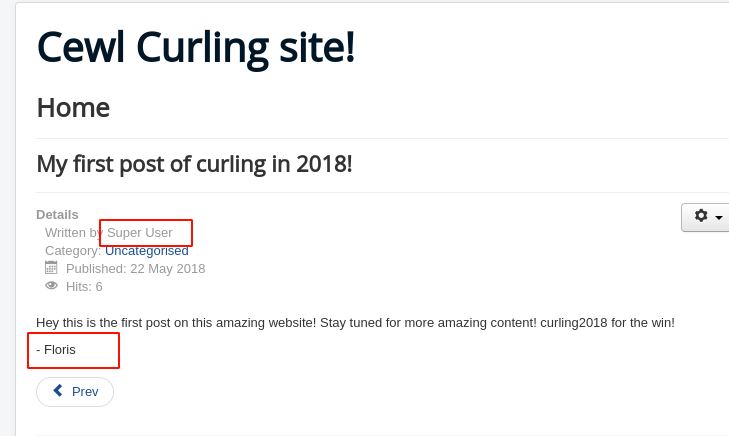
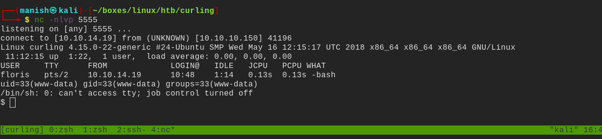
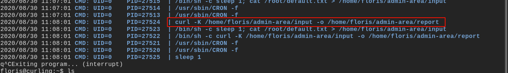
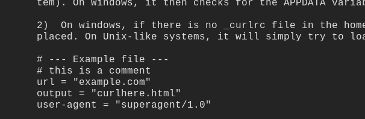
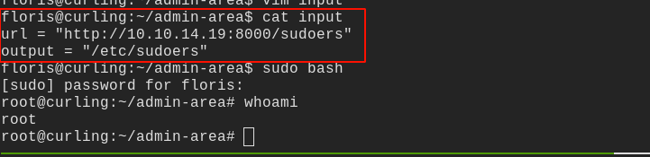

# curling

## nmap

PORT   STATE SERVICE VERSION
22/tcp open  ssh     OpenSSH 7.6p1 Ubuntu 4 (Ubuntu Linux; protocol 2.0)
| ssh-hostkey: 
|   2048 8a:d1:69:b4:90:20:3e:a7:b6:54:01:eb:68:30:3a:ca (RSA)
|   256 9f:0b:c2:b2:0b:ad:8f:a1:4e:0b:f6:33:79:ef:fb:43 (ECDSA)
|_  256 c1:2a:35:44:30:0c:5b:56:6a:3f:a5:cc:64:66:d9:a9 (ED25519)
80/tcp open  http    Apache httpd 2.4.29 ((Ubuntu))
|_http-generator: Joomla! - Open Source Content Management
|_http-server-header: Apache/2.4.29 (Ubuntu)
|_http-title: Home
Service Info: OS: Linux; CPE: cpe:/o:linux:linux_kernel

## httpenumeration 

- we know its running joomla on http

- the site doesnot look vulnerable to any kind of rce or login bypass attack
- but we do get username from the homepage

- potential usernames are **Super User and Floris**

  

- source of the page tells us there is secret.txt file inside 
- it is base 64 encode we decode it and get the password for logging into joomla 
- then we can create a shell by modifying on of the template

#### shell

## xdd

- we got a hexdump of password_backup file

- after using xxd and multiple reverse techniques we got a password og floris account 

## post

-  we see a cron running as root using pspy64s

- -K is for configuration
- from man page we can see it can get input and save anywhere in the curling machine since the cron is running as root

- changed sudoers file to get access get sudo privilege on all

