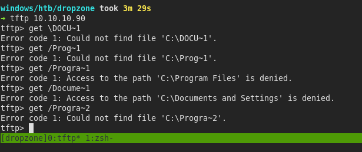
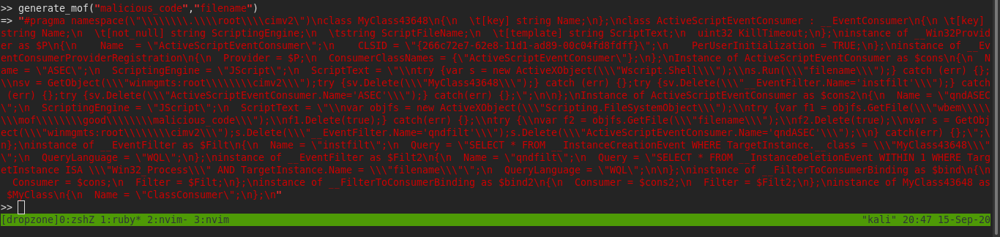
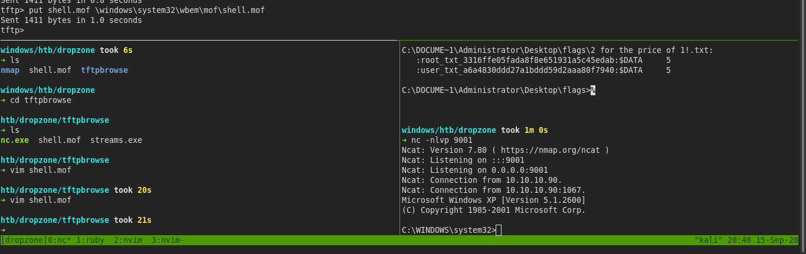

# dropzone

## nmap

###### tcp scan

Nmap scan report for 10.10.10.90
Host is up.
All 1000 scanned ports on 10.10.10.90 are filtered

###### udp scan

Host is up (0.30s latency).
Not shown: 999 open|filtered ports
PORT   STATE SERVICE
69/udp open  tftp

## tftp

- this tells us that it is a windows xp 32 bit machine

## exploit

- mof exploit
- we will create a mof file and put it in system32/wbem/mof/<mofFile>
- we can use psexec in msfconsole irb mode to generate a maliciuos mof

- instead of malicious code we can put a reverse nc shell command
- but we will also need to upload netcat

- we will get access as a admin account

