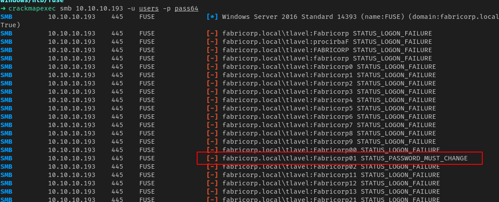

# fuse


## nmap

Nmap scan report for 10.10.10.193
Host is up (0.27s latency).
Not shown: 988 filtered ports
PORT     STATE SERVICE      VERSION
53/tcp   open  domain       Simple DNS Plus
80/tcp   open  http         Microsoft IIS httpd 10.0
| http-methods: 
|_  Potentially risky methods: TRACE
|_http-server-header: Microsoft-IIS/10.0
|_http-title: Site doesn't have a title (text/html).
88/tcp   open  kerberos-sec Microsoft Windows Kerberos (server time: 2020-11-09 12:51:05Z)
135/tcp  open  msrpc        Microsoft Windows RPC
139/tcp  open  netbios-ssn  Microsoft Windows netbios-ssn
389/tcp  open  ldap         Microsoft Windows Active Directory LDAP (Domain: fabricorp.local, Site: Default-First-Site-Name)
445/tcp  open  microsoft-ds Windows Server 2016 Standard 14393 microsoft-ds (workgroup: FABRICORP)
464/tcp  open  kpasswd5?
593/tcp  open  ncacn_http   Microsoft Windows RPC over HTTP 1.0
636/tcp  open  tcpwrapped
3268/tcp open  ldap         Microsoft Windows Active Directory LDAP (Domain: fabricorp.local, Site: Default-First-Site-Name)
3269/tcp open  tcpwrapped
Service Info: Host: FUSE; OS: Windows; CPE: cpe:/o:microsoft:windows

Host script results:
|_clock-skew: mean: 2h54m13s, deviation: 4h37m08s, median: 14m13s
| smb-os-discovery: 
|   OS: Windows Server 2016 Standard 14393 (Windows Server 2016 Standard 6.3)
|   Computer name: Fuse
|   NetBIOS computer name: FUSE\x00
|   Domain name: fabricorp.local
|   Forest name: fabricorp.local
|   FQDN: Fuse.fabricorp.local
|_  System time: 2020-11-09T04:51:20-08:00
| smb-security-mode: 
|   account_used: <blank>
|   authentication_level: user
|   challenge_response: supported
|_  message_signing: required
| smb2-security-mode: 
|   2.02: 
|_    Message signing enabled and required
| smb2-time: 
|   date: 2020-11-09T12:51:21
|_  start_date: 2020-11-09T11:24:56


## kerbrute

- collecting username from the site
- we will use these username to check if they are valid users in domain


- all of them are valid credentials we can use crackmapexec to brute force the password



##### creds

```
tlavel	Fabricorp01
```


- we can successfully change the password


- we will use rpcclient to login and query further


- found more users and a credential as well we can try the credential with all the users


## crackmapexec

- using crackmapexec with all the users


##### creds

```
svc-print $fab@s3Rv1ce$1
```


- now we can get a shell


## post

- we have SeLoadDriverPrivilege option enabled


- using capcom driver to fix it


