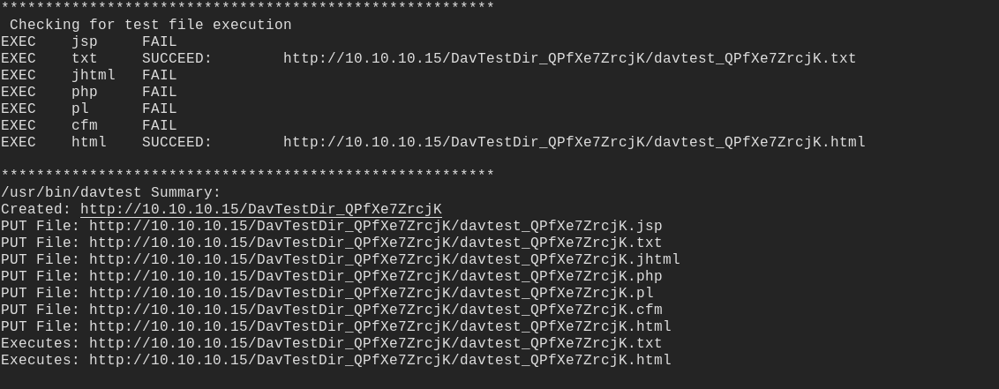
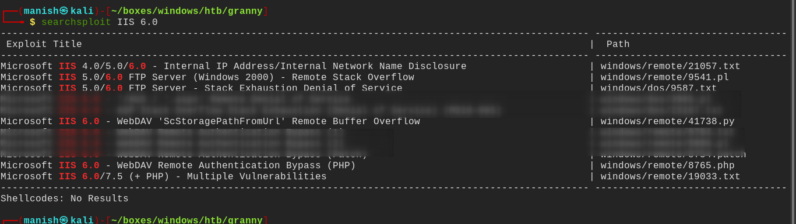
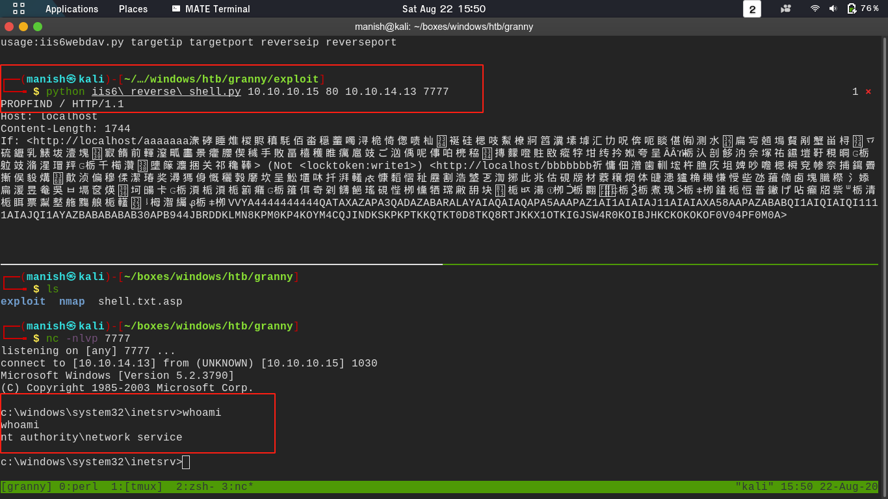
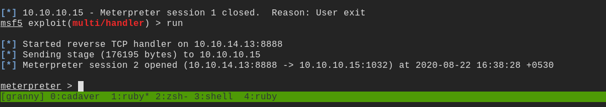
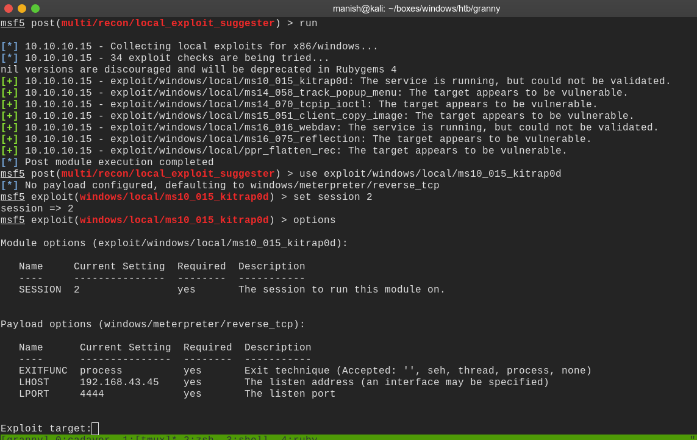
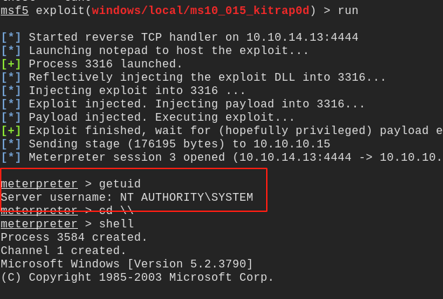

# granny

 

## nmap

initial scan

80/tcp open  http    Microsoft IIS httpd 6.0
| http-methods: 
|_  Potentially risky methods: TRACE DELETE COPY MOVE PROPFIND PROPPATCH SEARCH MKCOL LOCK UNLOCK PUT
|_http-server-header: Microsoft-IIS/6.0
|_http-title: Under Construction
| http-webdav-scan: 
|   Public Options: OPTIONS, TRACE, GET, HEAD, DELETE, PUT, POST, COPY, MOVE, MKCOL, PROPFIND, PROPPATCH, LOCK, UNLOCK, SEARCH
|   Server Date: Sat, 22 Aug 2020 09:39:25 GMT
|   Server Type: Microsoft-IIS/6.0
|   Allowed Methods: OPTIONS, TRACE, GET, HEAD, DELETE, COPY, MOVE, PROPFIND, PROPPATCH, SEARCH, MKCOL, LOCK, UNLOCK
|_  WebDAV type: Unknown
Service Info: OS: Windows; CPE: cpe:/o:microsoft:windows


## davtest

- so we use davtest to verify what can we execute 
- only two files are executable txt and html so not very useful




## cadaver


-  `**to upload the file just like ftp**`


## exploit

- after searching a lot found iss 6.0 buffer overflow vulnerability
- CVE-2017-7269
- https://www.exploit-db.com/exploits/41738
- [git repository](https://github.com/g0rx/iis6-exploit-2017-CVE-2017-7269)


#### searchsploit

in searchsploit also we can find it




#### shell



- this shell was not working because we didnt have many rights 
- we were running as network service which cannot do user related task
- used a aspx exploit and and uploaded it through davtest and gave a txt extension
- renamed the uploaded shell through this shell
- and executed it from website to get a meterpreter shell





got the meterpreter shell




```
used a most module kitrap0d useful in time when u have privileges but cannot access the files and services
```




