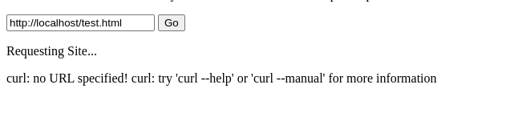
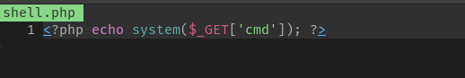
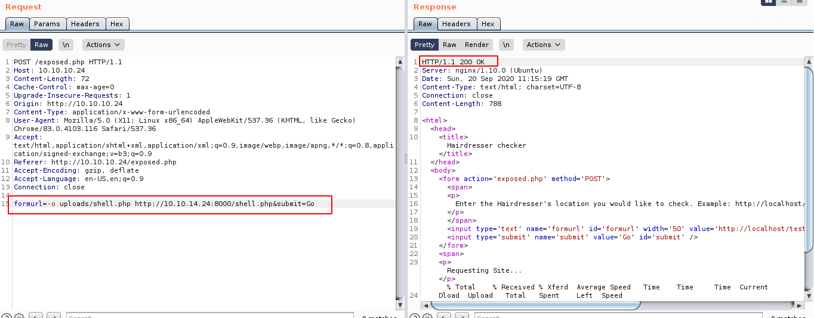
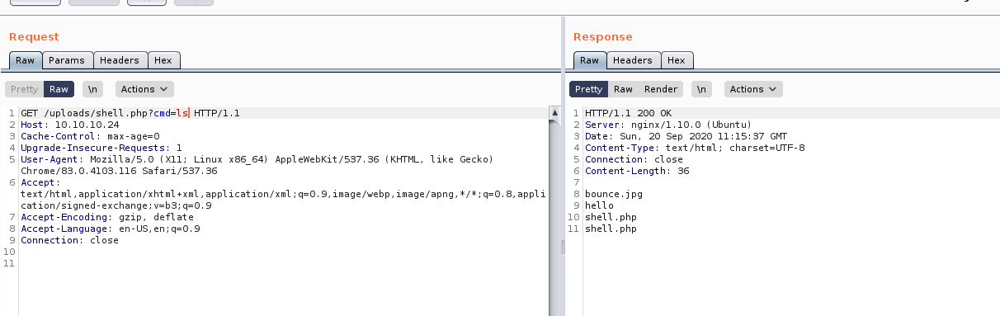

# haircut


## nmap


PORT   STATE SERVICE VERSION
22/tcp open  ssh     OpenSSH 7.2p2 Ubuntu 4ubuntu2.2 (Ubuntu Linux; protocol 2.0)
| ssh-hostkey: 
|   2048 e9:75:c1:e4:b3:63:3c:93:f2:c6:18:08:36:48:ce:36 (RSA)
|   256 87:00:ab:a9:8f:6f:4b:ba:fb:c6:7a:55:a8:60:b2:68 (ECDSA)
|_  256 b6:1b:5c:a9:26:5c:dc:61:b7:75:90:6c:88:51:6e:54 (ED25519)
80/tcp open  http    nginx 1.10.0 (Ubuntu)
|_http-server-header: nginx/1.10.0 (Ubuntu)
|_http-title:  HTB Hairdresser


## http

1. using gobuster we find a php file

```
/uploads (Status: 301)
/exposed.php (Status: 200)
```


2. exposed.php is running curl



3. we can use it to write to uploads directory and get a shell

- shell code




- request in burp




- code execution




## shell

-  we can get php reverse shell by uploading a shell
- once we have a shell we screen 4.5.0 
- we will use searchsploit to exploit it

