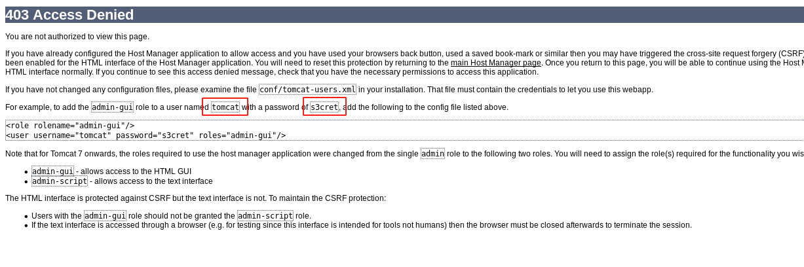
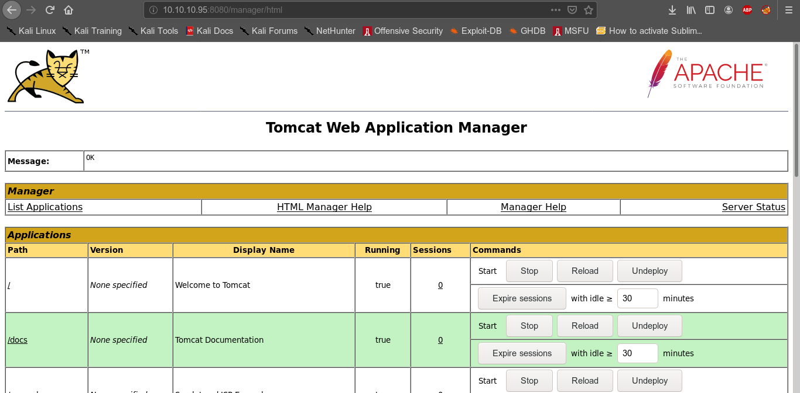
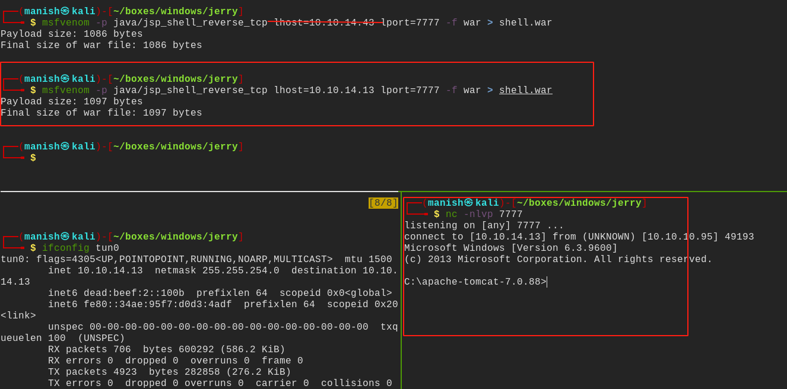
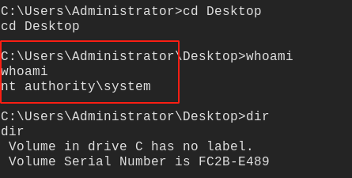

# jerry

## nmap

PORT     STATE SERVICE VERSION
8080/tcp open  http    Apache Tomcat/Coyote JSP engine 1.1
|_http-favicon: Apache Tomcat
|_http-open-proxy: Proxy might be redirecting requests
|_http-server-header: Apache-Coyote/1.1
|_http-title: Apache Tomcat/7.0.88

## httpenumeration

- we can see tomcat running lets try to login with default credentials

- successfully got the login 

## shell

- now we can try to get a shell bydeploying war file
- the executing the war file and getting a reverse shell

#### root

