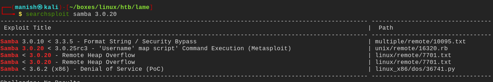
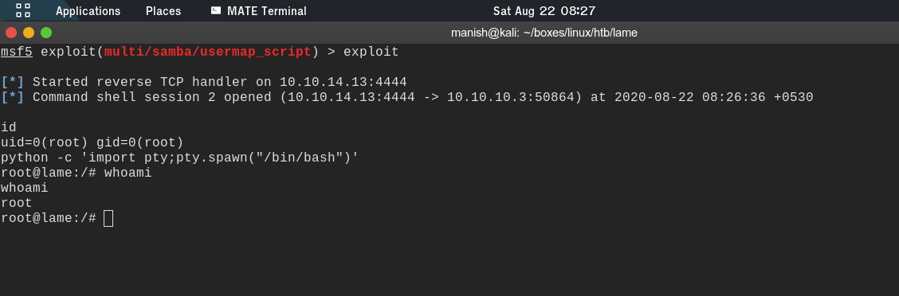

# lame

## nmap

PORT    STATE SERVICE     VERSION                                                                                                      
21/tcp  open  ftp         vsftpd 2.3.4                                                                                                 
|_ftp-anon: Anonymous FTP login allowed (FTP code 230)                                                                                 
| ftp-syst:                                                                                                                            
|   STAT:                                                                                                                              
| FTP server status:                                                                                                                   
|      Connected to 10.10.14.13                                                                                                        
|      Logged in as ftp                                                                                                                
|      TYPE: ASCII                                                                                                                     
|      No session bandwidth limit 
|      Session timeout in seconds is 300
|      Control connection is plain text
|      Data connections will be plain text
|      vsFTPd 2.3.4 - secure, fast, stable
|_End of status
22/tcp  open  ssh         OpenSSH 4.7p1 Debian 8ubuntu1 (protocol 2.0)
| ssh-hostkey: 
|   1024 60:0f:cf:e1:c0:5f:6a:74:d6:90:24:fa:c4:d5:6c:cd (DSA)
|_  2048 56:56:24:0f:21:1d:de:a7:2b:ae:61:b1:24:3d:e8:f3 (RSA)
139/tcp open  netbios-ssn Samba smbd 3.X - 4.X (workgroup: WORKGROUP)
445/tcp open  netbios-ssn Samba smbd 3.0.20-Debian (workgroup: WORKGROUP)
Service Info: OSs: Unix, Linux; CPE: cpe:/o:linux:linux_kernel

## ftp

- anonymous login is allowed but we dont find anything useful there
- vsftpd vulnerability is not exploitably port 6200 is filtered

## samba

- in searchsploit we find a vulnerability
- there is Username map script command execution module in metasploit

## shell

**root**

