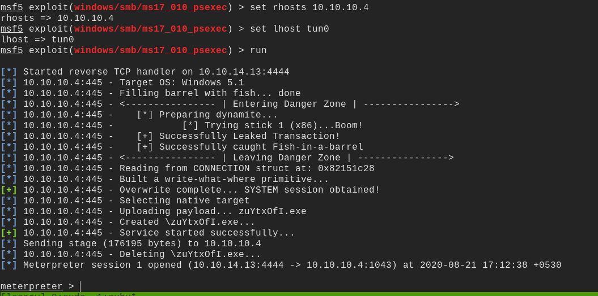
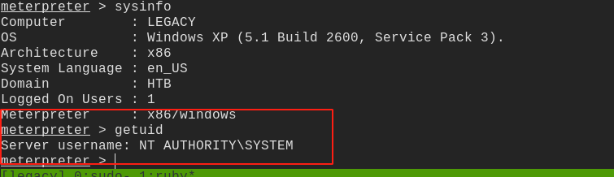

# legacy


## nmap

```
nmap -sC -sV 10.10.10.4 -oA nmap/initial
```


PORT     STATE  SERVICE       VERSION
139/tcp  open   netbios-ssn   Microsoft Windows netbios-ssn
445/tcp  open   microsoft-ds  Windows XP microsoft-ds
3389/tcp closed ms-wbt-server
Service Info: OSs: Windows, Windows XP; CPE: cpe:/o:microsoft:windows, cpe:/o:microsoft:windows_xp

Host script results:
|_clock-skew: mean: -4h29m50s, deviation: 2h07m16s, median: -5h59m50s
|_nbstat: NetBIOS name: LEGACY, NetBIOS user: <unknown>, NetBIOS MAC: 00:50:56:b9:b9:21 (VMware)
| smb-os-discovery: 
|   OS: Windows XP (Windows 2000 LAN Manager)
|   OS CPE: cpe:/o:microsoft:windows_xp::-
|   Computer name: legacy
|   NetBIOS computer name: LEGACY\x00
|   Workgroup: HTB\x00
|_  System time: 2020-08-21T11:27:32+03:00
| smb-security-mode: 
|   account_used: guest
|   authentication_level: user
|   challenge_response: supported
|_  message_signing: disabled (dangerous, but default)
|_smb2-time: Protocol negotiation failed (SMB2)

- running another nmap scan to check for vulnerabilities

```
nmap -n -Pn -sC -sV -p 445,3389 10.10.10.4 -oA nmap/vuln --script safe
```

|_  message_signing: disabled (dangerous, but default)
| smb-vuln-ms17-010: 
|   VULNERABLE:
|   Remote Code Execution vulnerability in Microsoft SMBv1 servers (ms17-010)
|     State: VULNERABLE
|     IDs:  CVE:CVE-2017-0143
|     Risk factor: HIGH
|       A critical remote code execution vulnerability exists in Microsoft SMBv1
|        servers (ms17-010).


## vulnerability

found a vulnerability **MS17-010**

- the windows 7 version of the exploit is not working properly and is buggy
- using msf5 exploit(windows/smb/ms17_010_psexec)




## post

we are already root




