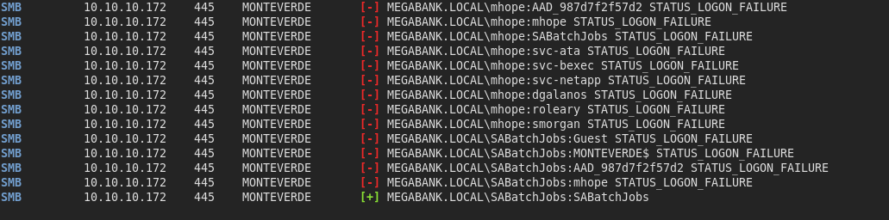
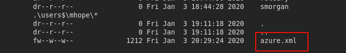
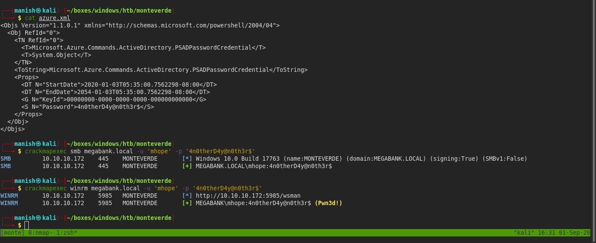
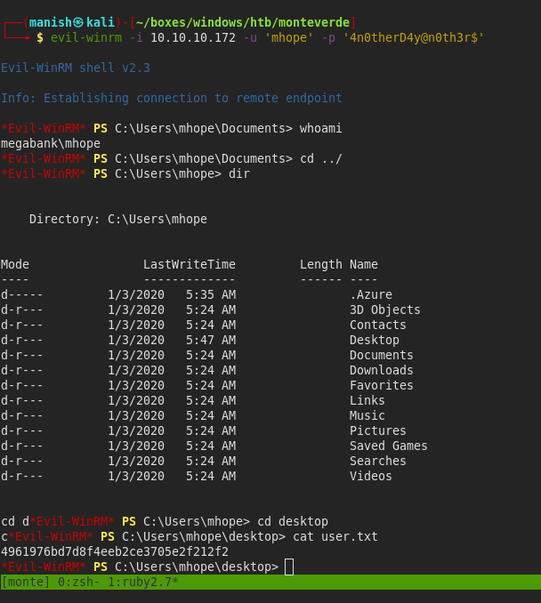
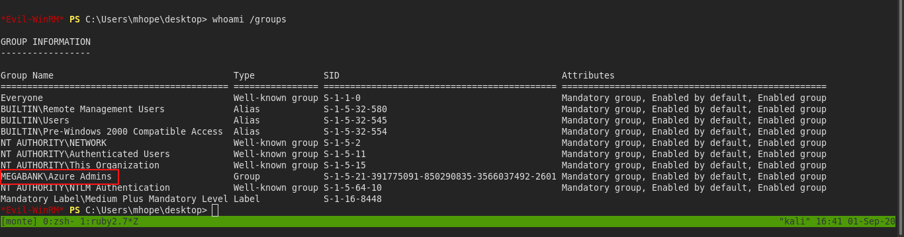
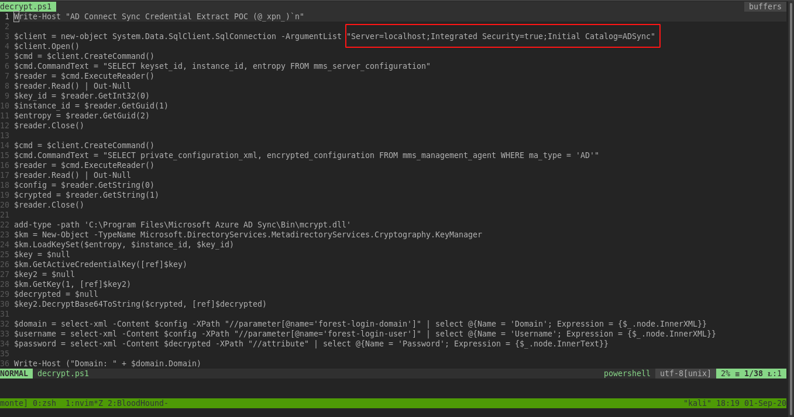
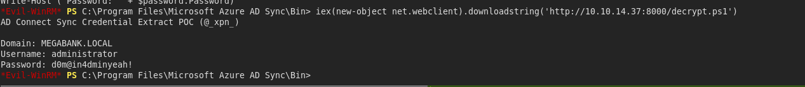
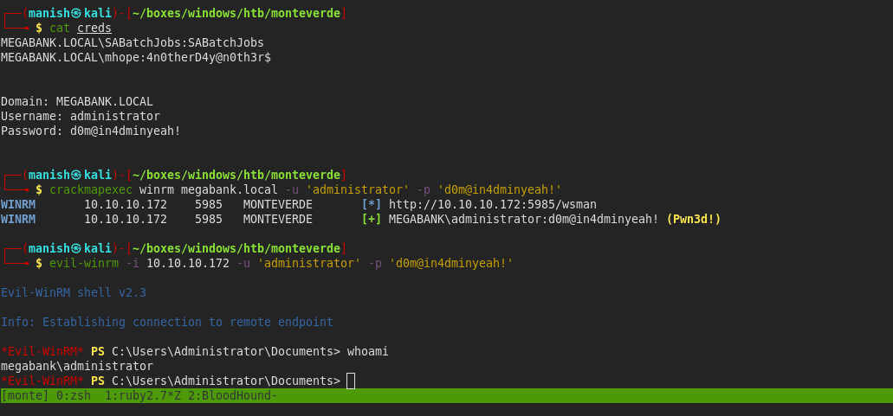

# monteverde

## nmap

PORT     STATE SERVICE       VERSION
53/tcp   open  domain?
| fingerprint-strings: 
|   DNSVersionBindReqTCP: 
|     version
|_    bind
88/tcp   open  kerberos-sec  Microsoft Windows Kerberos (server time: 2020-09-01 10:18:18Z)
135/tcp  open  msrpc         Microsoft Windows RPC
139/tcp  open  netbios-ssn   Microsoft Windows netbios-ssn
389/tcp  open  ldap          Microsoft Windows Active Directory LDAP (Domain: MEGABANK.LOCAL0., Site: Default-First-Site-Name)
445/tcp  open  microsoft-ds?
464/tcp  open  kpasswd5?
593/tcp  open  ncacn_http    Microsoft Windows RPC over HTTP 1.0
636/tcp  open  tcpwrapped
3268/tcp open  ldap          Microsoft Windows Active Directory LDAP (Domain: MEGABANK.LOCAL0., Site: Default-First-Site-Name)

## crackmapexec

- we used username as password to see if anything cracks
- and we got a hit.

#### credentials

SABatchJobs				SABatchJobs

#### smbmap

- we got a interesting file in mhope directory

- using crackmapexec we can see we get a shell

## shell

- got shell as mhope

## post

- we are part of  Azure Admins group

- Azure allows us to sync password between our cloud password and localusers
- it saves the password in some form inside the machine we will try to decrypt and extract password

- there is a blog post on how we can use it to decrypt the passwords saved locally

[azure ad](https://blog.xpnsec.com/azuread-connect-for-redteam/)

- we need to change the connection argument to connect to the database

- the part is changed and we get credentials dumped

-  using crackmapexec

