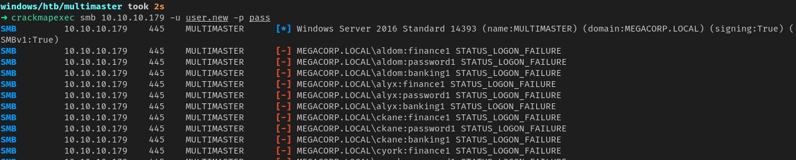
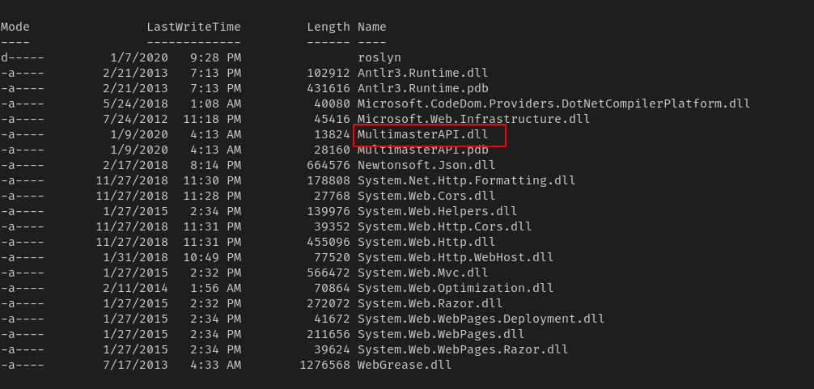
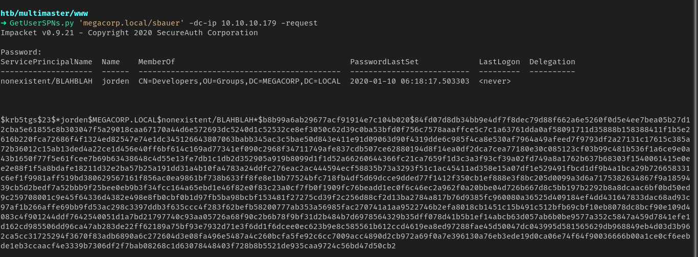

# multimaster


### nmap

```
PORT     STATE SERVICE       VERSION                                                                                                                  
53/tcp   open  domain?                                                                                      | fingerprint-strings:                                                                                     |   DNSVersionBindReqTCP:                                                                                   |     version                                                                                               |_    bind                                                                                                 80/tcp   open  http          Microsoft IIS httpd 10.0                                                       | http-methods:                                                                                             |_  Potentially risky methods: TRACE                                                                       |_http-server-header: Microsoft-IIS/10.0                                                                   |_http-title: 403 - Forbidden: Access is denied.                                                           88/tcp   open  kerberos-sec  Microsoft Windows Kerberos (server time: 2020-09-21 11:58:55Z)                 135/tcp  open  msrpc         Microsoft Windows RPC                                                         139/tcp  open  netbios-ssn   Microsoft Windows netbios-ssn                                                 389/tcp  open  ldap          Microsoft Windows Active Directory LDAP (Domain: MEGACORP.LOCAL, Site: Default-First-Site-Name)                          
445/tcp  open  microsoft-ds  Windows Server 2016 Standard 14393 microsoft-ds (workgroup: MEGACORP)         464/tcp  open  kpasswd5?                                                                                   593/tcp  open  ncacn_http    Microsoft Windows RPC over HTTP 1.0                                           636/tcp  open  tcpwrapped                                                                                   3268/tcp open  ldap          Microsoft Windows Active Directory LDAP (Domain: MEGACORP.LOCAL, Site: Default-First-Site-Name)                          
3269/tcp open  tcpwrapped                                                                                   3389/tcp open  ms-wbt-server Microsoft Terminal Services       
```


### http

1.  found few employees from website search feature


2. used jq for beautifying json file


3. grepped all the emails and usernames

```
cat employees | jq | grep email | awk -F "\"" '{print $4}' | tee emails  
cat employees | jq | grep email | awk -F "\"" '{print $4}' | awk -F "@" '{print $1}' | tee user
```


### sql injection

1. there is a sql injection on the site but it need character unicode
2. we can use sqlmap to perform it but we will try manual method


3. now we can perform sqli injection with the help requests module from commandline


4. we were able to extract username and password.

   - it is a nested select statement

   ```
   (SELECT STRING_AGG(name,',') FROM Hub_DB..sysobjects WHERE xtype = 'U')
   (SELECT STRING_AGG(username,',') FROM logins)
   (SELECT STRING_AGG(password,',') FROM logins)
   ```

   


#### hash

using hashcat to crack these password hashes its a 96 char hash


1. Keccak-384 hashtype got cracked and we got 3 passwords
2. we can use this for password spray


#### SID BRUTE

3. not a single success




4. we need to brute force rid to get other usernames using mssql injection

```
master.dbo.fn_varbintohexstr(SUSER_SID('MEGACORP\Administrator'))
```


5. can use this information to get all the username by querying there sid


-   using struct to convert rid to little endian
- we already got sid by querying the mssql server we just need add last 4 hex bytes that is rid
- we will increment it by 1 each time


6. we got some extra users now  lets try to crackmapexec with these users


7. got a match and we can also get a shell with evil-winrm


### shell


1. got shell as tushikikatomo
2. enumerating with winPEAS.exe
3. did not get anything useful


4. there are random ports opening and closing in localhost


5. further enumeration shows it is visual code debug ports


6. we will use cefdebug to run arbitrary code as that process
7. we have code execution


8. now we can get a reverseshell


now we are megacorp\cyork

9. running as cyork we find that we can read inetpub directory 
10. we find an interesting dll **MultimasterAPI.dll** we copy to local machine to analyze further



11. using strings in utf16 little endian format we get credentials


#### credentials

```
uid=finder password=D3veL0pM3nT!
```


#### crackmapexec


- got sbauer user lets login as that user


### bloodhound

1. logging in as sbauer user lets run bloodhound


2. we have generic write over jorden that means we can make it kerberostable by setting a spn
3. we will use evil-winrm inbuilt feature to bypass AMSI


4. then we can click on abuse for details


5. once we set a spn we can request for its ticket




6. we will crack it using hashcat


```
jorden		rainforest786
```


## weak service permissions

1. now we will login as jordon to see what privileges we have
2. we have generic write permission over all the services


3. means we can change service paths running as localsystem.

