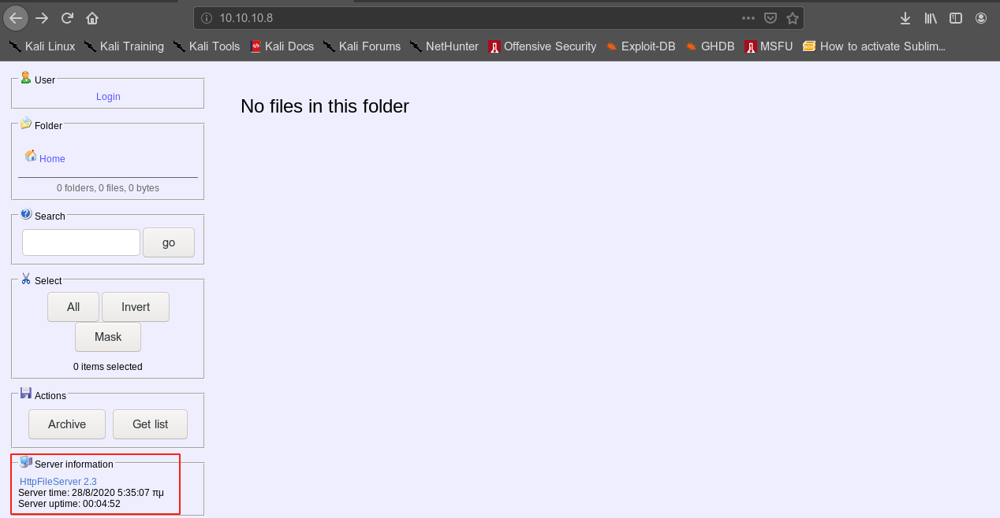
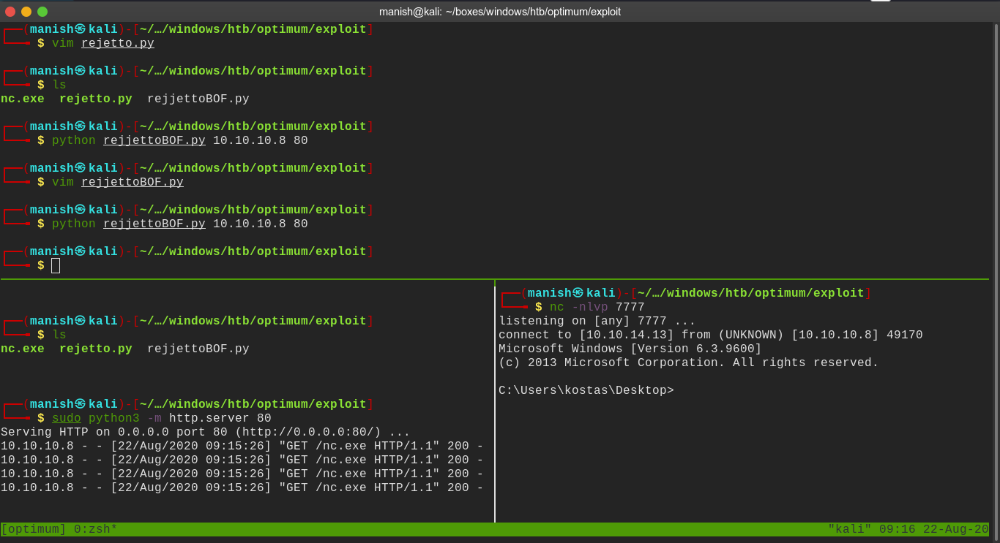
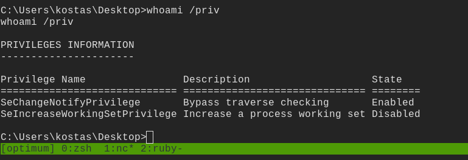
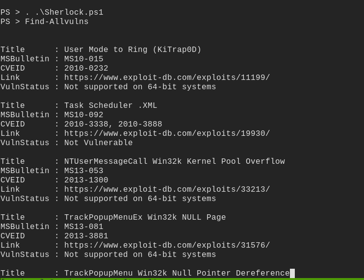

# optimum

## nmap

Nmap scan report for 10.10.10.8
Host is up (0.17s latency).
Not shown: 999 filtered ports
PORT   STATE SERVICE VERSION
80/tcp open  http    HttpFileServer httpd 2.3
|_http-server-header: HFS 2.3
|_http-title: HFS /
Service Info: OS: Windows; CPE: cpe:/o:microsoft:windows

## vulnerability

rejetto version 2.3 is running

#### searchsploit

## exploit

- we need to host a netcat listener for reverse connection 
- change local ip address and port number in file

#### shell

## post

- We see SeChangeNotifyPrivilege on.
- after some research found a powershell script sherlock

- loaded sherlock in powershell
- and run Find-AllVulns

- one privilege escalation script looked promising

[SeChangeNotifyPrivilege Escalation script](https://github.com/FuzzySecurity/PSKernel-Primitives/tree/master/Sample-Exploits/MS16-135)

- run the script and get NT Authority

