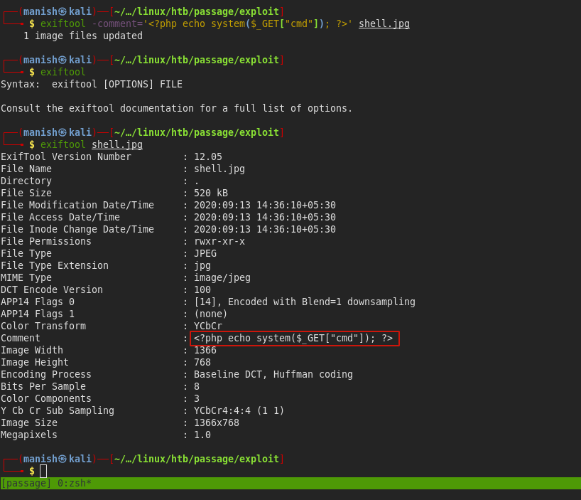
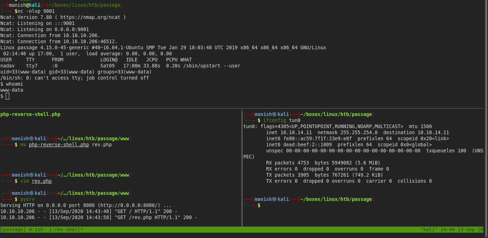
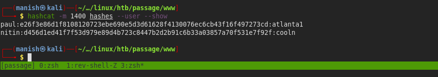
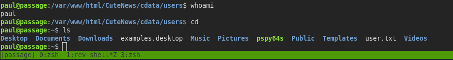
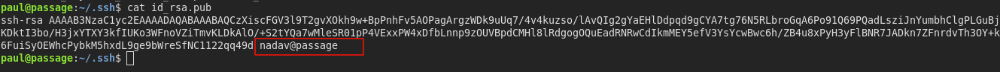
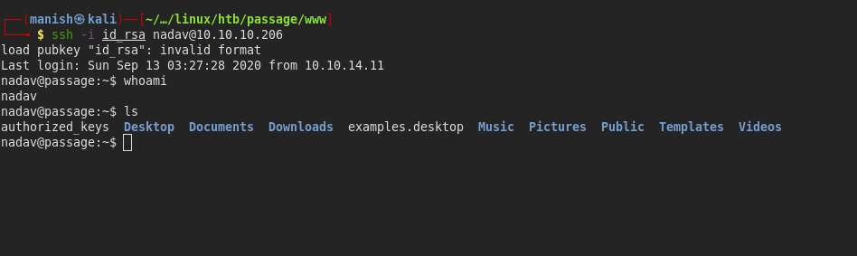
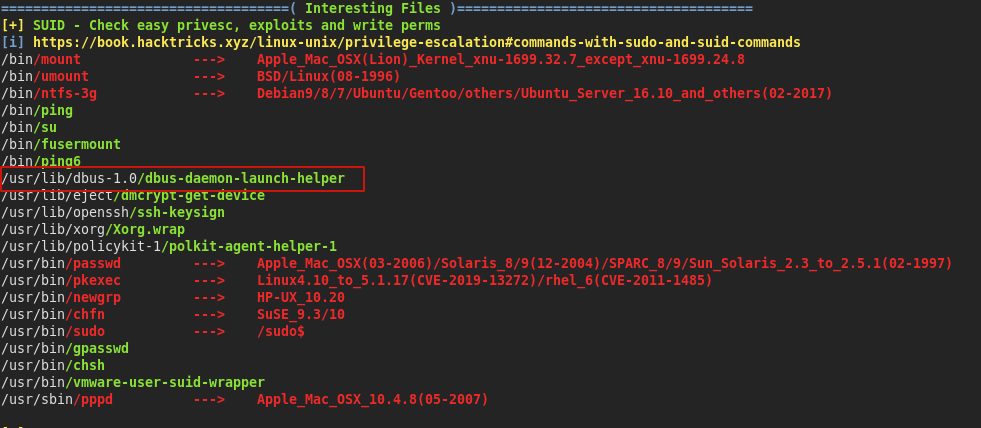
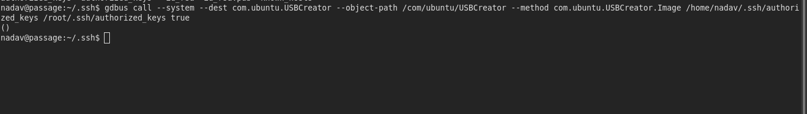
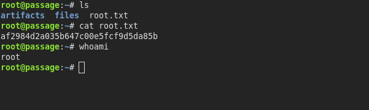

# passage


## nmap

PORT   STATE SERVICE VERSION
22/tcp open  ssh     OpenSSH 7.2p2 Ubuntu 4 (Ubuntu Linux; protocol 2.0)
| ssh-hostkey: 
|   2048 17:eb:9e:23:ea:23:b6:b1:bc:c6:4f:db:98:d3:d4:a1 (RSA)
|   256 71:64:51:50:c3:7f:18:47:03:98:3e:5e:b8:10:19:fc (ECDSA)
|_  256 fd:56:2a:f8:d0:60:a7:f1:a0:a1:47:a4:38:d6:a8:a1 (ED25519)
80/tcp open  http    Apache httpd 2.4.18 ((Ubuntu))
|_http-server-header: Apache/2.4.18 (Ubuntu)
|_http-title: Passage News
Service Info: OS: Linux; CPE: cpe:/o:linux:linux_kernel


## web

- webserver is using **CuteNews 2.1.2**
- there is RCE vulnerability in CuteNews which we will exploit


- First we need to create a account

- then we will a upload a malicous file with php code
- upload it on our avatar 
- avatar is saved in CuteNews/uploads/ directory




#### shell

- we get a code execution now we can upload a php reverse shell and execute it to get the shell



interesting directory to enumerate

- /var/www/html/CuteNews/cdata/users/

- we find lots of base64 serialized objects
- one of the object is sha2-256 hash of the user




- cracked it using hashcat now lets try to escalate to a legitimate user on the box



- now we are paul


## privesc

- in .ssh directory we found nadavs private and public key




- that means we can ssh into nadav using this key




#### root

- we have dbus demon with setuid



- [link to exploitation](https://unit42.paloaltonetworks.com/usbcreator-d-bus-privilege-escalation-in-ubuntu-desktop/)


```bash
gdbus call --system --dest com.ubuntu.USBCreator --object-path /com/ubuntu/USBCreator --method com.ubuntu.USBCreator.Image /home/nadav/.ssh/authorized_keys /root/.ssh/authorized_keys true
```

- copied the private key to roots authorized keys file




- we are root



