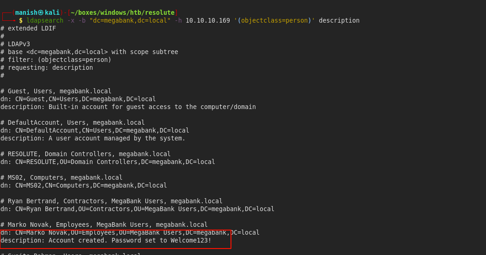
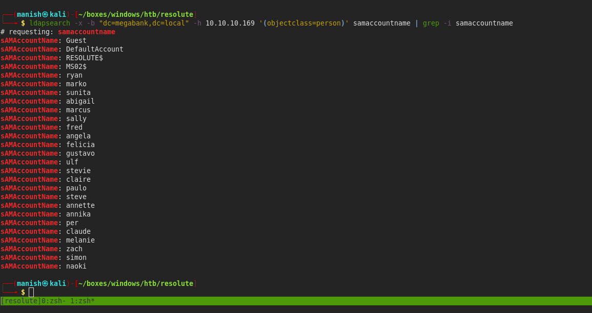
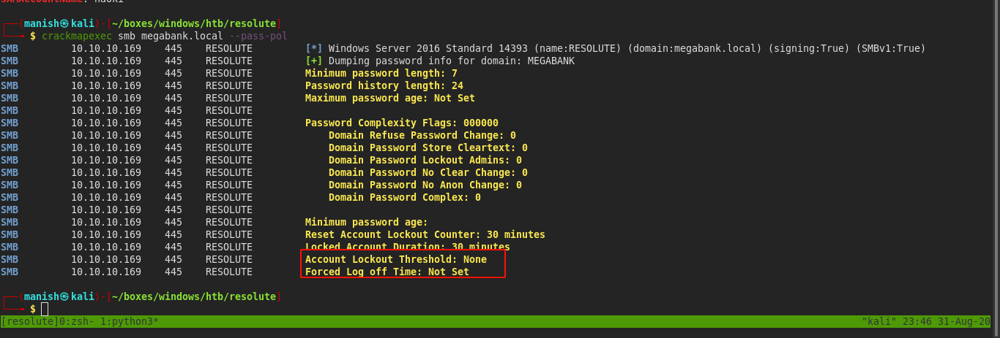
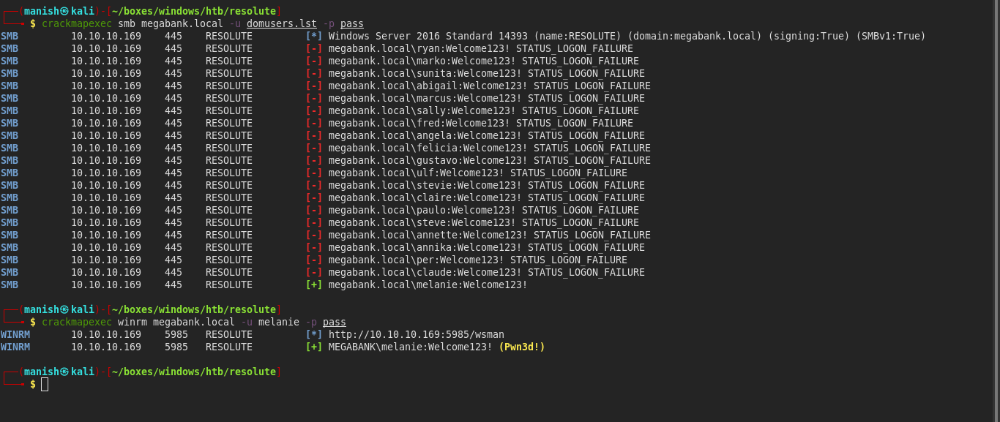
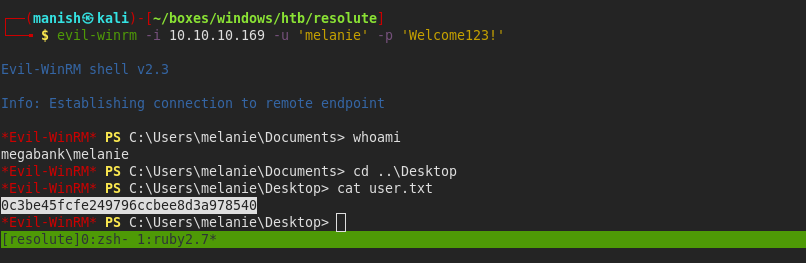
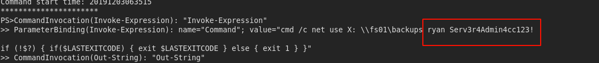
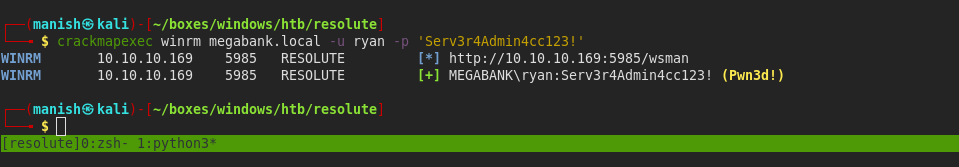
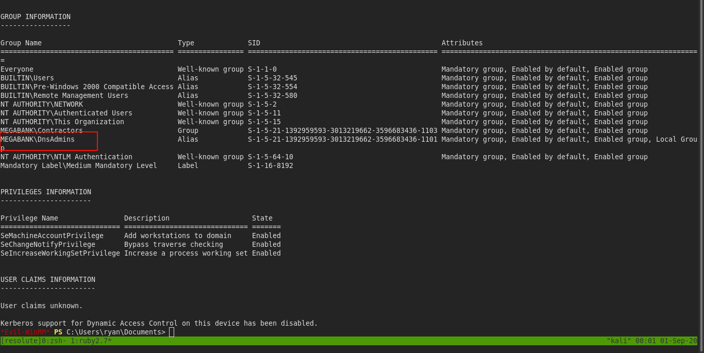
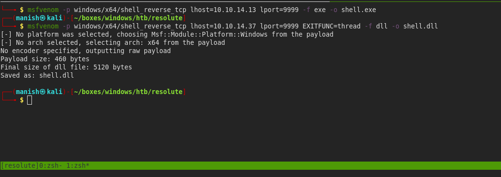
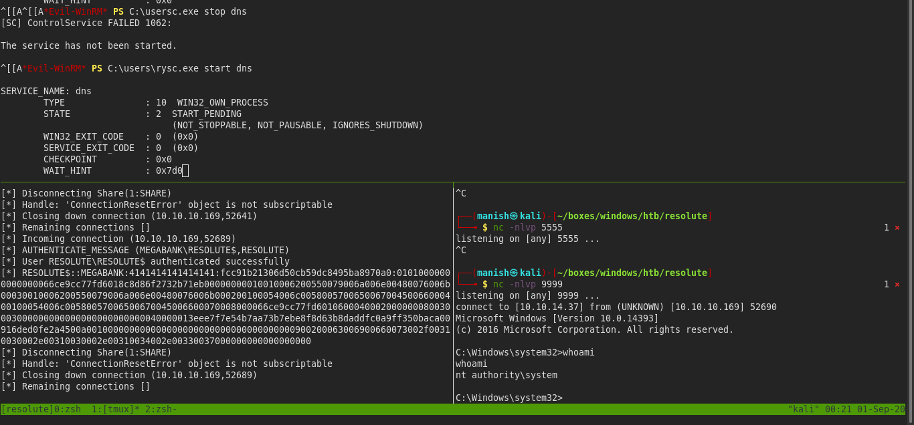

# resolute


## nmap


PORT     STATE    SERVICE      VERSION                                                                                                                                   
53/tcp   open     domain?                                                                                                                                                
| fingerprint-strings:                                                                                                                                                   
|   DNSVersionBindReqTCP:                                                                                                                                                
|     version                                                                                                                                                            
|_    bind                                                                                                                                                               
88/tcp   open     kerberos-sec Microsoft Windows Kerberos (server time: 2020-08-31 17:52:33Z)                                                                            
135/tcp  open     msrpc        Microsoft Windows RPC                                                                                                                     
139/tcp  open     netbios-ssn  Microsoft Windows netbios-ssn                                                                                                             
389/tcp  open     ldap         Microsoft Windows Active Directory LDAP (Domain: megabank.local, Site: Default-First-Site-Name)                                           
445/tcp  open     microsoft-ds Windows Server 2016 Standard 14393 microsoft-ds (workgroup: MEGABANK)                                                                   
464/tcp  open     kpasswd5?                                                                                                                                              
593/tcp  open     ncacn_http   Microsoft Windows RPC over HTTP 1.0
636/tcp  open     tcpwrapped
3268/tcp open     ldap         Microsoft Windows Active Directory LDAP (Domain: megabank.local, Site: Default-First-Site-Name)
3269/tcp open     tcpwrapped
7938/tcp filtered lgtomapper

- all of the open ports tells us that it is a domain controller


## ldap

- we  can query domain controller via ldap for any information we need
- as anonymous login is allowed we are part of the domain

```bash
ldapsearch -x -b "dc=megabank,dc=local" -h 10.10.10.169 '(objectclass=person)' description
```



- we can see in description 'Welcome123!' as a new users password
- we use password spray to see if any of the users has there default password not changed


- now we need to get usernames we can again use ldapsearch to query domain 
- then we will filter samaccountnames from it




## crackmapexec

- now we can use crackmapexec for password spray but we will check for password policy so that no account gets locked out



- account lockout threshold is none


#### shell



- we get a shell as a normal user melanie lets login and enumerate further




## post

- we found a hidden directory in root names PSTransScripts.
- there is a hidden powershell log probably and we found credential two another user




#### credentials

ryan						Serv3r4Admin4cc123!


#### crackmapexec




- we are part of DnsAdmins 
- there is a article on how we can leverage this to get code execution   [link of privesc](https://www.abhizer.com/windows-privilege-escalation-dnsadmin-to-domaincontroller/)



- we will create a malicious dll and load it into dns and then restart dns and get a reverse shell


- msfvenom payload




- got the reverse shell to the box with nt authority privilege 
- we need to set EXITFUNC=thread in msfvenom or the dns service will stop responding

