# secnotes

## nmap

PORT    STATE SERVICE      VERSION                                                                                                                                       
80/tcp  open  http         Microsoft IIS httpd 10.0                                                                                                                      
| http-methods:                                                                                                                                                          
|_  Potentially risky methods: TRACE                                                                                                                                     
|_http-server-header: Microsoft-IIS/10.0                                                                                                                                 
| http-title: Secure Notes - Login                                                                                                                                       
|_Requested resource was login.php                                                                                                                                       
445/tcp open  microsoft-ds Windows 10 Enterprise 17134 microsoft-ds (workgroup: HTB)                                                                                     

windows 10 17134 					====>  			 windows 10 1803 version

## httpenumeration

- no default credentials on the website
- we can signup to the site and create notes 
- potential username found

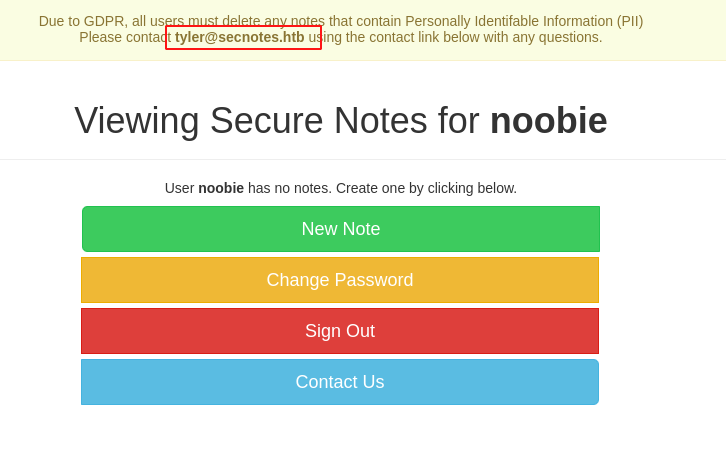

username 

​	tyler				or 				tyler@secnotes.htb

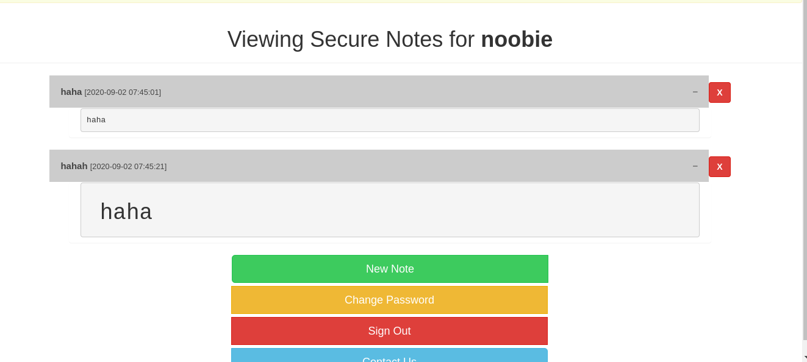

- we have a html code injection.

- we can change the password by a simple get request
- we can send a link to the admin and force him to change the password through this link

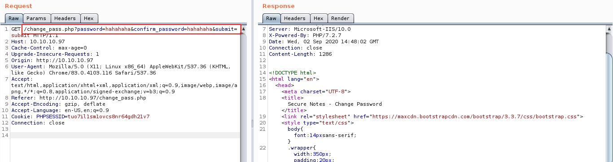

- admin is responding to our links
- we can simply give it a link to change password to whatever we want

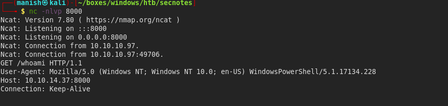

- send a malicious payload to change his password

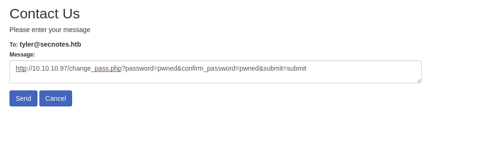

## shell

- logged in as tyler

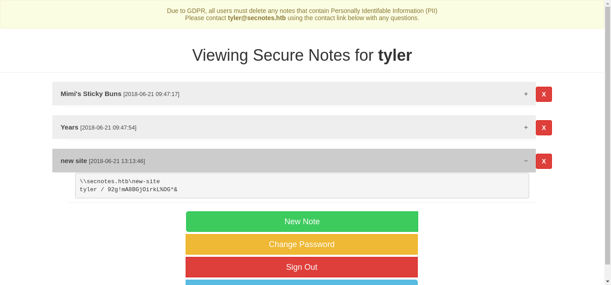

- we see a share we can log into with a username and password

#### credentials

username								tyler

password								92g!mA8BGjOirkL%OG*&

#### nmap

PORT     STATE SERVICE
80/tcp   open  http
445/tcp  open  microsoft-ds
8808/tcp open  ssports-bcast

- also found a new port at 8808

#### crackmapexec

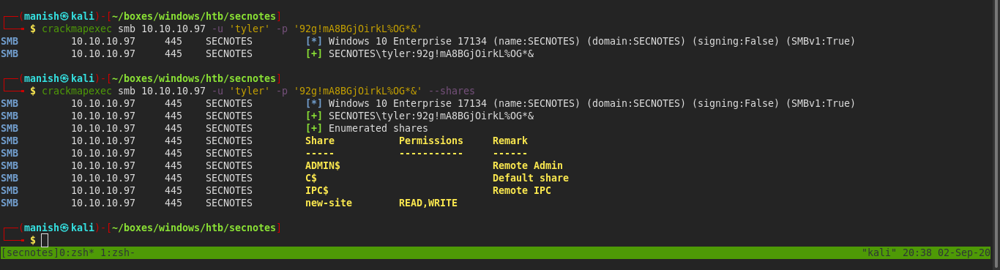

- we have read and write access to one of the shares names as new-site
- we can create a malicious payload and execute it

#### code execution

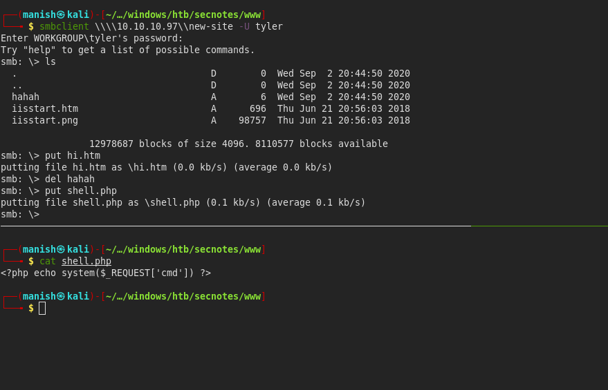

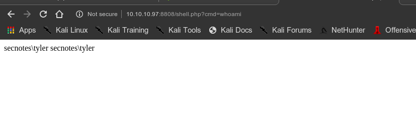

- we got a shell nishang powershell code

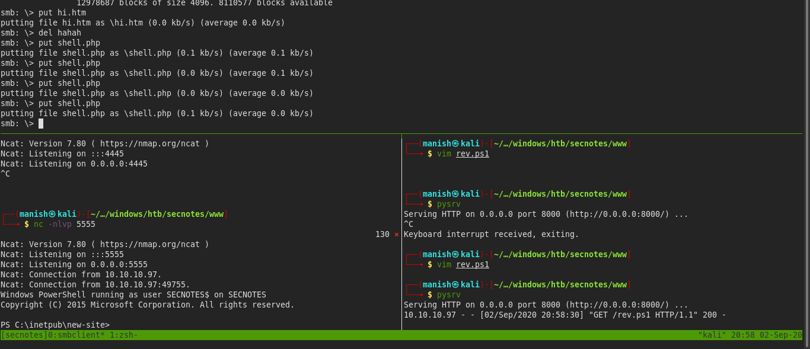

## post

- there is ubuntu installed on windows
- we can access ubuntu file structure and all its subdirectories are installed in a particular folder
- there is a artcile on how to access it all [link on accessing ubuntu folders and file in windows](https://www.howtogeek.com/261383/how-to-access-your-ubuntu-bash-files-in-windows-and-your-windows-system-drive-in-bash/)

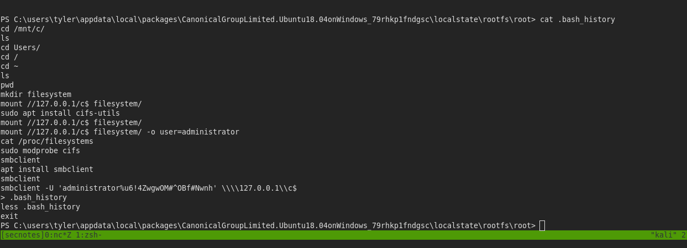

- we found username and password in .bash_history file

#### credentials

administrator

u6!4ZwgwOM#^OBf#Nwnh

#### root

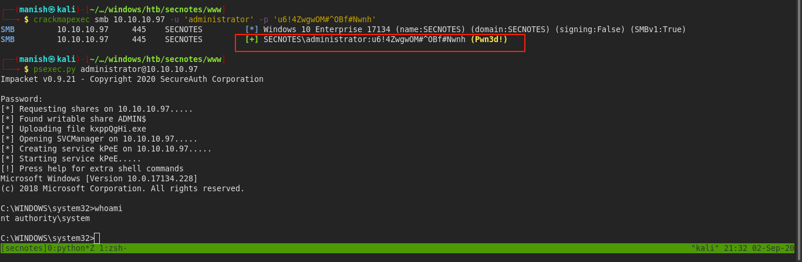

- we can do secretsdump to dump all the hashes
- its useful in active directory as we can forge a golden ticket with krbtgt's hash

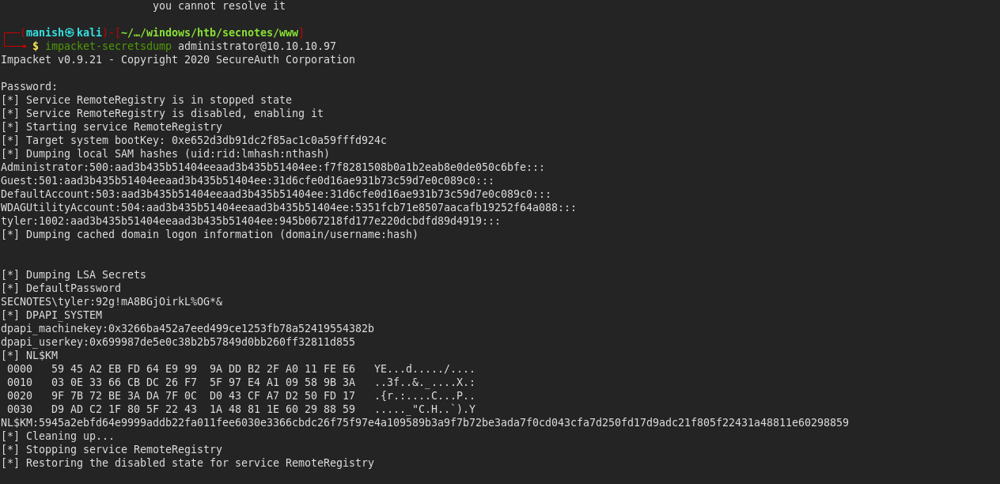