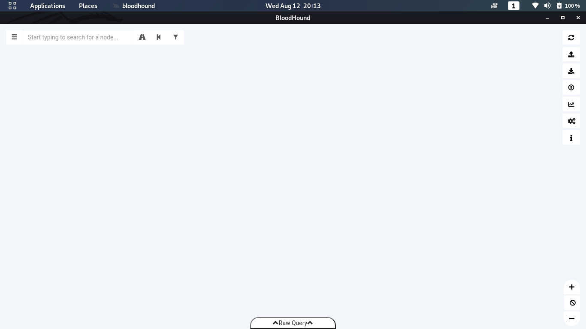

# Post

## Powerview


#### loading powerview


#### 

#### admin groups


#### Share Finder


#### operating system


## BloodHound


#### SharpHound

- It is used to collect information about domain 
- this is a powershell script 
- it is need to run locally on machine and it will create a zip file which we will collect

```powershell
Invoke-BloodHound -CollectionMethod All -Domain controller.local -ZipFilename loot.zip
```


now we will collect zip file and run it on bloodhound tool in kali


#### neo4j

```
sudo neo4j console
bloodhound
```




- we need to import the file inside the application for analysis


now we can run various given queries to get our results


