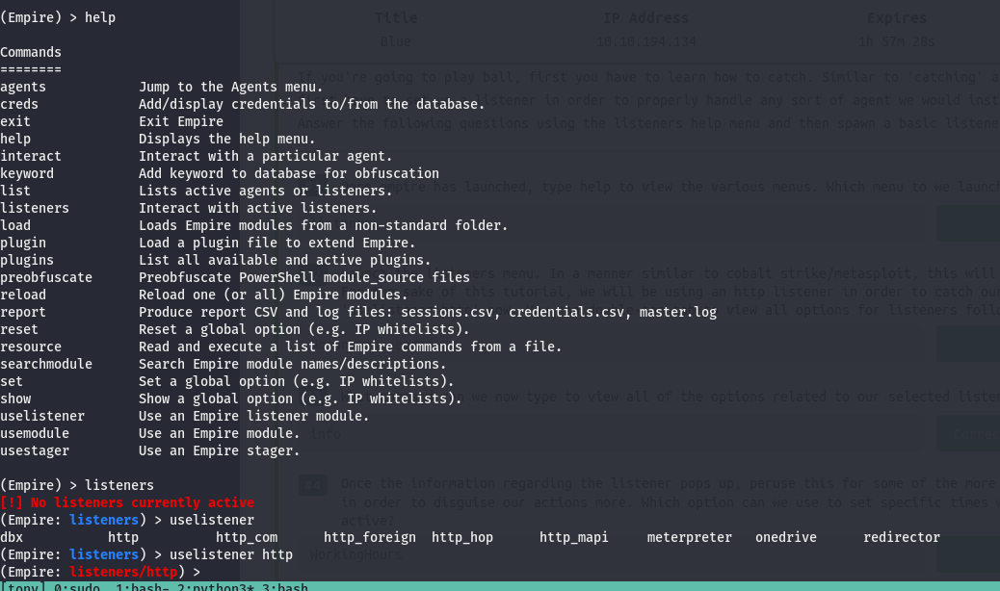
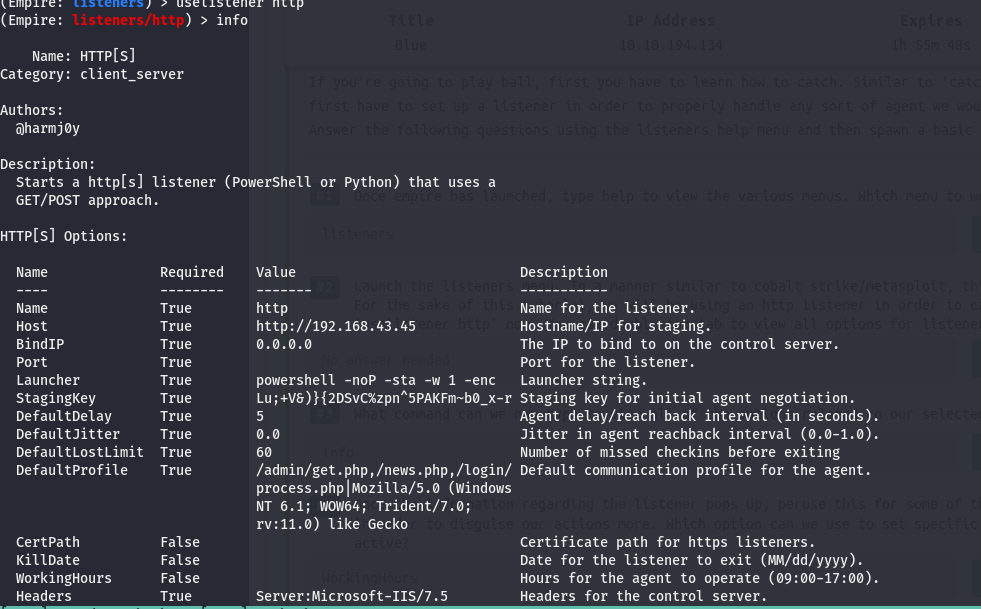
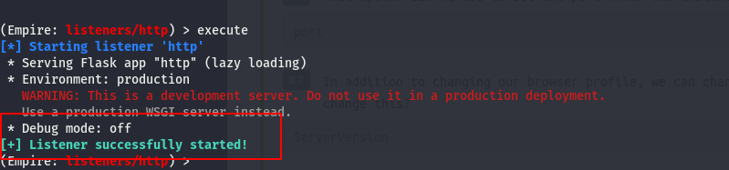
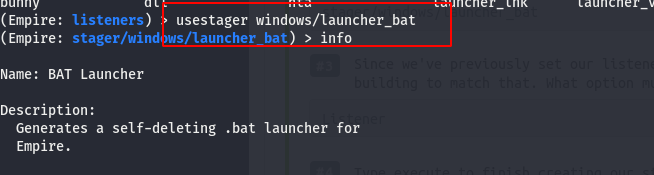
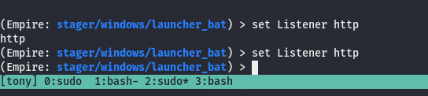
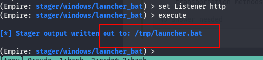

# Powershell Empire

## listeners

to launch a listener

- listener
- uselistener module and listener type

info will give extra information about listener we using

execute command to start listener successfully

## stagers

- usestager to launch anytype of stager

- set previously configured listener

executing a listener

