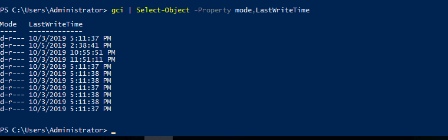

# powershell

[powershell verbs](https://docs.microsoft.com/en-us/powershell/scripting/developer/cmdlet/approved-verbs-for-windows-powershell-commands?view=powershell-7)

Powershell is the Windows Scripting Language and shell environment that is built using the .NET framework. 

This also allows Powershell to execute .NET functions directly from its shell. Most Powershell commands, called *cmdlets,* are written in .NET. Unlike other scripting languages and shell environments, the output of these *cmdlets* are objects - making Powershell somewhat object oriented. This also means  that running cmdlets allows you to perform actions on the output  object(which makes it convenient to pass output from one *cmdlet* to another). The normal format of a *cmdlet* is represented using **Verb-Noun**; for example the *cmdlet* to list commands is called `Get-Command.`

Common verbs to use include:


- Get
- Start
- Stop 
- Read
- Write
- New
- Out

 Get-Help

## Creating Objects From Previous *cmdlets*

One way of manipulating objects is pulling out the properties from the  output of a cmdlet and creating a new object. This is done using the `Select-Object` *cmdlet.* 



this will pipe object of first commands output to second.

You can also use the following flags to select particular information:

- first - gets the first x object
- last - gets the last x object
- unique - shows the unique objects
- skip - skips x objects


## Filtering Objects

When retrieving output objects, you may want to select objects that match a very specific value. You can do this using the `Where-Object` to filter based on the value of properties. 

The general format of the using this *cmdlet* is 

```powershell
Verb-Noun | Where-Object -Property PropertyName -operator Value
Verb-Noun | Where-Object {$_.PropertyName -operator Value}
```

The second version uses the $_ operator to iterate through every object passed to the Where-Object cmdlet.

**Powershell is quite sensitive so make sure you don't put quotes around the command!**

Where `-operator` is a list of the following operators:

- -Contains: if any item in the property value is an exact match for the specified value
- -EQ: if the property value is the same as the specified value
- -GT: if the property value is greater than the specified value

[different operators](https://docs.microsoft.com/en-us/powershell/module/microsoft.powershell.core/where-object?view=powershell-6)


```powershell
Get-Service | Where-Object -Property Status -eq Stopped
```


## Sort-Object

```powershell
Get-ChildItem | Select-Object Creationtime
```


## problems

get file by name

```powershell
Get-ChildItem -Path C:\ -Recurse | Where-Object -Property Name -EQ interesting-file.txt.txt  -ErrorAction SilentlyContinue
```


how many cmdlets are present

```powershell
Get-Command | where-object -property commandtype -eq cmdlet
```


FILE HASH

```powershell
Get-FileHash 'location' -Alogrithm MD5
```


present working directory

```powershell
Get-Location
```


### web request

[web-request](https://docs.microsoft.com/en-us/powershell/module/microsoft.powershell.utility/invoke-webrequest?view=powershell-6)


### decode from base64

```powershell
[System.text.encoding]::ASCII.GetString([System.Convert]::FromBase64String($data))
```


## Enumeration

The first step when you have gained initial access to any machine would be to enumerate. We'll be enumerating the following:

- users
- basic networking information
- file permissions
- registry permissions
- scheduled and running tasks
- insecure files

identify user by sid


Get-NetIPAddress		##equal to ifconfig of kali


How many ports are listening

```powershell
Get-NetTCPConnection | Where-object -property state -eq listen | measure
```


Patches applied 

```powershell
Get-HotFix
```


Host fix by id

```powershell
Get-HotFix -ID KB----
```


read a particular type of file


get Schduled TASK

```powershell
Get-ScheduledTask -TaskName new-sched-task
```


## scripting

### port listener

```powershell
$system_ports = Get-NetTCPConnection -State Listen
$text_port = Get-Content -Path 'C:\Users\Administrator\Desktop\ports.txt'
foreach($port in $text_port){
	if($port -in $system_ports.LocalPort){
		echo $port
	}
}
```


Getting all tcp connection that are listen state and comparing it with already given ports to check if a port is open or close


### find file containing password

```powershell
ls -recurse | select-string -pattern password
```


### portscanner

```powershell
130..140 | % {echo ((new-object system.net.sockets.tcpclient).connect("127.0.0.1,$_")) "Port $_ is open"} 2>$null
```

