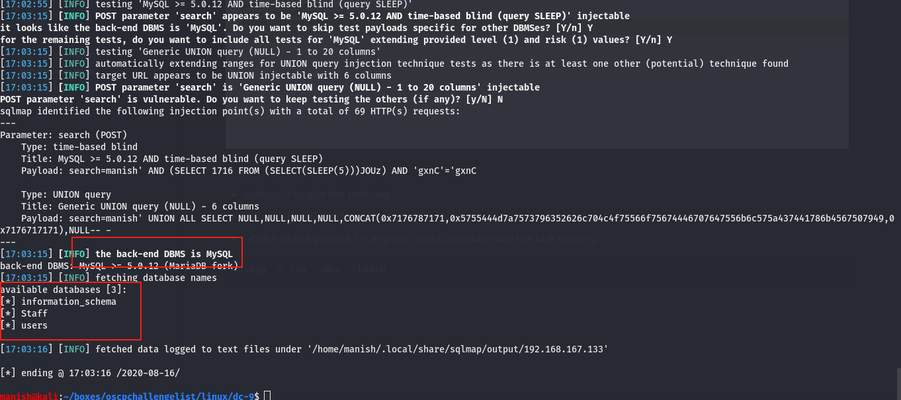
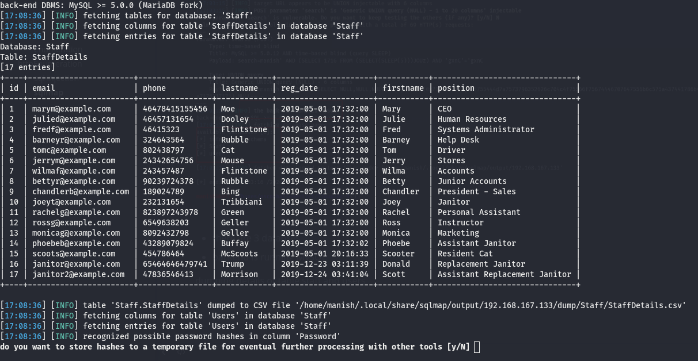
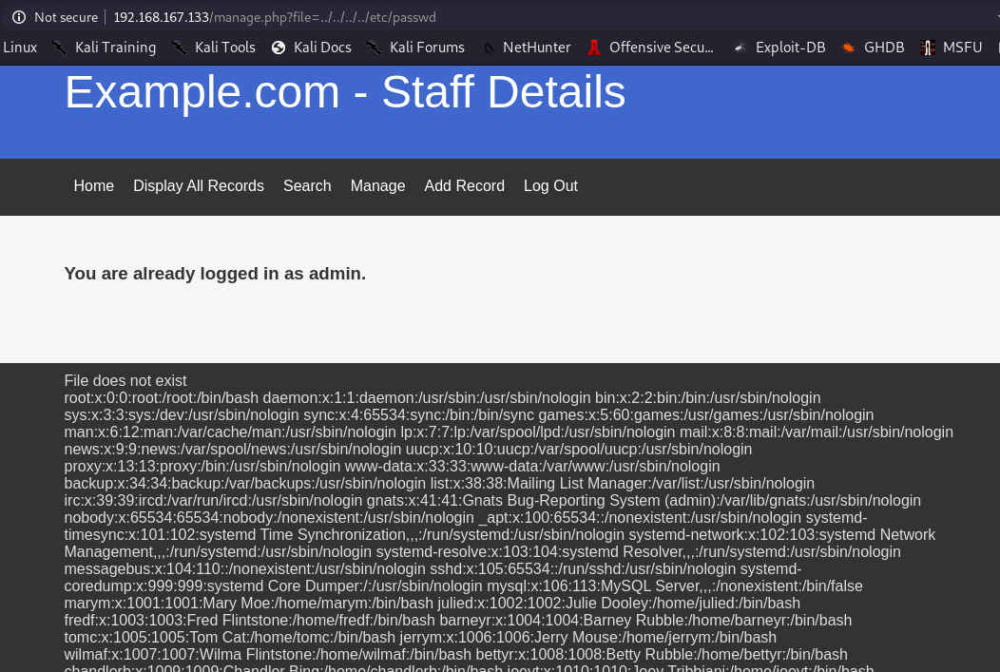

# DC-9


## nmap


#### ip

```
192.168.167.133
```


#### enumeration

PORT   STATE SERVICE VERSION
80/tcp open  http    Apache httpd 2.4.38 ((Debian))
|_http-server-header: Apache/2.4.38 (Debian)
|_http-title: Example.com - Staff Details - Welcome

only http is open


## httpEnumeration

search box is vulnerable to sqlinjection


#### sql injection

manually inserted some sql quiries to get see if there is sql injection

````
' or 1=1 -- -
````


enumerating version 

```
' or 1 = 1 union select @@version,2,3,4,5,6
```


#### sqlmap

- using sqlmap to get all the details
- copy the contents of request
- and pass it to sqlmap with -r flag


- sqlmap -r to give the post req.
- --dbs to identify backend dbms.
- --batch to not prompt for any user input and automate the task entirely.

```
sqlmap -r req --dbs --batch
```





- there are 3 databses 
- backend is running MySQL

##### staff

dumping details of database staff and users




##### users table


## hash cracking 

lets crack password of admin user

hashcat did not gave any result

tried crackstation and got  the credentials


#### credentials

admin		transorbital1


## httpEnumeration


logging in with the credentials

we got a local file inclusion with manage.php




#### port knock

````
port knocking sequence at /etc/knockd.conf
````


```
sequence 	7469, 8475, 9842
```


before port knocking


after port knocking


## exploit


#### hydra


lets brute force the password and id we got from Users database


```
[22][ssh] host: 192.168.167.133   login: chandlerb   password: UrAG0D!
[22][ssh] host: 192.168.167.133   login: joeyt   password: Passw0rd
[22][ssh] host: 192.168.167.133   login: janitor   password: Ilovepeepee
```


## post


#### enumeration

found new credentials in user janitors account


#### hydra

using hydra to bruteforce with these credentials


found 2 valid credentials


#### fredf

this user can run following command with no password


this code is getting a file and appending it to another


we can create a new user and append it to /etc/passwd with root privileges


## root

