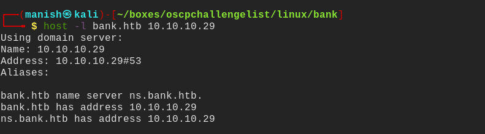
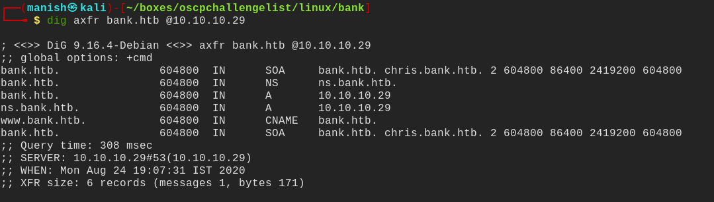
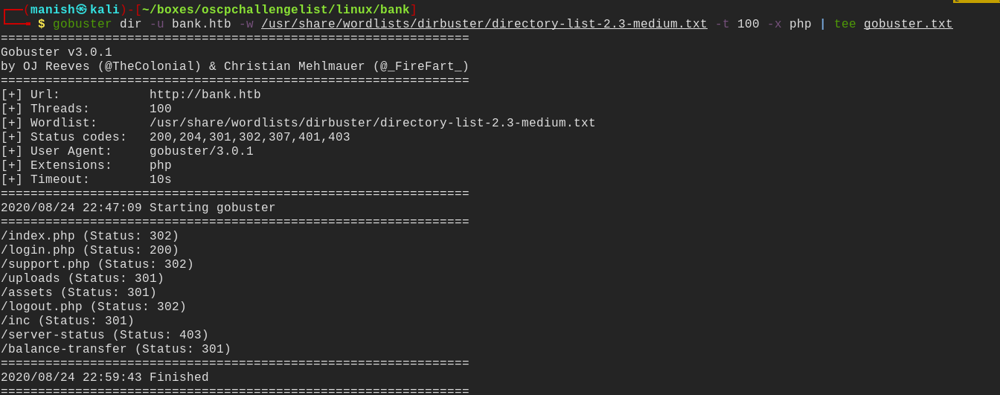
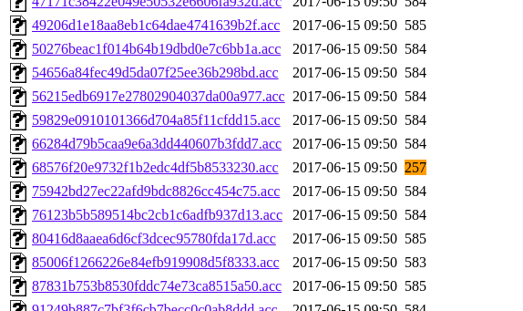
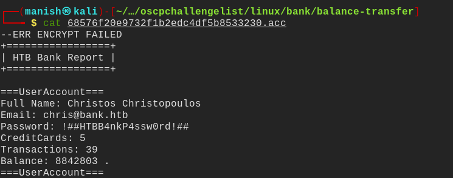
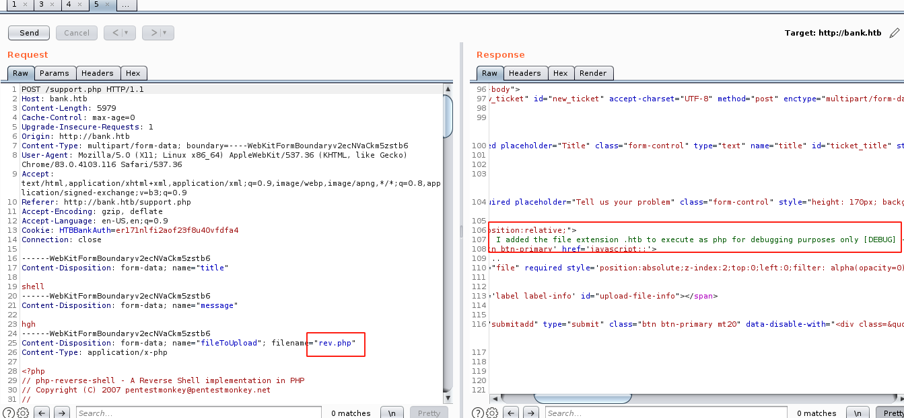
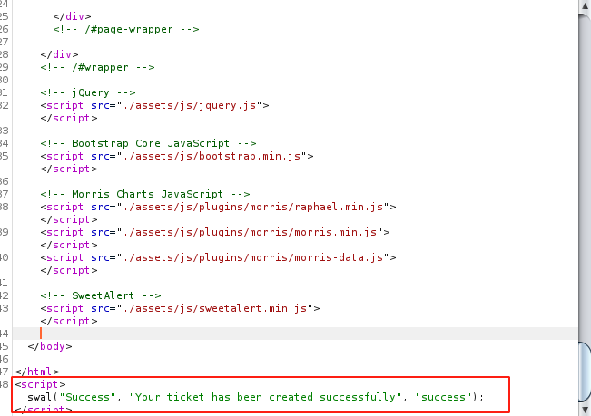
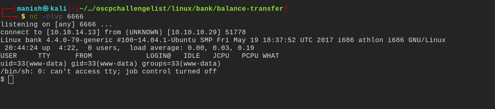
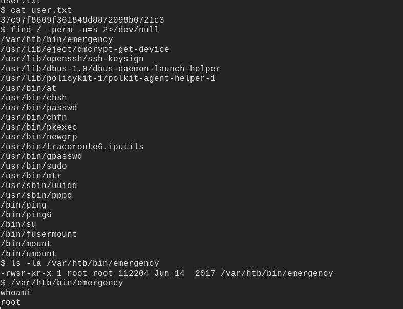

# bank


## nmap


PORT   STATE SERVICE VERSION                                                                                                           
22/tcp open  ssh     OpenSSH 6.6.1p1 Ubuntu 2ubuntu2.8 (Ubuntu Linux; protocol 2.0)                                                    
| ssh-hostkey:                                                                                                                         
|   1024 08:ee:d0:30:d5:45:e4:59:db:4d:54:a8:dc:5c:ef:15 (DSA)                                                                         
|   2048 b8:e0:15:48:2d:0d:f0:f1:73:33:b7:81:64:08:4a:91 (RSA)                                                                         
|   256 a0:4c:94:d1:7b:6e:a8:fd:07:fe:11:eb:88:d5:16:65 (ECDSA)                                                                        
|_  256 2d:79:44:30:c8:bb:5e:8f:07:cf:5b:72:ef:a1:6d:67 (ED25519)                                                                      
53/tcp open  domain  ISC BIND 9.9.5-3ubuntu0.14 (Ubuntu Linux)                                                                         
| dns-nsid:                                                                                                                            
|_  bind.version: 9.9.5-3ubuntu0.14-Ubuntu                                                                                             
80/tcp open  http    Apache httpd 2.4.7 ((Ubuntu))                                                                                     
|_http-server-header: Apache/2.4.7 (Ubuntu)                                                                                            
|_http-title: Apache2 Ubuntu Default Page: It works                                                                                    
Service Info: OS: Linux; CPE: cpe:/o:linux:linux_kernel                                    


## DNS


-  we see DNS port open we can try some dns enumeration on the box

#### host

```
host -l bank.htb 10.10.10.29
```

- we dont find any information




#### dig

```
dig axfr bank.htb @10.10.10.29
```



- we got some extra information


## httpenumeration


#### using gobuster




- balance transfer is interesting directory 
- we got one file that is smaller than others

- reading its content we get credentials for the login




#### credentials




email			chris@bank.htb

Password	!##HTBB4nkP4ssw0rd!##


## shell

- the file is being filtered 
- but in comments we can see there is .htb extension to execute php code so lets change the extension and see


- 


- successfully created the ticket




- got the shell by clicking on ticket


#### shell




## post

- search for set uid
- found emergency and it is bash with setuid incase he forgot password

