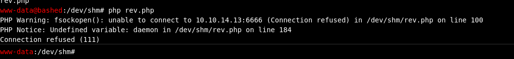
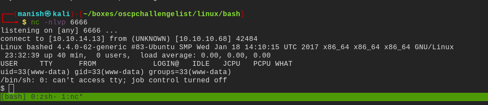
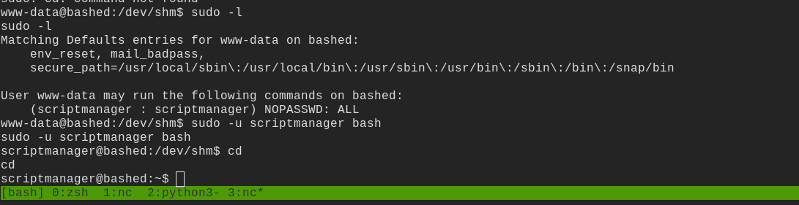
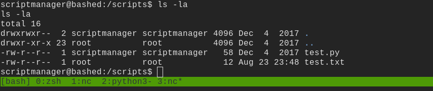
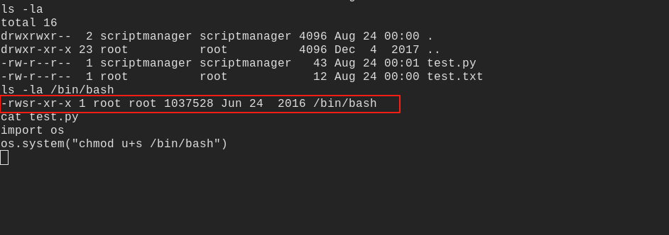
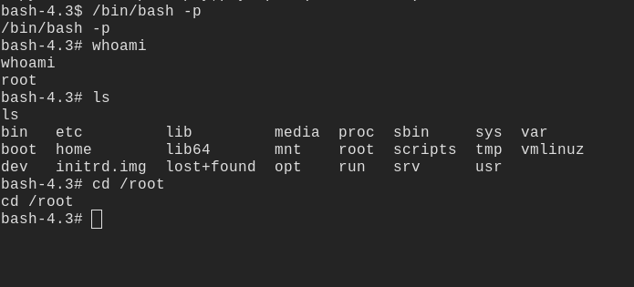

# bashed

## nmap

PORT   STATE SERVICE VERSION
80/tcp open  http    Apache httpd 2.4.18 ((Ubuntu))
|_http-server-header: Apache/2.4.18 (Ubuntu)
|_http-title: Arrexel's Development Site

## gobuster

/.htaccess (Status: 403)
/.htpasswd (Status: 403)
/css (Status: 301)
/dev (Status: 301)
/fonts (Status: 301)
/images (Status: 301)
/js (Status: 301)
/php (Status: 301)
/server-status (Status: 403)
/uploads (Status: 301)

- dev folder looks internesting
- found a php bashic shell installed already
- we can use it to get a shell

## shell

- uploaded rev.php in /dev/shm
- executed it with php and got the shell

shell

## post

- sudo -l we can run as scriptmanager to escalate to scriptmanager

#### script folder

- we can see test.py is accessible by scriptmanager
- and it is execute by test because test.txt has ownership of root
- we can manipulate test.py to setuid of bash

- successfully setting up set uid binary now we can exploit bash

#### root

