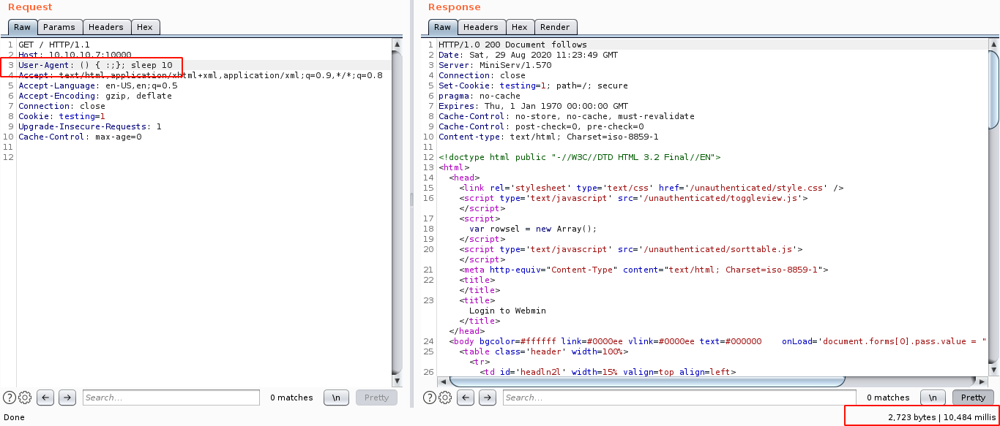
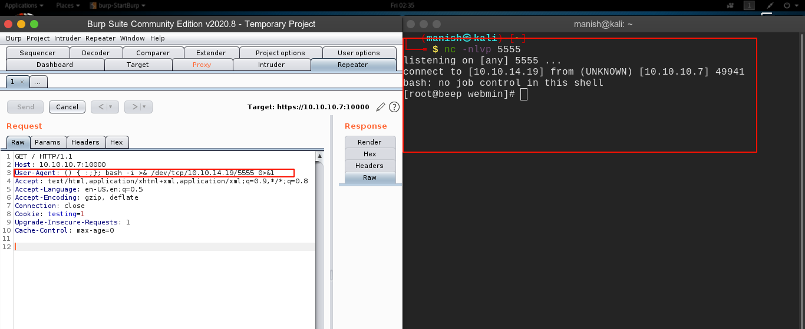
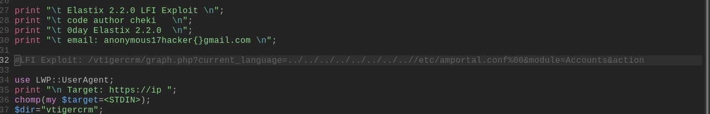
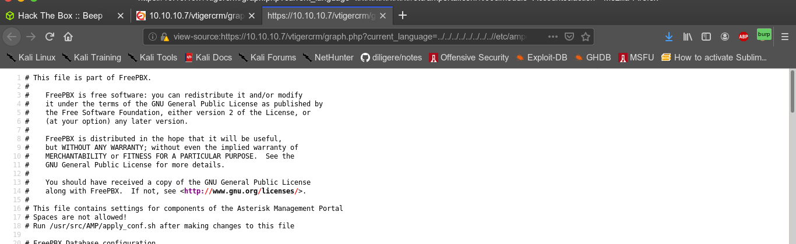
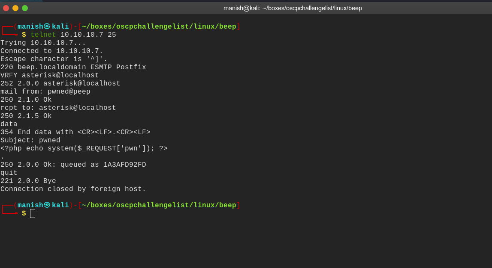
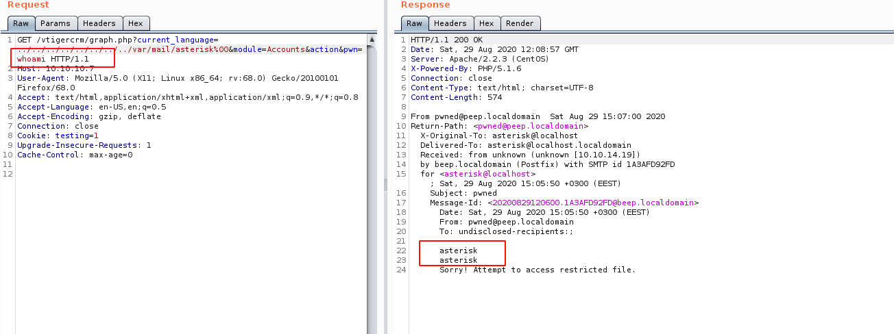
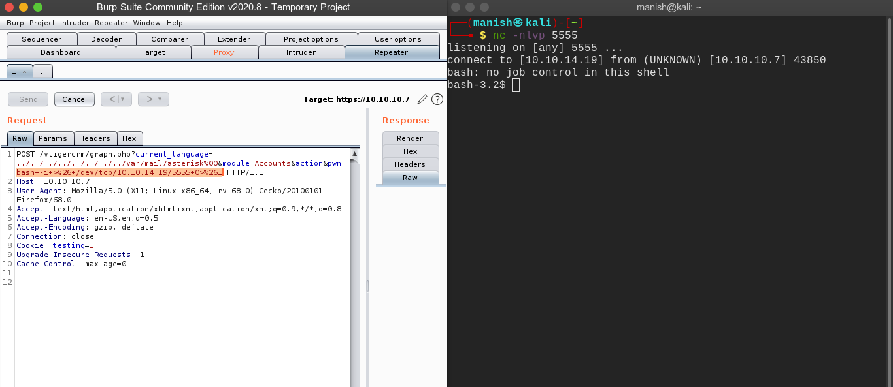
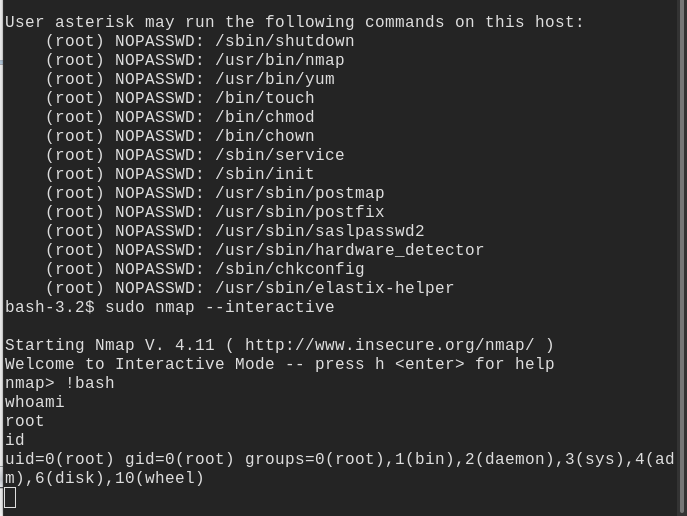

# beep

## nmap

PORT      STATE SERVICE    VERSION                                                                                                     
22/tcp    open  ssh        OpenSSH 4.3 (protocol 2.0)                                                                                  
| ssh-hostkey:                                                                                                                         
|   1024 ad:ee:5a:bb:69:37:fb:27:af:b8:30:72:a0:f9:6f:53 (DSA)
|_  2048 bc:c6:73:59:13:a1:8a:4b:55:07:50:f6:65:1d:6d:0d (RSA)
25/tcp    open  smtp       Postfix smtpd
|_smtp-commands: beep.localdomain, PIPELINING, SIZE 10240000, VRFY, ETRN, ENHANCEDSTATUSCODES, 8BITMIME, DSN, 
80/tcp    open  http       Apache httpd 2.2.3
|_http-server-header: Apache/2.2.3 (CentOS)
|_http-title: Did not follow redirect to https://10.10.10.7/
|_https-redirect: ERROR: Script execution failed (use -d to debug)
110/tcp   open  pop3       Cyrus pop3d 2.3.7-Invoca-RPM-2.3.7-7.el5_6.4
|_pop3-capabilities: UIDL STLS RESP-CODES TOP LOGIN-DELAY(0) APOP IMPLEMENTATION(Cyrus POP3 server v2) PIPELINING USER EXPIRE(NEVER) AUTH-RESP-CODE
111/tcp   open  rpcbind    2 (RPC #100000)
143/tcp   open  imap       Cyrus imapd 2.3.7-Invoca-RPM-2.3.7-7.el5_6.4
|_imap-capabilities: CATENATE NAMESPACE UIDPLUS OK URLAUTHA0001 X-NETSCAPE BINARY NO QUOTA THREAD=ORDEREDSUBJECT RENAME SORT SORT=MODSEQ IMAP4rev1 CONDSTORE UNSELECT ANNOTATEMORE LISTEXT IDLE MAILBOX-REFERRALS ID LIST-SUBSCRIBED CHILDREN MULTIAPPEND Completed IMAP4 THREAD=REFERENCES STARTTLS ATOMIC LITERAL+ ACL RIGHTS=kxte
443/tcp   open  ssl/https?
|_ssl-date: 2020-08-29T10:11:11+00:00; +17s from scanner time.
993/tcp   open  ssl/imap   Cyrus imapd
|_imap-capabilities: CAPABILITY
995/tcp   open  pop3       Cyrus pop3d
3306/tcp  open  mysql      MySQL (unauthorized)
4445/tcp  open  upnotifyp?
10000/tcp open  http       MiniServ 1.570 (Webmin httpd)
|_http-title: Site doesn't have a title (text/html; Charset=iso-8859-1).
Service Info: Hosts:  beep.localdomain, 127.0.0.1, example.com

## shellshock

- blind command execution using shellshock vulnerability

## root

## LFI to RCE

- We will use log poisoning to get command execution

- LFI link lets test it

#### lfi

- we have lfi
- from nmap scan we know there is smtp service running 
- we can collect username from here and see if we can mail anyone
- then we will try to read logs to see if we get command execution

- we got code execution when reading mail log
- location of mail log is **/var/mail/asterisk**

#### shell

- got command execution

- logged in as user asterisk
- asterisk can run nmap as root so we can start nmap interactive and get bash