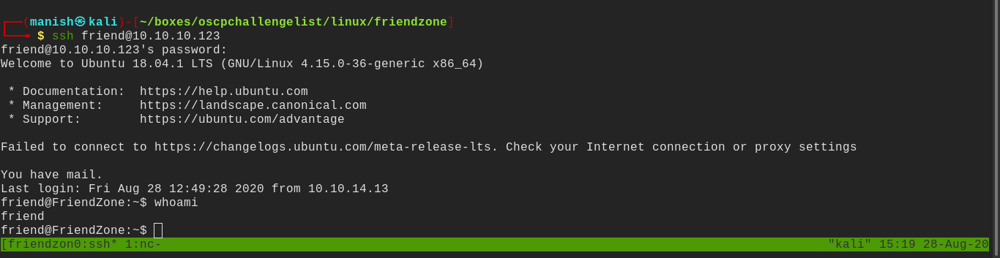

# friendzone

## nmap

PORT    STATE SERVICE     VERSION                                                                                                      
21/tcp  open  ftp         vsftpd 3.0.3                                                                                                 
22/tcp  open  ssh         OpenSSH 7.6p1 Ubuntu 4 (Ubuntu Linux; protocol 2.0)                                                          
| ssh-hostkey:                                                                                                                         
|   2048 a9:68:24:bc:97:1f:1e:54:a5:80:45:e7:4c:d9:aa:a0 (RSA)                                                                         
|   256 e5:44:01:46:ee:7a:bb:7c:e9:1a:cb:14:99:9e:2b:8e (ECDSA)                                                                        
|_  256 00:4e:1a:4f:33:e8:a0:de:86:a6:e4:2a:5f:84:61:2b (ED25519)                                                                      
53/tcp  open  domain      ISC BIND 9.11.3-1ubuntu1.2 (Ubuntu Linux)                                                                    
| dns-nsid:                                                                                                                            
|_  bind.version: 9.11.3-1ubuntu1.2-Ubuntu                                                                                             
80/tcp  open  http        Apache httpd 2.4.29 ((Ubuntu))                                                                               
|_http-server-header: Apache/2.4.29 (Ubuntu)                                                                                           
|_http-title: Friend Zone Escape software                                                                                              
139/tcp open  netbios-ssn Samba smbd 3.X - 4.X (workgroup: WORKGROUP)                                                                  
443/tcp open  ssl/http    Apache httpd 2.4.29                                                                                          
|_http-server-header: Apache/2.4.29 (Ubuntu)                                                                                           
|_http-title: 404 Not Found                                                                                                            
| ssl-cert: Subject: commonName=friendzone.red/organizationName=CODERED/stateOrProvinceName=CODERED/countryName=JO                     
| Not valid before: 2018-10-05T21:02:30
|_Not valid after:  2018-11-04T21:02:30
|_ssl-date: TLS randomness does not represent time
| tls-alpn: 
|_  http/1.1
445/tcp open  netbios-ssn Samba smbd 4.7.6-Ubuntu (workgroup: WORKGROUP)

## dns

#### dig

- zone transfer

## smbenumeration

#### crackmapexec

- got creds
- we also have write permission to development folder 

#### credentials

username 		  admin

password			WORKWORKHhallelujah@#

## httpenumeration

- there is virutal host routing enabled which shows different landing page to different subdomains
- in ssl version of site the landing page is different and dns enumeration subdomain are also working

- in administrator1 subdomain we see login information
- we can put credentials here from earlier file

#### local file inclusion

- there is a local file inclusion vulnerability

- decoding dashboard.php gave us a hint that its including .php extension automatically after everyfile
- this means we cannot read /etc/passwd or attacks like log poisoning through lfi is not possible

#### shell

- we took  a note of /etc/Development folder being writable by anyone 
- we can include a php reverse shell file and see if it works

- now we finally got a shell

- we got one interesting file with credentials

#### credentials

username		friend

password		Agpyu12!0.213$

- we use these credentials to ssh into box

got the proper shell

## post

- now we will use enumeration scripts to find interesting files and folders and permissions

- interesting world writable files we python2 os module
- probably will be useful in exploitation
- looking for active cronjobs using pspy64s

- we see it imports os module and as we know from earlier os module is world writable
- so we will edit os module to execute a command to change bash permission with setuid bit

- created a system command to make bash binary with setuid permission 
- that means now we can run it as root

#### root

