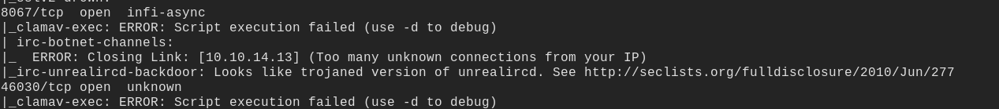
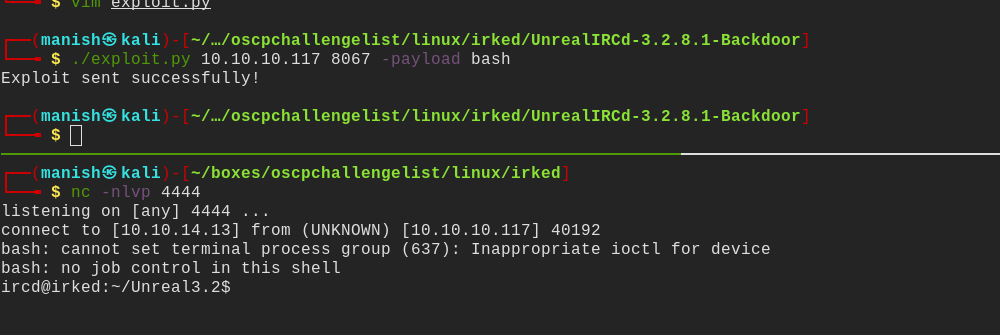
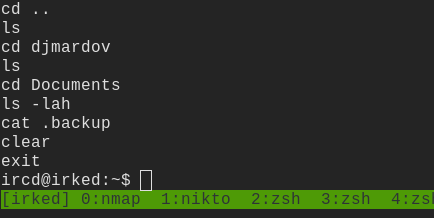
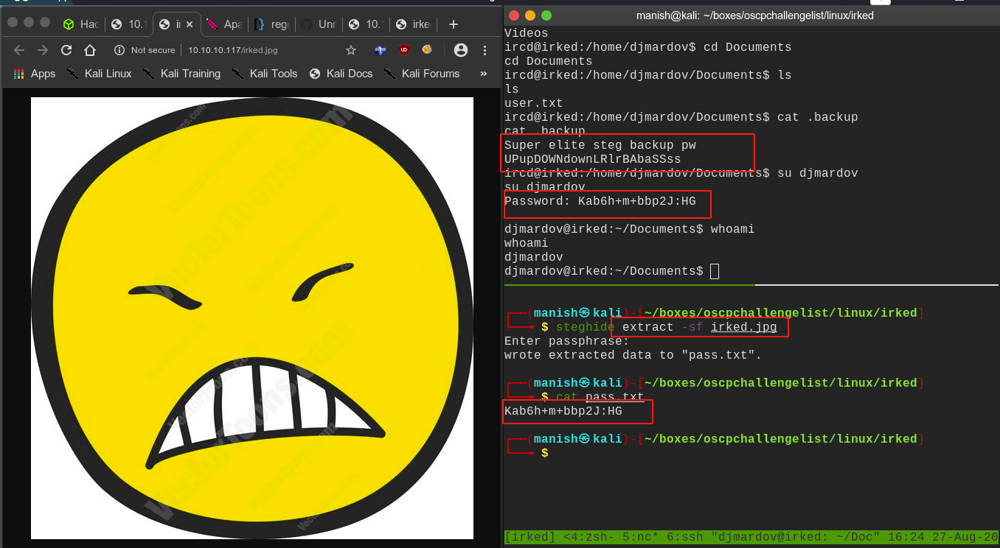
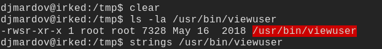
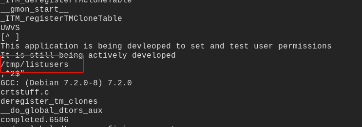
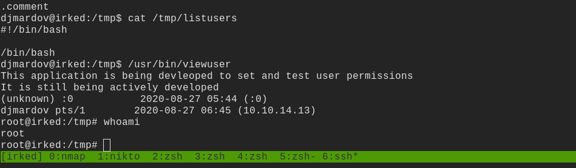

# irked

## nmap

PORT    STATE SERVICE VERSION
22/tcp  open  ssh     OpenSSH 6.7p1 Debian 5+deb8u4 (protocol 2.0)
| ssh-hostkey: 
|   1024 6a:5d:f5:bd:cf:83:78:b6:75:31:9b:dc:79:c5:fd:ad (DSA)
|   2048 75:2e:66:bf:b9:3c:cc:f7:7e:84:8a:8b:f0:81:02:33 (RSA)
|   256 c8:a3:a2:5e:34:9a:c4:9b:90:53:f7:50:bf:ea:25:3b (ECDSA)
|_  256 8d:1b:43:c7:d0:1a:4c:05:cf:82:ed:c1:01:63:a2:0c (ED25519)
80/tcp  open  http    Apache httpd 2.4.10 ((Debian))
|_http-server-header: Apache/2.4.10 (Debian)
|_http-title: Site doesn't have a title (text/html).
111/tcp open  rpcbind 2-4 (RPC #100000)

6697/tcp  open  irc     UnrealIRCd
8067/tcp  open  irc     UnrealIRCd
46030/tcp open  status  1 (RPC #100024)
65534/tcp open  irc     UnrealIRCd

#### nmap scripting engine

- looks like this version of unrealircd allows us to execute remote code 
- due to a backdoor in its source code

## exploit

- got the shell using a github code on this

#### shell

#### enumeration

- in .bash_history we found a .backup folder in Documents directory of other user

- we can read the contents of this directory and it looks like pointing to some stegnography
- we see on photo on the landing page of website we can download it and try to use this password

-  we are now elevated user and can get user.txt

## post

- there is one application with setuid
- thats different from otherss

- using strings on it gave us a file location probably its going there to check for somefile

- we put bash script to spawn a shell and got root

