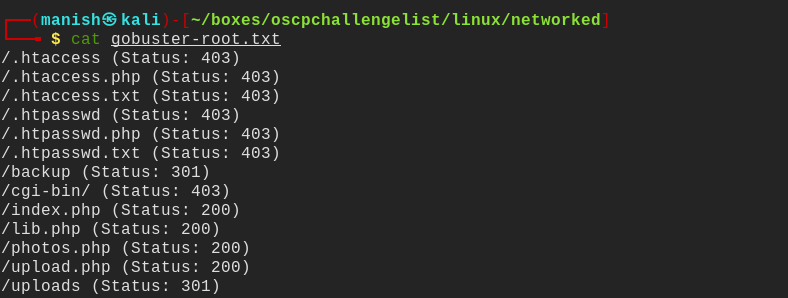
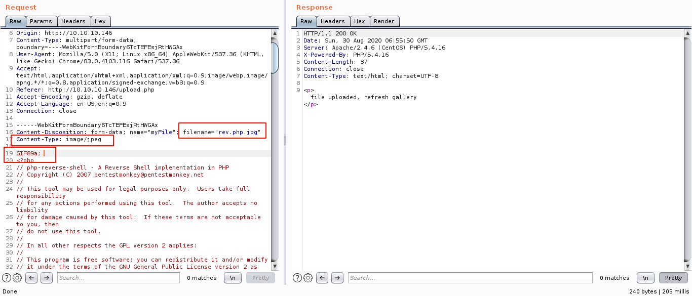
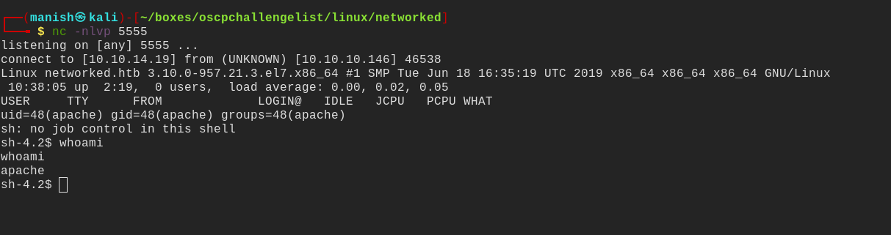
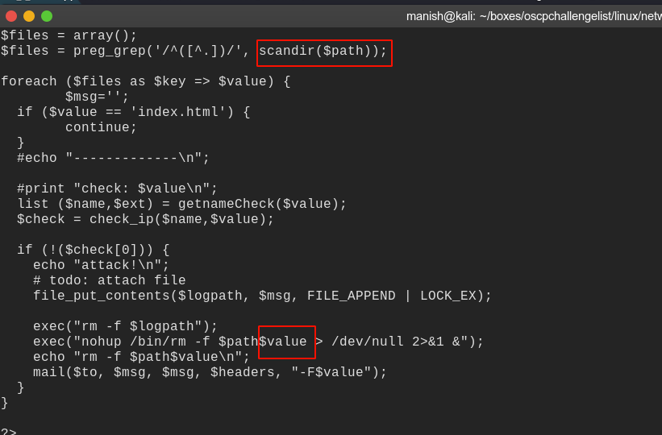
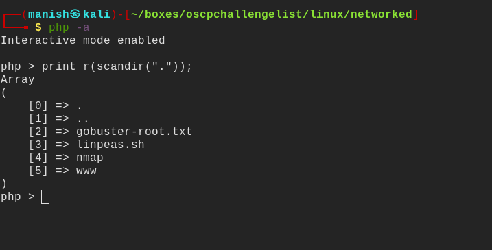
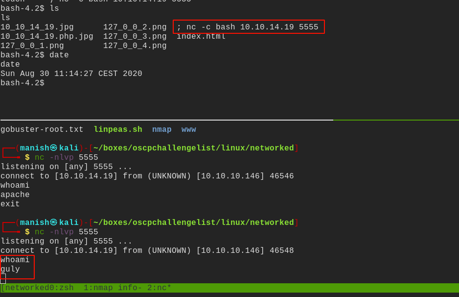
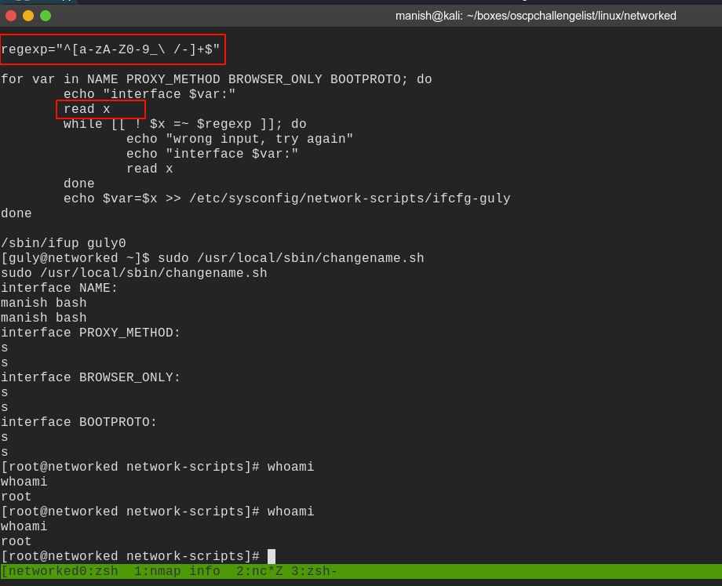
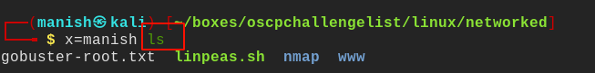

# networked

## nmap

PORT    STATE  SERVICE VERSION
22/tcp  open   ssh     OpenSSH 7.4 (protocol 2.0)
| ssh-hostkey: 
|   2048 22:75:d7:a7:4f:81:a7:af:52:66:e5:27:44:b1:01:5b (RSA)
|   256 2d:63:28:fc:a2:99:c7:d4:35:b9:45:9a:4b:38:f9:c8 (ECDSA)
|_  256 73:cd:a0:5b:84:10:7d:a7:1c:7c:61:1d:f5:54:cf:c4 (ED25519)
80/tcp  open   http    Apache httpd 2.4.6 ((CentOS) PHP/5.4.16)
|_http-server-header: Apache/2.4.6 (CentOS) PHP/5.4.16
|_http-title: Site doesn't have a title (text/html; charset=UTF-8).
443/tcp closed https

## gobuster

- found backup folder
- it contains source code of the files are being uploaded
- we can bypass it by changing mime type and change the header to that of a image
- and rename file as file.php.jpg

- we see a message file uploaded successfully
- we can now execute it and get the shell

## shell

- got a reverse shell

- enumerating the home directory we found a cronjob running

- there is a code injection vulnerability in the file.
- basically the code is equivalent of putting * in front of a ls.
- and then removing those files.

- we can use this to put a filename as '; whoami' and it will be executed
- we can use it to create a file name with reverse nc shell

- we got command execution with user guly

## post

- we can run **/usr/local/sbin/changename.sh** as root
- vulnerability is in the way its reading variable and spaces are allowed
- we use this to execute bash and get reverse shell

- this leads to command execution example below

